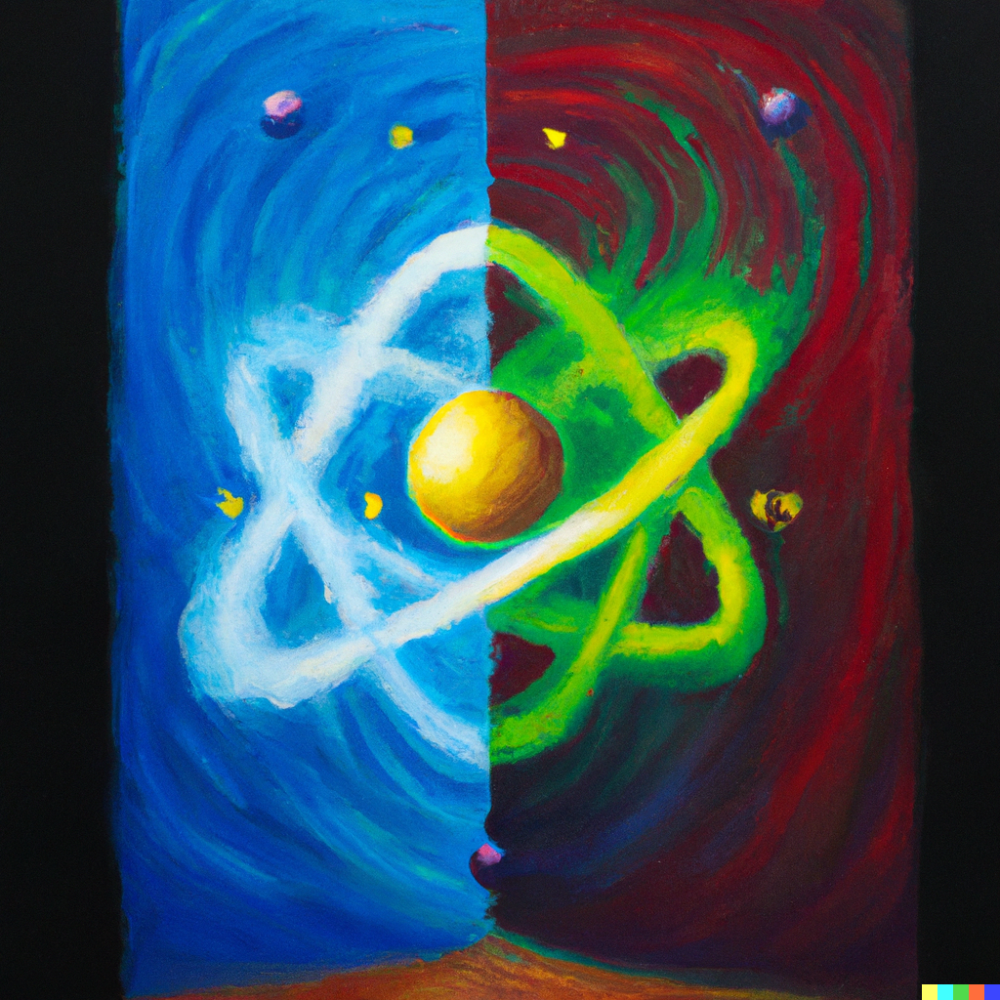
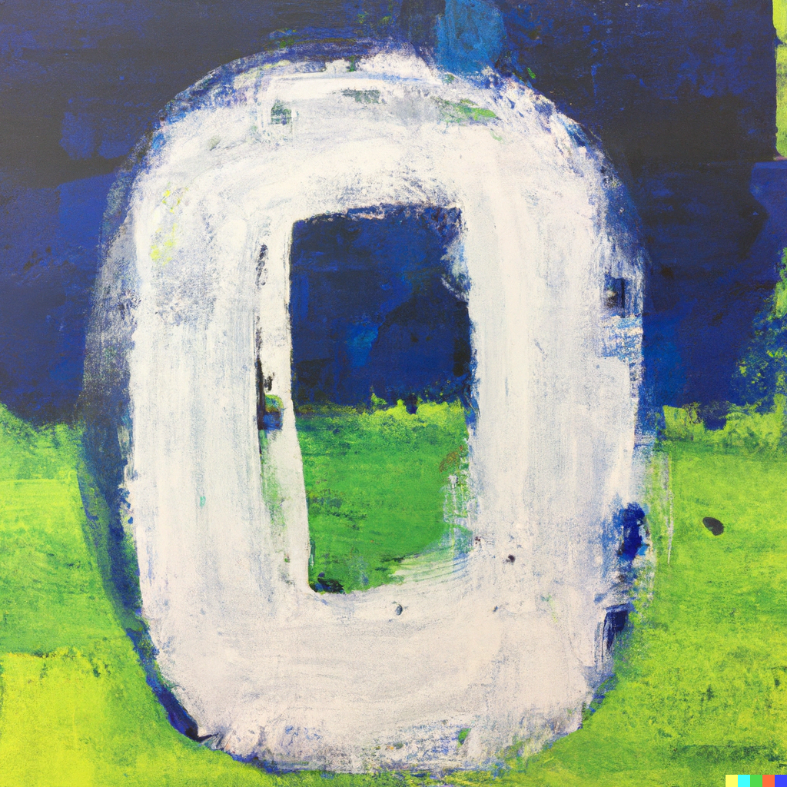
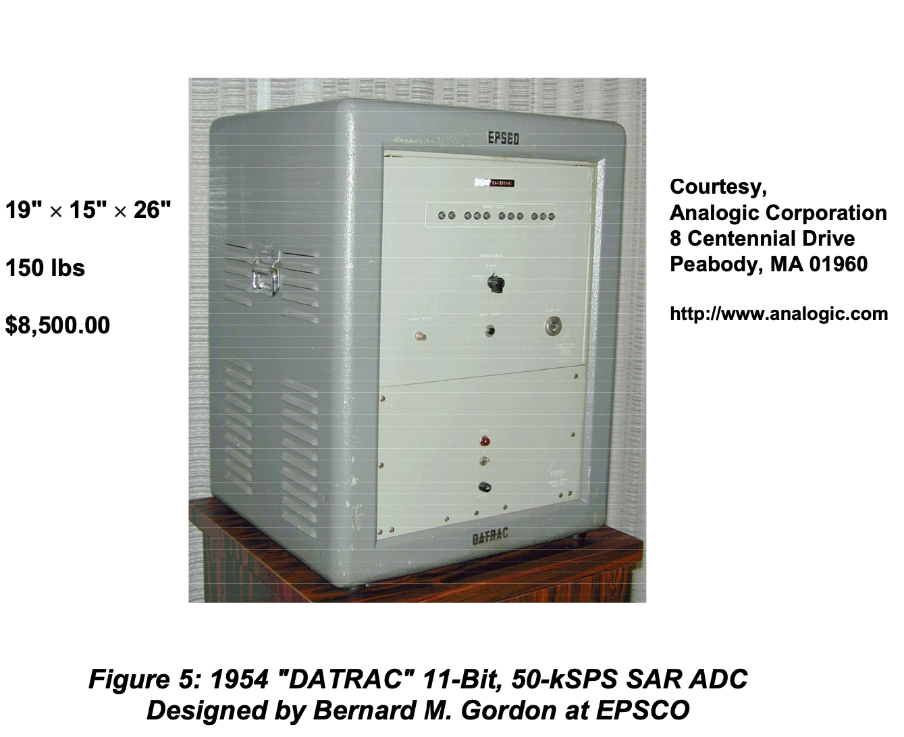
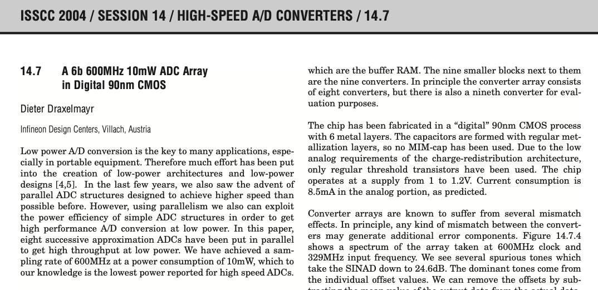

footer: Carsten Wulff 2022
slidenumbers:true
autoscale:true
theme: Plain Jane, 1
text:  Helvetica
header:  Helvetica

# My thoughts on analog design 

---
[.background-color:#000000]
[.text: #FFFFFF]


---

# How I see our roles 

**Professors:** Guide students on what is impossible, possible, and hints on what
might be possible 

**Ph.D students:** Venture into the unknown and make something (more) possible

**Master students:** Learn all that is currently possible

**Bachelor students:** Learn how to make complicated into easy

**Industry:** Take what is possible, and/or complicated, and make it easy


---

The world is analog. The laws of behavior are written in the mathematics of calculus [^1] 


$$ \oint_{\partial \Omega} \mathbf{E} \cdot d\mathbf{S} = \frac{1}{\epsilon_0} \iiint_{V} \mathbf{\rho}
\cdot dV$$  
<sub>Relates net electric flux to net enclosed electric charge</sub>

$$ \oint_{\partial \Omega} \mathbf{B} \cdot d\mathbf{S} = 0$$
<sub>Relates net magnetic flux to net enclosed magnetic charge</sub>

$$ \oint_{\partial \Sigma} \mathbf{E} \cdot d\mathbf{\ell} = - \frac{d}{dt}\iint_\Sigma \mathbf{B}
\cdot d\mathbf{S}$$
<sub>Relates induced electric field to changing magnetic flux</sub>

$$ \oint_{\partial \Sigma} \mathbf{B} \cdot d\mathbf{\ell} = \mu_0\left(
\iint_\Sigma \mathbf{J} \cdot d\mathbf{S} + \epsilon_0 \frac{d}{dt}\iint_\Sigma
\mathbf{E} \cdot d\mathbf{S} \right)$$
<sub>Relates induced magnetic field to changing electric flux and to current density</sub>


[^1]: [Maxwell's equations](https://en.wikipedia.org/wiki/Maxwell%27s_equations)

---

The behavior of electrons is written in quantum mechanics

$$\psi(x,t) = Ae^{j(kx - \omega t)}$$
<sub>Probability amplitude of an electron</sub>


$$ \frac{1}{2 m} \frac{\hbar}{j^2} \frac{\partial^2}{\partial^2 x}\psi(x,t) +
U(x)\psi(x,t) = -\frac{\hbar}{j}\frac{\partial}{\partial t} \psi(x,t)$$
<sub>Space and time evolution of an electron ([Schrödinger equation](https://en.wikipedia.org/wiki/Schrödinger_equation))</sub>

$$ n = \int_{E_1}^{E_2}{N(E)f(E)dE}$$
<sub>Electron density ([Density of states](https://en.wikipedia.org/wiki/Density_of_states))</sub>

$$f(E) = \frac{1}{e^{(E_i - E_F)/kT} + 1}$$
<sub>Relates the average number of fermions in thermal equlilibrium to the
energy of a single-particle state ([Fermi-Dirac statistics](https://en.wikipedia.org/wiki/Fermi–Dirac_statistics))</sub>



---
[.table-separator: #000000, stroke-width(1)] 
[.table: margin(8)]

The abstract digital world is written in the mathematics of boolean algebra[^4]


$$ 1 = \text{True} $$, $$ 0 = \text{False} $$


| A | B | <sub>NOT(A AND B)</sub> |
|:---|:---|:---|
| 0 | 0 | 1 |
| 0 | 1 | 1 |
| 1 | 0 | 1 |
| 1 | 1 | 0 |

All digital processing can be made with the NOT(A AND B) function!




[^4]: [Boolean algebra](https://en.wikipedia.org/wiki/Boolean_algebra)

---

# People that design digital circuits can reuse the work of others


---

#  People that design analog circuits can learn from others, but need to deal with the real world on their own


---

### Should we do as much as possible in the abstract digital world? 

 

---

[.column]
<br>
<br>
# Worlds first commercial ADC
[.column]



<sub>One of the first commerical offerings of a successive approximation
analog-to-digital converter [^5]</sub>


[^5]: https://www.analog.com/media/en/training-seminars/tutorials/mt-021.pdf

---
[.background-color:#000000]
[.text: #FFFFFF]
# There will always be analog circuits, because the real world is analog

---
# Why is reuse of analog circuits hard?

---

### Life of an analog designer: Schematic Design

[.column]


[.column]


---
### Life of an analog designer: Layout Design

[.column]


[.column]


---
[.background-color:#000000]
[.text: #FFFFFF]
# My journey on "How can I simplify analog design?"

---
#[fit] Trigger 


---
#[fit] Problem


---

#[fit] Architecture




---

#[fit] Plan 

9-bit SAR ADC with 28 nm FDSOI transistors

9-bit SAR ADC with IO voltage (180 nm) FDSOI transistors

---


# How to make multiple SAR ADCs with limited time?


Spend 50% of time for 6 months to **develop** a tool to make SAR ADCs

Spend 50% of time for 6 months to **make** the SAR ADCs


---


16 k Perl lines. Ported to C++ for speed $$\Rightarrow$$ [ciccreator](https://github.com/wulffern/ciccreator)

---


---


---


---

[A Compiled 9-bit 20-MS/s 3.5-fJ/conv.step SAR ADC in 28-nm FDSOI for Bluetooth Low Energy Receivers](https://ieeexplore.ieee.org/document/7906479)


---


---
# Since then 

Measured: 28 nm FDSOI, 55 nm 
Ported: 22 nm FDSOI, 22 nm, 28 nm, 65 nm, 130 nm

Finally, there is an open source port to skywater 130nm! 
[wulffern/sun_sar9b_sky130nm](https://github.com/wulffern/sun_sar9b_sky130nm)


---
[.background-color:#000000]
[.text: #FFFFFF]

#[fit] Key learnings

---

# Super simple transistor was a good choice for portability
---

[.column]

```json
        { "name" : "DMOS_BULKN" ,
          "class" : "Gds::GdsPatternTransistor",
          "abstract" : 1,
          "yoffset": -0.5,
          "widthoffset" : -0.5,
           "fillCoordinatesFromStrings" : [
               [   "OD",
                  "-------------------",
                  "----xxx------------",
                  "----xxx------------",
                  "----xxx------------",
                  "-------------------"
              ],
              ...
              [   "M1",
                  "----------------xxx",
                  "----wDw---------xxx",
                  "----------wGw---xBx",
                  "----wSw---------xxx",
                  "----------------xxx"
              ],
              ...
              [   "NDIFFC",
                  "-------------------",
                  "----LTR------------",
                  "-------------------",
                  "----LTR------------",
                  "-------------------"
              ]
          ]
        }
```

[.column]

```json
{ "name" : "DMOS" ,
  "class" : "Gds::GdsPatternTransistor",
  "yoffset": -0.5,
  "type": "pch",
  "widthoffset" : -1,
  "fillCoordinatesFromStrings" : [
   [  "OD",
      "------------------xxxx",
      "----xxK-----------xCxC",
      "----xxx-----------xxxx",
      "----xxK-----------xCxC",
      "------------------xxxx"
   ],
   [  "PO",
      "-mmmmmmmmmmmmm--------",
      "----------------------",
      "-mmmmmmmmmmcxc--------",
      "----------------------",
      "-mmmmmmmmmmmmm--------"
   ],
   [  "M1",
      "------------------xxxx",
      "----wDww----------xxxx",
      "-----------wGww---xBxx",
      "----wSww----------xxxx",
      "------------------xxxx"
   ]
  ],
  "afterNew" : {
    "copyColumns" :[
      { "count" : 0, "offset" : 4,"length" : 4}
    ]
  }
}
```

---

[.column]

2016 (Perl compiler)

```json 
{ "name": "SARCMPHX1_CV",
  "description" : "Half a strong-arm comparator",
  "class" : "Layout::LayoutDigitalCell",
  "setYoffsetHalf" :  "" ,
  "rows" : 7,
  "beforeRoute" : {
    "addDirectedRoutes" : [ ["PO","VMR","MN6:G-MP6:G"],
                            ["M1","VMR","MP4:G||MP6:G"],
                            ["M1","CI","MN1:G||MN5:G"],
                            ["M1","N2","MN1:D,MN3:D,MN5:D-|--MP1:D"],
                            ["M1","N1","MN0:D,MN2:D|-MN4:D"],
                            ["M1","N1","MN0:D-|--MP0:S"],
                            ["M1","CO","MP3:D,MP5:D--|-MN6:D"],
                            ["PO","CK","MN0:G-MP0:G"],
                            ["M1","CK","MP0:G,MP1:G-|MP3:G"],
                            ["M4","NC","MP2$:D--|--MP2:G"]
                          ]
    },
    "afterRoute" : {
    "addPortOnRects" : [ ["AVDD","M4" ],
       ["N1","M1","MN4:D"],
       ["N2","M1","MN5:D" ]]
 }
}

```

[.column]

2022 (C++ compiler)

```json 
{ "name": "SARCMPHX1_CV",
  "description" : "Half a strong-arm comparator",
  "class" : "Layout::LayoutDigitalCell",
  "setYoffsetHalf" :  1 ,
  "rows" : 7,
  "meta" : {
       "noSchematic" : true
  },
  "decorator" : [
     {"ConnectSourceDrain" : ["M1","||",""]}
  ],
  "beforeRoute" : {
    "addDirectedRoutes" : [ ["PO","VMR","MN6:G-MP6:G"],
                            ["M1","VMR","MP4:G||MP6:G"],
                            ["M1","CI","MN1:G||MN5:G"],
                            ["M1","N2","MN1:D,MN3:D,MN5:D-|--MP1:D"],
                            ["M1","N1","MN0:D,MN2:D|-MN4:D"],
                            ["M1","N1","MN0:D-|--MP0:S"],
                            ["M1","CO","MP3:D,MP5:D--|-MN6:D"],
                            ["PO","CK","MN0:G-MP0:G"],
                            ["M1","CK","MP0:G,MP1:G-|MP3:G"],
                            ["M4","NC","MP2$:D-|--MP2:G"]
                          ]
    },
    "afterRoute" : {
              "addPortOnRects" : [["BULKP","M1"],
                  ["BULKN","M1"],
                  ["AVDD","M4" ],
                  ["N1","M1","MN4:D"],
                  ["N2","M1","MN5:D" ]]
    }
}

```

---

# Usage is hard, requires a new type of analog designer/programmer

---


#[fit] [wulffern/aicex](https://github.com/wulffern/aicex)

---

#[fit] Thanks!

Most pictures by DALL-E


