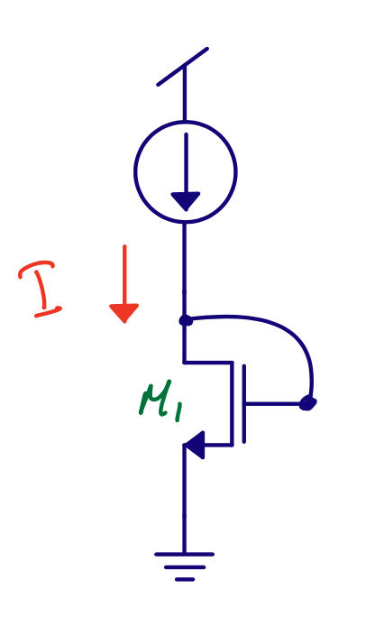

footer: Carsten Wulff 2022
slidenumbers:true
autoscale:true
theme: Plain Jane, 1
text:  Helvetica
header:  Helvetica

<!--pan_title: Analog Design Fundamentals -->

<!--pan_skip: -->

## TFE4188 - Lecture 1
# Analog design fundamentals

---

<!--pan_skip: -->

# Goal for today

Choosing transistor sizes is **complicated**

How to make **state-of-the-art** designs

**Recommendations** for transistor sizes

---


<!--pan_skip: -->

#[fit] Complicated

---

## Analog Design Process

[.column]
- Define the problem, what are you trying to solve?
- Find a circuit that can solve the problem (papers, books)
- **Find right transistor sizes. What transistors should be weak inversion, strong inversion, or don't care?**
- Check operating region of transistors (.op)
- Check key parameters (.dc, .ac, .tran)

[.column]
- Check function. Exercise all inputs. Check all control signals
- Check key parameters in all corners. Check mismatch (Monte-Carlo simulation)
- Do layout, and check it's error free. Run design rule checks (DRC). Check layout versus schematic (LVS)
- Extract parasitics from layout. Resistance, capacitance, and inductance if necessary.
- On extracted parasitic netlist, check key parameters in all corners and mismatch (if possible).
- If everything works, then your done.

*On failure, go back as far as necessary*

---

Assume active ($$V_{ds} > V_{eff}$$ in strong inversion, or $$V_{ds} > 3 V_T$$ in weak inversion) <sub>For diode connected transistors, this is always true</sub>

Weak inversion 

 $$ I_{D} = I_{D0} \frac{W}{L} e^{V_eff / n V_T} $$, $$V_{eff} \propto \ln{I_D} $$

Strong inversion 

 $$ I_{D} = \frac{1}{2} \mu_n C_{ox} \frac{W}{L} V_{eff}^2$$, $$V_{eff} \propto \sqrt{I_D} $$

**Operating region for a diode connected transistor only depends on the current**



---


[.column]
 

[.column]

# Flavors

<!--pan_doc:

Mosfets come in flavors, we can separate into PMOS and NMOS. 

-->

Random 130 nm MOS technology

| Parameter | Min  | Max | Unit |
|-----------|------|-----|------|
| L         | 0.13 | 100 | um   |
| W         | 0.15 | 50  | um   |

Assume 5n quantization.  Permutations per transistor (P)
 $$P = 2 \times 19974 \times 9970 = 398 \text{ M} $$ 

Typical ADC ~ 20 k transistors 
 $$ P_{ADC} = 20 \text{ k} \times 2 \times 398 \text{ M} = 16 \text{ P}$$

**Too large solution space for exhaustive search**

---
# Picking transistor size

Not possible with exhaustive search

Simplify as much as possible

Use brain


---

#[fit] State-of-the-art

---

# How to make state-of-the-art designs


Know what is **known**

Find a good **problem** to solve

Find an **architecture** that could work

Work through all **important** details

If publishing, have some **luck**

**There is no magic in state-of-the-art designs**

<sub><sub>However, a fast brain might get there faster. A slow brain may never reach the end.</sub></sub>

---

# My only <sub><sub>published</sub></sub> state-of-the-art design


---

#[fit] Trigger

<!--pan_doc:

Back in November 2009 I was listening to Lanny Lewyn talk about regular layout at NorChip in Trondheim and idea struck 
'I'm pretty sure I'm able to write a script to generate this layout'. In 2010 I started writing the script. 

-->


---
#[fit] Problem


<!--pan_doc:

Although I knew what I wanted to do, generate layout, I needed a problem to solve. It was not enough for me to make something to generate layout. I wanted the generated layout,
and the generated analog blocks, to be better than anything out there. It should be state of the art, even though it was generated, or compiled. 

I don't remember how I choose the problem, but I did see the overview of ADCs and noticed the lack of high efficiency, medium speed ADCs. I also knew from my PhD that 
Walden figure of merit favors low-resolution ADCs. 

-->


---
#[fit] Architecture

<!--pan_doc:

In 2009 there was really only one type of ADC that made sense, the successive-approximation ADC. Using finger capacitors had become common, and 
it was demonstrated that it was OK to use really small capacitors, down to atto farads. 

The thermal noise power of an ADC is in part determined by the capacitor size, given by 

$$ P_{noise} = \frac{k T}{C} $$

Especially in nano-scale, and we were targeting 28 nm FDSOI, it was now possible to design both atto farad unit caps, and approach the thermal limit for 8-bit ADCs. 

I was not sure whether it would be 8-bit, 9-bit or 10-bit that would be the most power optimum for 28 nm FDSOI, so I wanted to make multiple versions.

-->


---
<!--


---
-->

#[fit] Question


Designing a SAR ADC from scratch takes times!

Could I design  "once and for all" a process independent SAR architecture that is tolerant towards supply, temperature, process, mismatch and process technology?


<!--pan_doc:

Could I generate multiple versions, one 8-bit, 9-bit and 10-bit? 

-->

---

#[fit] Plan 

9-bit SAR ADC with 28 nm FDSOI transistors

9-bit SAR ADC with IO voltage (180 nm) FDSOI transistors


---


---

[.column]

# How to make multiple SAR ADCs with limited time?


Spend 50% of time for 6 months to **develop** a tool to make SAR ADCs

Spend 50% of time for 6 months to **make** the SAR ADCs

<!--pan_doc: 
At the time, my language of choice was Perl, so the first version of the script was a 16 k line Perl program that I named cnano.

Cnano was started while I worked at Nordic, and I was able to bring the code with me to NTNU when I started my post doc. 

In the end, cnano turned out out be slow, and the problem of variable type (numbers could be integer or float, but in a controlled manner) was becoming an issue.

As such, I started writing Custom IC Creator abbreviated cic (which actually meant Carstens IC creator ;-) )  in 2014. cic is written in C++, and was developed to replace cnano. After 2017, I stopped maintaining cnano. 

Below is an exceprt of the cic code. You can download cic from [https://github.com/wulffern/ciccreator](https://github.com/wulffern/ciccreator)

-->

[.column]

```cpp
#include "core/layoutcell.h"

typedef QMap<QString,QList<cIcSpice::SubcktInstance*>>  SARgroup;

namespace cIcCells{
    
    class SAR : public cIcCore::LayoutCell
    {
        Q_OBJECT

    public:    
        virtual void place();

        virtual void route();
        
        int getCellWidth(SARgroup groups,QString group);
        
        cIcCore::Instance* placeAlternateMirror(SARgroup groups,QString group, 
            int i, int x ,int y, int xoffset);
        
        int addSarRouting(int y,int msw,int mw);

        static bool sortGraph(cIcCore::Graph* a, cIcCore:: Graph *b);
    
    private:
        Rect* sarn;
        Rect* sarp;
    };       
}

```

---

<!--pan_doc:

I wanted the input data to cnano/cic to be human readable, easy to parse and independent of technology. I also wanted the input data to be independent of 
platform (linux,mac,windows) and CAD vendor (Cadence, Synopsys )

-->


16 k Perl lines. Ported to C++ for speed $$\Rightarrow$$ [ciccreator](https://github.com/wulffern/ciccreator)

---


---


---


---

[A Compiled 9-bit 20-MS/s 3.5-fJ/conv.step SAR ADC in 28-nm FDSOI for Bluetooth Low Energy Receivers](https://ieeexplore.ieee.org/document/7906479)


---


---

#[fit] Result


---

# SUN\_SAR9B\_GF130N
```
├── SAR9B_CV.json
├── SAR9B_CV.spi
├── capacitor.json
├── dmos_gf130nm_core.json
└── gf_130bcdlite.tech
```

9-bit is not the energy optimum for GF130N. The power consumption of the digital is too high. The energy optimum is more like 13-bit, however, the CDAC matching limits performance to about 10/11-bit

$$ \log2[(W_{130n} L_{130n})/(W_{28n} L_{28n} )] = \log2[(0.95\times0.14)/(0.258 \times 0.03)]=4\text{-bit extra}$$


---

#[fit] Recommendations 

---
#[fit] [https://github.com/wulffern/aicex](https://github.com/wulffern/aicex)


---
Typical


---

Temperature


---

Process


---

Process and temperature


---

#[fit] What $$gm/I_d$$ would you pick?


---
Temperature and ```BINN 0 N1_0 i=i(VREF) tc1={0.3/100}```


---
Process, Temperature and ```BINN 0 N1_0 i=i(VREF) tc1={0.3/100}```


---


---


---

## [sun\_tr\_sky130nm](https://github.com/wulffern/sun_tr_sky130nm)

---

## Use a few transistors that you know well. Know all **important** details 

## Use M factor to scale current and $$gm$$. Bus notation M1<9:0> on instance name

## Pick the right bias current for your circuit (constant, constant gm, proportional to temperature)

---

#[fit] Thanks!

