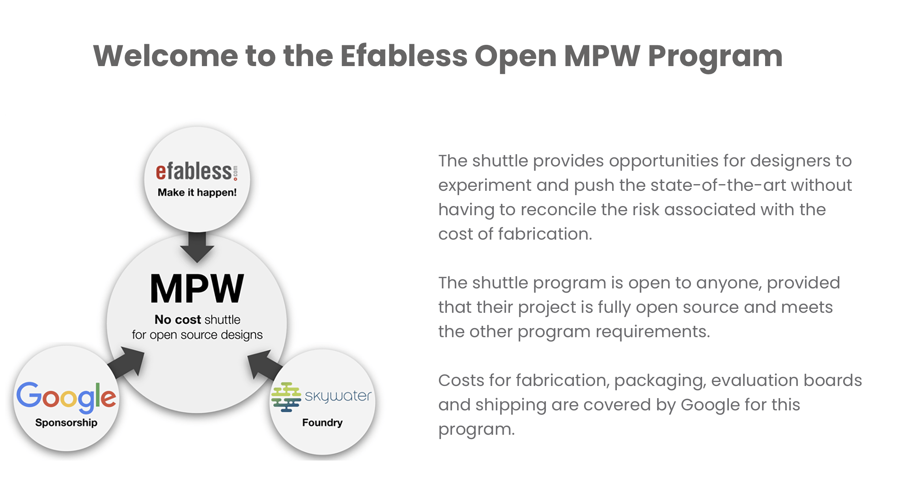
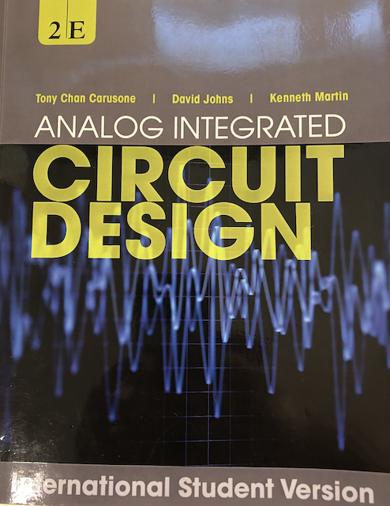
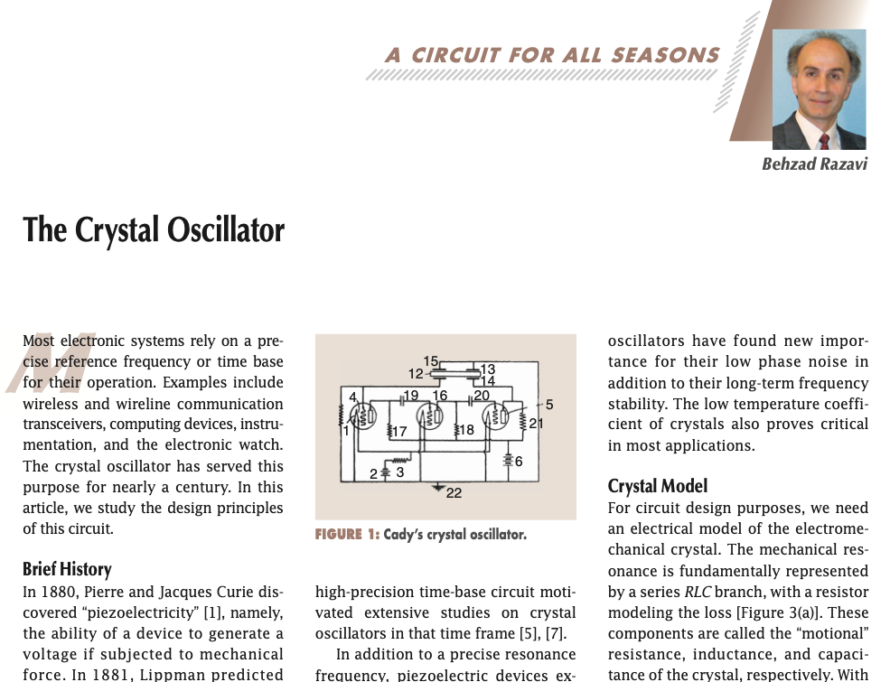

footer: Carsten Wulff 2023
slidenumbers:true
autoscale:true
theme: Plain Jane, 1
text:  Helvetica
header:  Helvetica
    

<!--pan_title: Lecture 1 -  Introduction -->

<!--pan_skip: -->
## [TFE4188 - Lecture 1](https://wulffern.github.io/aic2023/2023/01/12/Lecture-1-Introduction.html) 
# Advanced Integrated Circuits Introduction

---

<!--pan_skip: -->

# [https://wulffern.github.io/aic2023](https://wulffern.github.io/aic2023/)

---


#[fit] Who

---

<!--pan_doc: 
My name is 
-->

Carsten Wulff [carstenw@ntnu.no](carstenw@ntnu.no)

<!--pan_doc: and I've worked in the integrated circuit industry for the past 20 years. 

I finished my Masters in 2002, and did a Ph.D on analog-to-digital converters finished in 2008. 

Since that time, I've had a three axis in my work/hobby life
- I work at  [Nordic Semiconductor](https://www.nordicsemi.com) where I've been since 2008. The first 7 years I did analog design
  (ADCs, DC/DCs, GPIO). From 2015 I've been the Wireless group manager. The Wireless group make most
  of the analog and RF designs for Nordic's short-range products. 
- I work at [NTNU](https://ntnu.no) where I did a part time postdoc from 2014 - 2017. From 2020 I've been working on and teaching [Advanced Integrated
  Circuits](https://www.ntnu.edu/studies/courses/TFE4188#tab=omEmnet)
- I have a hobby trying to figure out how to make a new analog circuit design
  paradigm. The one we have today with
  schematic/simulation/layout/verification/simulation is too slow


This semester I can be found on B311 on Fridays. 
I work 100% at Nordic, and 20% at NTNU, so don't expect that I'm available at all times to answer questions. 


-->


---

<!--pan_skip: -->

# Teaching assistants

- Fredrik Esp Feyling
- Jonathan Sæthre Ege

---

<!--pan_skip: -->

#[fit] Why

---

#[fit] I want you to learn the necessary skills to make your own ICs

<!--pan_doc: 

In 2020 the global integrated circuit market was [437.7 billion dollars](https://www.fortunebusinessinsights.com/integrated-circuit-market-106522)! 
The market is expected to grow to 1136 billion in 2028.

Integrated circuits enable pretty much all technologies.

I will be dead in approximately 50 years, and will retire in approximately 30 years. 
Everything I know will be gone (except for the small pices I've left behind in videos or written word)

Someone must take over, and to do that, they need to know most of what I know. 

That's were some of you come in. Some of you will find integrated circuits interesting to make, and in addition, you have 
the stamina, patience, and brain necessary to learn some of the hardest topics in the world.

> Making integrated circuits (that work reliably) is not rocket science, it's much harder.

In this course we'll mostly focus on analog ICs, because the real world is analog, and all ICs must have some 
analog components, otherwise they won't work.

-->

---

[.column]


<sub> [https://circuitcellar.com/insights/tech-the-future/kinget-the-world-is-analog/](https://circuitcellar.com/insights/tech-the-future/kinget-the-world-is-analog/)</sub>

<!--pan_doc:

The steps to make integrated circuits is split in two. We have a analog flow, and a digital flow. 

It's rare to find a single human that do both flows well. Ususally people choose, and I think it's based on what they like and their personality.

If you like the world to be ordered, with definite answers, then it's likely that you'll find the digital flow interesting.

If you're comfortable with not knowing, and an insatiable desire to understand how the world *really* works at a fundamental level, then 
it's likely that you'll find analog flow interesting. 

-->

---


---

## I would like some of you to tapeout an IC

<!--pan_doc:

Something that would make me really happy is if someone is able to tapeout an IC after this course. 

The fantastic thing that now it's actually possible without signing an NDA or buying expensive software licenses. 

In 2020 Google and Skywater joined forces to release a 130 nm process design kit to the public. In addition, they 
have fuled a renaissance of open source software tools so it's possible to tapeout an IC. 

Together with [Efabless](https://https://efabless.com) they have free shuttles that anyone can join (as long as the design is open source)

-->



---

<!--pan_doc: 

## What the team needs to know to design ICs 

There are a multitude of tools and skills needed to design professional ICs. 
It's not likely that you'll find all the skills in one human, and even if you
could, one human does not have sufficient bandwidth to design ICs with all it's aspects in a 
resonable timeline 

That is, unless we can find a way to ICs alot easier to make.

The skills needed are

-->

- _Project flow support_: **Confluence**, JIRA, risk management (DFMEA), failure analysis (8D)
- _Language_: **English**, **Writing English (Latex, Word, Email)**
- _Psychology_: Personalities, convincing people, presentations (Powerpoint, Deckset), **stress management (what makes your brain turn off?)**
- _DevOps_: **Linux**, bulid systems (CMake, make, ninja), continuous integration (bamboo, jenkins), **version control (git)**, containers (docker), container orchestration (swarm, kubernetes)
- _Programming_: Python, Go, C, C++, Matlab <sub>Since 1999 I’ve programmed in Python, Go, Visual BASIC, PHP, Ruby, Perl, C#, SKILL, Ocean, Verilog-A, C++, BASH, AWK, VHDL, SPICE, MATLAB, ASP, Java, C, SystemC, Verilog, and probably a few I’ve forgotten.</sub>
- _Firmware_: signal processing, algorithms
- _Infrastructure_: **Power management**, **reset**, **bias**, **clocks**
- _Domains_: CPUs, peripherals, memories, bus systems
- _Sub-systems_: **Radio’s**, **analog-to-digital converters**, **comparators**
- _Blocks_: **Analog Radio**, Digital radio baseband
- _Modules_: Transmitter, **receiver**, de-modulator, timing recovery, state machines
- _Designs_: **Opamps**, **amplifiers**,  **current-mirrors**, adders, random access memory blocks, standard cells
- _Tools_: **schematic**, **layout**, **parasitic extraction**, synthesis, place-and-route, **simulation**,  (System)Verilog, **netlist** 
- _Physics_: transistor, pn junctions, quantum mechanics

---
[.background-color: #000000]
[.text: #FFFFFF]

<!--pan_doc: 
# IC design mantra 

To copy an old mantra I have on learning programming 

-->

> Find a problem that you really want to solve, and learn programming to solve it. There is  no point in saying "I want to learn programming", then sit down with a book to read about programming, and expect that you will learn programming that way. It will not happen. The only way to learn programming is to do it, a lot. 
-- Carsten Wulff 

<!--pan_doc:

And run the perl program 

-->


``` perl
s/programming/analog design/ig
```

---

### Zen of IC design (stolen from Zen of Python)

<!--pan_doc: 

When you learn something new, it's good to listen to someone that has done whatever it is before. 

Here is some guiding principles that you'll likely forget. 

-->

[.column]
- Beautiful is better than ugly.
- Explicit is better than implicit.
- Simple is better than complex.
- Complex is better than complicated.
- Readability counts (especially schematics).
- Special cases aren't special enough to break the rules.
- Although practicality beats purity.

[.column]

- In the face of ambiguity, refuse the temptation to guess.
- There should be one __and preferably only one__ obvious way to do it.
- Now is better than never.
- Although never is often better than *right* now.
- If the implementation is hard to explain, it's a bad idea.
- If the implementation is easy to explain, it may be a good idea.

---

<!--pan_skip: -->

#[fit] Course

---

# Goal of lectures

<!--pan_doc: 

Don't expect that I'll magically take information and put it inside your head, and you'll suddenly understand everything about making ICs.

**You are the one that must teach yourself everything.**

I consider my role as a guide, similar to a mountain guide. I can't carry you up the mountain, you need to walk up the mountain
, but I know the safe path to take and increase the likelyhood that you'll come back alive. 

My goal for the lectures is to:

-->

- Enable you to read the book
- Enable you to read papers (latest research)
- Correct misunderstandings of the topic 
- Answer any questions you have on the chapters

<!--pan_doc:

I'm not a mind reader, I can't see inside your head. That means, you must ask questions, only by your questions can I start to understand
what pieces of information is missing from your head, or maybe how to correct your understanding. 

At the same time, and similar to a mountain guide, you should not assume I'm always right. I'm human, and I will make mistakes. 
And maybe you can correct my understanding of something. All I care about is to *really* understand how the world works, so if you think 
my understanding is wrong, then I'll happily discuss. 

-->

---

[.column]
# Plan

**Lectures:**
Thursday at 08:15 - 10:00

The "lectures" will be Q & A's on the topic. If no questions, then I'll ramble on

**Exercise Hours:**
Friday at 14:15 - 16:00 

The TA will be in the "exercise hours", and I also will hopefully join most days.


---

## 

- [Description](https://www.ntnu.no/studier/emner/TFE4188#tab=omEmnet)

- [Time schedule](https://tp.uio.no/ntnu/timeplan/?id=TFE4188&sem=23v&sort=form&type=course)

- [Lecture plan](https://wulffern.github.io/aic2023/plan/)

- [Syllabus](https://wulffern.github.io/aic2023/syllabus/)


---

<!-- 

# Syllabus

The syllabus will be from Analog Integrated Circuit Design (CJM) and Circuits for all seasons. 

Buy a hardcopy of the book if you don't have that. Don't expect to understand the book by reading the PDF. 

-->

 


---

## Exam

- May/June 2022?
- 4 hours
- A - F grade (F = Fail)

---
<!--pan_skip: -->

#[fit] Time to take responsibility for your own future 

---

## Exercises

- Exercises on blackboard now
- Solutions on blackboard after the deadline
- **One compulsory exercise: Exercise 0 - Skywater 130nm tutorial**
- For the rest, two options:
  - Don't do the exercises, don't get feedback
  - Do the exercises, hand them in within deadline, get feedback
- The TA's will only support the exercises in the marked weeks

---

## Project

**Compulsory submission, no exam without submission.**

**Minimum:** Schematic, and simulation of a temperature sensor in sky130B and a project report

**Maximum:** Tapeout submission to [Google/Efabless Open MPW Shuttle](https://efabless.com/open_shuttle_program). **No report necessary.**

Do it in groups, or personal, you decide. 

Deadline: 29 of April 

Strict deadline, if you hand in 30 of April at 00:00:01, then no exam.

---

# RIPLEY (2023)

 "I say we take off and nuke the site from orbit. It's the only way to be sure.", Ellen Ripley, Aliens

### **Design a integrated temperature sensor with digital read-out.**

---

#[fit] Project Report $$\Rightarrow$$ Paper

<!--pan_doc: 

I would be surprised if all of you actually do the tapeout. I'll also be surprised if some of you do the tapeout. 

As such, I my current expectation is that most of you will write the report. It must be in JSSC paper format. See below for an example.

-->

[A Compiled 9-bit 20-MS/s 3.5-fJ/conv.step SAR ADC in 28-nm FDSOI for Bluetooth Low Energy Receivers](https://ieeexplore.ieee.org/document/7906479)

<!--pan_doc:

The report end up in a PDF that is generated with latex and the journal template. 

I don't care what you actually write in, I do some of my work in [Markdown](https://github.com/wulffern/memos/blob/main/2021-07-08_diodes/memo.md) and produce a [PDF](https://github.com/wulffern/memos/blob/main/delivery/2021-07-08_diodes.pdf)

-->

[IEEE journal template](https://ctan.org/pkg/ieeetran?lang=en), [Example](https://github.com/wulffern/jssc2017)

Must use `\documentclass[journal,11pt,letterpaper]{IEEEtran}`

Strict page limit for report, max 8 pages (excluding bio and references). More
than 8 pages $$\Rightarrow$$ Not approved submission, and no exam. 

---

#[fit] Software

<!--pan_doc:

We'll use professional 
-->
Open source software (xschem, ngspice, sky130B PDK, Magic VLSI, netgen)

<!--pan_doc:

I've made a rather detailed (at least I think so myself) tutorial on how to make a current mirror with the open source tools.
I stongly recommend you start with that first. 
-->

 [rply\_ex0\_sky130nm](https://wulffern.github.io/rply_ex0_sky130nm)
 
 
<!--pan_doc:
 
 I've also made some more complex examples, that can be found at the link below. There are digital logic cells, standard transistors, an 9-bit ADC, and a 
 few other blocks. 
 
-->
 
 [aicex](https://wulffern.github.io/aicex)

---

# Lower your expectations on EDA software

Expect that you will spend at least $$2\pi$$ times more time than planned *(mostly due to software issues)* 

---

<!--pan_skip: -->

#[fit] Questions 

---

# Do
- google
- ask a someone in your class
- use the "øvingstime and labratorieøvelse" to talk to teaching assistants and hopefully me. Don't ask about future exercises
- come to the office (B311) on Fridays

---

#[fit] Thanks!


