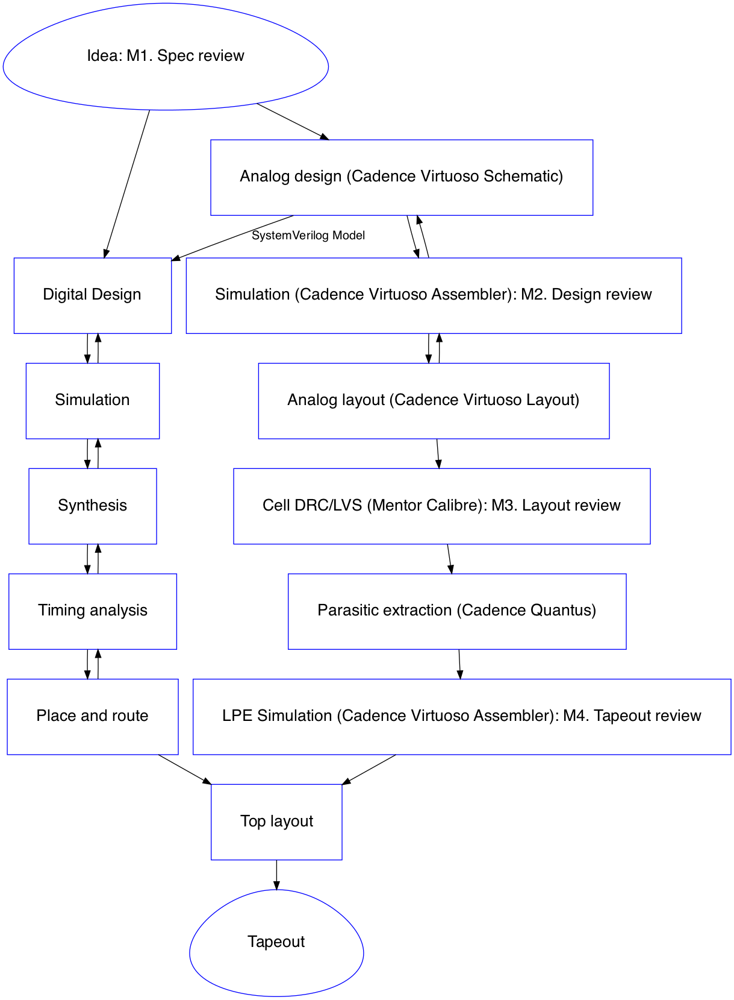

footer: Carsten Wulff 2023
slidenumbers:true
autoscale:true
theme: Plain Jane, 1
text:  Helvetica
header:  Helvetica
    
## TFE4188 - Lecture 1 
# Advanced Integrated Circuits Introduction

## [Source](https://github.com/wulffern/aic2023/blob/main/lectures/l1_intro.md)

---

#[fit] Who

---

# Carsten Wulff [carstenw@ntnu.no](carstenw@ntnu.no)


---

# Teaching assistants

- Fredrik Esp Feyling
- Jonathan Sæthre Ege

---

#[fit] Why

---

#[fit] I want you to learn the necessary skills to make your own ICs

---

[.column]


<sub> [https://circuitcellar.com/insights/tech-the-future/kinget-the-world-is-analog/](https://circuitcellar.com/insights/tech-the-future/kinget-the-world-is-analog/)</sub>


[.column]



---


## I would like some of you to tapeout an IC


---

- _Project flow support_: **Confluence**, JIRA, risk management (DFMEA), failure analysis (8D)
- _Language_: **English**, **Writing English (Latex, Word, Email)**
- _Psychology_: Personalities, convincing people, presentations (Powerpoint, Deckset), **stress management (what makes your brain turn off?)**
- _DevOps_: **Linux**, bulid systems (CMake, make, ninja), continuous integration (bamboo, jenkins), **version control (git)**, containers (docker), container orchestration (swarm, kubernetes)
- _Programming_: Python, Go, C, C++, Matlab <sub>Since 1999 I’ve programmed in Python, Go, Visual BASIC, PHP, Ruby, Perl, C#, SKILL, Ocean, Verilog-A, C++, BASH, AWK, VHDL, SPICE, MATLAB, ASP, Java, C, SystemC, Verilog, and probably a few I’ve forgotten.</sub>
- _Firmware_: signal processing, algorithms
- _Infrastructure_: **Power management**, **reset**, **bias**, **clocks**
- _Domains_: CPUs, peripherals, memories, bus systems
- _Sub-systems_: **Radio’s**, **analog-to-digital converters**, **comparators**
- _Blocks_: **Analog Radio**, Digital radio baseband
- _Modules_: Transmitter, **receiver**, de-modulator, timing recovery, state machines
- _Designs_: **Opamps**, **amplifiers**,  **current-mirrors**, adders, random access memory blocks, standard cells
- _Tools_: **schematic**, **layout**, **parasitic extraction**, synthesis, place-and-route, **simulation**,  (System)Verilog, **netlist** 
- _Physics_: transistor, pn junctions, quantum mechanics

---
[.background-color: #000000]
[.text: #FFFFFF]

> Find a problem that you really want to solve, and learn programming to solve it. There is  no point in saying "I want to learn programming", then sit down with a book to read about programming, and expect that you will learn programming that way. It will not happen. The only way to learn programming is to do it, a lot. 
-- Carsten Wulff 


```perl
s/programming/analog design/ig
```

---

### Zen of IC design (stolen from Zen of Python)

[.column]
- Beautiful is better than ugly.
- Explicit is better than implicit.
- Simple is better than complex.
- Complex is better than complicated.
- Readability counts (especially schematics).
- Special cases aren't special enough to break the rules.
- Although practicality beats purity.

[.column]

- In the face of ambiguity, refuse the temptation to guess.
- There should be one __and preferably only one__ obvious way to do it.
- Now is better than never.
- Although never is often better than *right* now.
- If the implementation is hard to explain, it's a bad idea.
- If the implementation is easy to explain, it may be a good idea.

---


#[fit] Course

---
# Goal of lectures

- Enable you to read the book
- Enable you to read papers (latest research)
- Correct misunderstandings of the topic 
- Answer any questions you have on the chapters

---
[.column]
# Plan

Thursday at 08:15 - 10:00 

The "lectures" will be Q & A's on the topic. If no questions, then I'll ramble on

[Description](https://www.ntnu.no/studier/emner/TFE4188#tab=omEmnet)

[Time schedule](https://tp.uio.no/ntnu/timeplan/?id=TFE4188&sem=23v&sort=form&type=course)

[.column]

---


---

| Week | Book                 | Thursday                  | Topics                                                      |
|------|----------------------|---------------------------|-------------------------------------------------------------|
| 2    | CJM 1-6              | Introduction              | Info, transistors                                           |
| 3    |                      | ICs and their components  | Components, ESD, GGNMOS, Latchup                            |
| 4    | CJM 7,8              | Reference and bias        | Diode voltage, Bandgaps, low voltage bandgaps, bias sources |
| 5    | CJM 12               | Filters                   | Filter synthesis, Gm-C, Active-RC                           |
| 6    | CJM 11-14            | Switched capacitor        | Discrete-Time, Z-domain, Switched capacitor                 |
| 7    | CJM 18               | Oversampling converters   | FOM, Quantization, Oversampling, Noise shaping, Sigma-Delta |
| 8    |                      | Winter holiday            |                                                             |
| 9    | Slides               | Low-power radio recievers | GFSK, QPSK, PSK, QAM, radio blocks                          |
| 10   | CJM 7.4, CFAS,+DC/DC | Voltage regulation        | LDO, ULP, BUCK, BOOST, PWM, PFM                             |
| 11   | CJM 19, CFAS         | PLLs                      | Calculation, VCO, PFD, Loop-filter, dividers                |
| 12   | Paper                | Oscillators               | RC-Oscillators, Crystal oscillators                         |
| 13   |                      | Q & A                     |                                                             |
| 14   |                      | Easter                    |                                                             |
| 15   |                      | Easter                    |                                                             |
| 16   |                      | Q & A                     |                                                             |
| 17   |                      | Q & A                     |                                                             |

---

#[fit] Exam

---

- May/June 2022?
- 4 hours
- A - F grade (F = Fail)

---

#[fit] Time to take responsiblity for your own future 

---

#[fit] Exercises

---

- Exercises on blackboard now
- Solutions on blackboard after the deadline
- Two options:
  - Don't do the exercises, don't get feedback
  - Do the exercises, hand them in within deadline, get feedback
- The TA's will only support the exercises in the marked weeks

---

| Date       | Week | Topic         |
|------------|------|---------------|
| 2023-01-20 | 3    | Transistors   |
| 2023-02-03 | 5    | Bandgap       |
| 2023-02-17 | 7    | Noise         |
| 2023-03-03 | 9    | Discrete time |
| 2023-03-17 | 11   | PLL           |
| 2023-03-31 | 13   | LDO           |

---

#[fit] Project

---

**Compulsory submission, no exam without submission.**

Minimum: Schematic, and simulation of a temperature sensor in sky130B and a project report

Maximum: Tapeout submission to [Google/Efabless Open MPW Shuttle](https://efabless.com/open_shuttle_program). **No report necessary.**

Do it in groups, or personal, you decide. 

Deadline: 29 of April 

Strict deadline, if you hand in 30 of April at 00:00:01, then no exam.

---

# [RIPLEY (2023)](https://www.ntnu.no/wiki/pages/viewpage.action?pageId=263423049)

 "I say we take off and nuke the site from orbit. It's the only way to be sure.", Ellen Ripley, Aliens

### **Design a integrated temperature sensor with digital read-out.**

---

#[fit] Project Report $$\Rightarrow$$ Paper

#[fit] [A Compiled 9-bit 20-MS/s 3.5-fJ/conv.step SAR ADC in 28-nm FDSOI for Bluetooth Low Energy Receivers](https://ieeexplore.ieee.org/document/7906479)

[IEEE journal template](https://ctan.org/pkg/ieeetran?lang=en), [Example](https://github.com/wulffern/jssc2017)

Must use `\documentclass[journal,11pt,letterpaper]{IEEEtran}`

Strict page limit for report, max 8 pages (excluding bio and references). More than 8 pages $$\Rightarrow$$ Fail 

---

#[fit] Software

Open source software (xschem, ngspice, sky130B PDK, Magic VLSI, netgen)

# [aicex](https://github.com/wulffern/aicex)

---

# Lower your expectations on EDA software

---

# Expect that you will spend at least $$2\pi$$ times more time than planned *(mostly due to software issues)* 

---

#[fit] Questions 

---

## Do
- google
- ask a someone in your class
- use the "øvingstime and labratorieøvelse" to talk to teaching assistants. Don't ask about future exercises
- ask in the teams channels
- come to the office (B311) on Thursdays

---

#[fit] Thanks!


