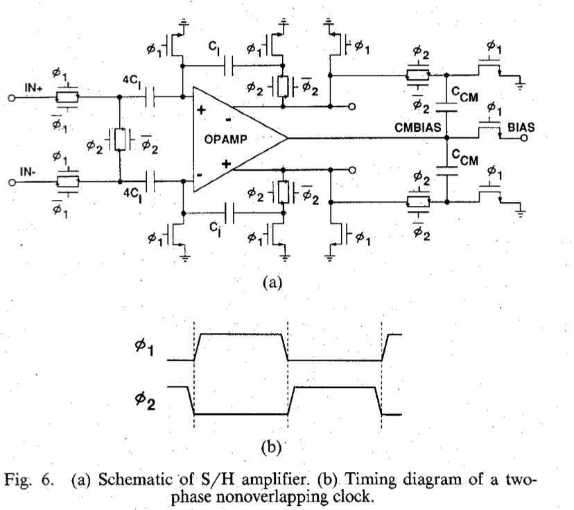
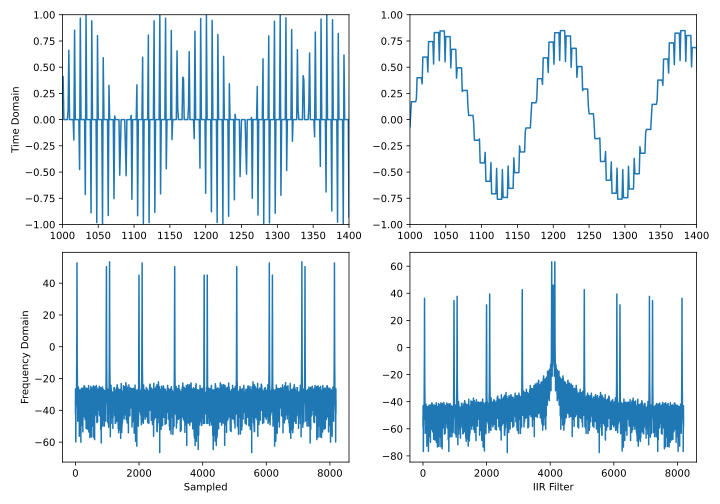
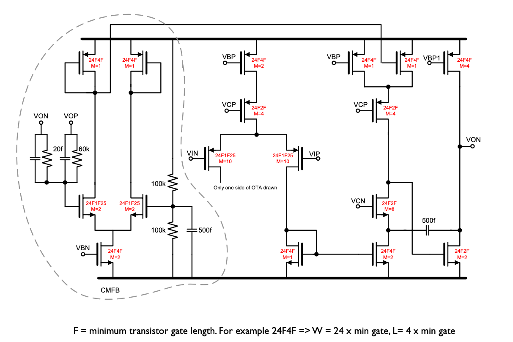
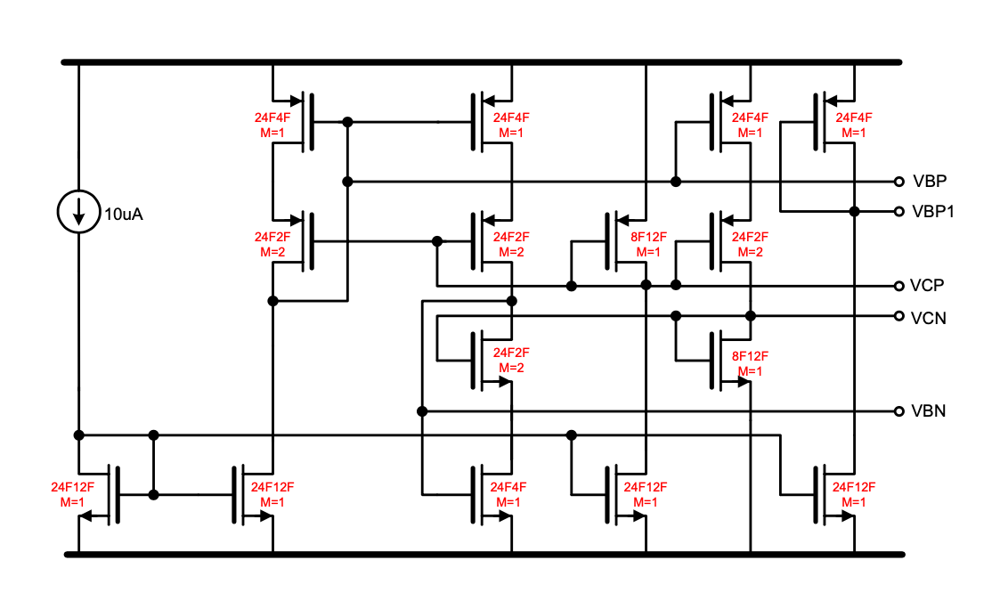

footer: Carsten Wulff 2023
slidenumbers:true
autoscale:true
theme: Plain Jane, 1
text:  Helvetica
header:  Helvetica

<!--pan_skip: -->


<!--pan_title: Lecture 5 - Switched-Capacitor Circuits -->

## TFE4188 - Introduction to Lecture 5
# Switched-Capacitor Circuits

---

<!--pan_doc:

<iframe width="560" height="315" src="https://www.youtube.com/embed/wsxdcsPZiDM" title="YouTube video player" frameborder="0" allow="accelerometer; autoplay; clipboard-write; encrypted-media; gyroscope; picture-in-picture; web-share" allowfullscreen></iframe>

-->

<!--pan_skip: -->

# Goal

Understand **why** we would use switched capacitor circuits

Introduction to **discrete-time**, and **switched capacitor principles** and the **circuits** we need

---

<!--pan_skip: -->

#[fit] Why

---

# Active-RC

<!--pan_doc: 

A general purpose Active-RC bi-quadratic (two-quadratic equations) filter is shown below 

-->


<!--pan_doc:

If you want to spend a bit of time, then try and calculate the transfer function below.

-->


$$H(s) = \frac{\left[ \frac{C_1}{C_B}s^2 + \frac{G_2}{C_B}s + (\frac{G_1G_3}{C_A C_B})\right]}{\left[ s^2  + \frac{G_5}{C_B}s + \frac{G_3 G_4}{C_A C_B}\right]}$$


<!--pan_doc: 

Active resistor capacitor filters are made with OTAs (high output impedance) or OPAMP
(low output impedance). Active amplifiers will consume current, and in Active-RC 
the amplifiers are always on, so there is no opportunity to reduce the current
consumption by duty-cycling (turning on and off).

Both resistors and capacitors vary on an integrated circuit, and the
3-sigma variation can easily be 20 %. 

The pole or zero frequency of an Active-RC filter is proportional to the inverse of the 
product between R and C
-->

$$\omega_{p|z} \propto \frac{G}{C} = \frac{1}{RC}$$

<!--pan_doc:

As a result, the total variation of the pole or zero frequency is can have a 
3-sigma value of 

$$ \sigma_{RC} = \sqrt{ \sigma_R^2 + \sigma_C^2 } = \sqrt{0.02^2 + 0.02^2} = 0.028 = 28 \text{ \%}$$

On an IC we sometimes need to calibrate the R or C in production 
to get an accurate RC time constant.

We cannot physically change an IC, every single one of the 100 million copies
of an IC is from the same Mask set. That's why ICs are cheap. To make the Mask set is 
incredibility expensive (think 5 million dollars), but a copy made from the Mask set can cost one dollar or less. To calibrate we need additional circuits.

Imagine we need a resistor of 1 kOhm. We could create that by parallel connection
of larger resistors, or series connection of smaller resistors. Since we know the maximum
variation is 0.02, then we need to be able to calibrate away +- 20 Ohms. We could have
a 980 kOhm resistor, and then add ten 4 Ohm resistors in series that we can short 
with a transistor switch. 

But is a resolution of 4 Ohms accurate enough? What if we need a precision of 0.1%?
Then we would need to tune the resistor within +-1 Ohm, so we might need 80 0.5 Ohm
resistors. 

But how large is the on-resistance of the transistor switch? Would that 
also affect our precision? 

But is the calibration step linear when we add the transistors. If we have a non-linear 
calibration step, then we cannot use gradient decent calibration algorithms, nor can we
use binary search. 

Analog designers need to deal with an almost infinite series of "But", and 
the experienced designer will know when to stop, when is the "But what if" not 
a problem anymore. 

The most common error in analog integrated circuit design is a "I did not imagine that 
my circuit could fail in this manner" type of problem. Or, not following the line of "But"'s far enough.

But if we follow all the "But"'s we will never tapeout!

Although active-RC filters are great for linearity and easy to drive, but if we need accurate time constant, there are better alternatives.

-->

---


# Gm-C


$$ H(s) = \frac{\left[ s^2\frac{C_X}{C_X + C_B} + s\frac{G_{m5}}{C_X + C_B} + \frac{G_{m2}G_{m4}}{C_A(C_X + C_B)}\right]}
{\left[s^2 + s\frac{G_{m2}}{C_X + C_B} + \frac{G_{m1}G_{m2}}{C_A(C_X + C_B)} \right]}$$

<!--pan_doc:

The pole and zero frequency of a Gm-C filter is 

-->


$$\omega_{p|z} \propto \frac{G_m}{C}$$

<!--pan_doc:

The transconductance accuracy depends on the circuit, and the bias circuit, so we can't give a general, applies for all circuits, sigma number. 
Capacitors do have 3-sigma 20 % variation, usually.

Same as Active-RC, Gm-C need calibration to get accurate pole or zero frequency.

-->

---

# Switched capacitor circuits

<!--pan_doc:

We can make switches and capacitors behave as a resistor. An example of such a
circuit can be found in 

-->

[A pipelined 5-Msample/s 9-bit analog-to-digital converter](https://ieeexplore.ieee.org/document/1052843)

<!--pan_doc:

Shown in the figure below. You should think of the switched capacitor circuit as 
similar to a an amplifier with constant gain. We can use two resistors and an opamp 
to create a gain. Imagine we create a circuit without the switches, and 
with a resistor of $R$ from input to virtual ground, and $4R$ in the feedback. Our Active-R would 
have a gain of $A = 4$. 

You might not believe it, but the circuit below is almost the same, but we've
used switched capacitor. The complete amplifier still has a $A = 4$, but not all the time.

The switches disconect the OTA and capacitors for half the time, but for the other half,
at least for the latter parts of $\phi_2$ the gain is four.

-->



<!--pan_doc: 

The output is only correct for a finite, but periodic, 
time interval. The circuit is discrete time. As long as all circuits afterwards 
also have a discrete-time input, then it's fine. An ADC can sample the output from the amplifier
at the right time, and never notice that the output is shorted to a DC voltage in $\phi_1$

Switched capacitor circuits rely on charge transfer. We charge the capacitor $4C$ to the 
differential input voltage in $\phi_1$

$$ Q_1 = 4 C V_{in} $$

Then we turn off $\phi_1$, which opens all switches. The charge on $4C$ will still be $Q_1$ 
(except for higher order effects like  charge injection from switches).

After a short time (overlap), we turn on $\phi_2$, closing some of the switches.
The OTA will start to force it's two inputs to be the same, and we short the left side of 
$4C$. After some time we would have the same voltage on the left side of $4C$ for the
two capacitors, and another voltage on the left side of the $4C$ capacitors. The two 
capacitors must now have the same charge, so the difference in charge, or differential charge
must be zero. 

Physics tell us that charge is conserved, so our differential charge $Q_1$ cannot vanish into thin air.
The difference in electrons that made $Q_1$ must be somewhere in our circuit.

Assume the designer of the circuit has done a proper job, then the $Q_1$ charge 
will be found on the feedback capacitors.

We now have a $Q_1$ charge on smaller capacitors, so the differential output voltage must be 

$$ Q_1 = 4 C V_{in} = Q_2 = C V_{out} $$

The gain is 

$$A = \frac{V_{out}}{V_{in}} = 4$$

Why would we go to all this trouble to get a gain of 4?

In general, we can sum up with the following equation.

-->

$$\omega_{p|z} \propto \frac{C_1}{C_2}$$

<!--pan_doc:

We can use these "switched capacitor resistors"  to get pole or zero frequency or gain proportional to a the relative size of capacitors, which is a 
fantastic feature. Assume we make two identical capacitors in our layout. We won't know the absolute size of the capacitors on the 
integrated circuit, whether the $C_1$ is 100 fF or 80 fF, but 
we can be certain that if $C_1 = 80$ fF, then $C_2 = 80$ fF to a precision of around 0.1 %. 

With switched capacitor amplfiers we can set an accurate gain, and we can set an accurate pole and zero frequency (as long as we have an accurate cloc and a high
DC gain OTA).
The switched capacitor circuits do have a drawback. They are discrete time circuits.  As such, we must treat them with caution, and they will always need 
some analog filter before to avoid a phenomena we call aliasing. 

-->


---

# Discrete-Time Signals

<!--pan_doc:

An random, gaussian, continuous time, continuous value, signal has infinite information. The frequency can be anywhere from zero to infinity, 
the value have infinite levels, and the time division is infinetly small. We cannot store such a signal. We have to quantize.

If we quantize time to $T = 1\text{ ns}$, such that we only record the value of the signal every 1 ns, 
what happens to all the other information? The stuff that changes at 0.5 ns or 0.1 ns, or 1 ns.

We can always guess, but it helps to know, as in absolutely know, what happens. That's where mathemathics come in. 

With mathematics we can prove things, and know we're right

## The mathematics 

-->
---

[.column]

Define $$ x_c$$ as a continuous time, continuous value signal

Define $$ 
\ell(t) = \begin{cases}
1 & \text{if } t \geq 0 \\
0 & \text{if } t < 0
\end{cases}
$$

<!--pan_doc: which makes $\ell(t)$ a step function. -->

Define $$ x_{sn}(t) = \frac{x_c(nT)}{\tau}[\ell(t-nT) - \ell(t - nT - \tau)]$$

<!--pan_doc: 
where $x_{sn}(t)$ is a function of the continuous time signal at the time interval $nT$. 
-->

Define $$ x_s(t) = \sum_{n=-\infty}^{\infty}{x_{sn}(t)}$$

<!--pan_doc:

where $x_s(t)$ is the sampled, continuous time, signal. 
-->

[.column]

Think of a sampled version of an analog signal as an infinite sum of pulse trains where the area under the pulse train is equal to the analog signal. 

__Why do this?__


---


<!--pan_doc:

With a exact definition of a sampled signal in the time-domain it's sometimes possible to find the Laplace transform, and see how the frequency 
spectrum looks.

-->


[.column]

If $$ x_s(t) = \sum_{n=-\infty}^{\infty}{x_{sn}(t)}$$

Then $$ X_{sn}(s) = \frac{1}{\tau}\frac{1 - e^{-s\tau}}{s} x_c(nT)e^{-snT} $$

And  $$ X_s(s) = \frac{1}{\tau}\frac{1 - e^{-s\tau}}{s} \sum_{n=-\infty}^{\infty}x_c(nT)e^{-snT}$$

Thus $$ \lim_{\tau \to 0} \rightarrow X_s(s) = \sum_{n=-\infty}^{\infty}x_c(nT)e^{-snT}$$

Or $$ X_s(j\omega) = \frac{1}{T}\sum_{k=-\infty}^{\infty} X_c\left(j\omega - \frac{j k 2 \pi}{T}\right)$$

[.column]

**The spectrum of a sampled signal is an infinite sum of frequency shifted spectra**

or equivalenty

**When you sample a signal, then there will be copies of the input spectrum at every $$ nf_s$$**

However, if you do an FFT of a sampled signal, then all those infinite spectra will fold down between $$ 0 \to f_{s1}/2$$ or $$- f_{s1}/2 \to f_{s1}/2$$ for a complex FFT

<!--pan_doc:

## Python discrete time example

If your signal processing skills are a bit thin, now might be a good time to read up on [FFT](https://en.wikipedia.org/wiki/Fast_Fourier_transform),
[Laplace transform](https://en.wikipedia.org/wiki/Laplace_transform) and [But what is the Fourier Transform?](https://www.youtube.com/watch?v=spUNpyF58BY)

In python we can create a demo and see what happens when we "sample" an "continous time" signal. Hopefully it's obvious that it's impossible to emulate a "continous time"
signal on a digital computer. After all, it's digital (ones and zeros), and it has a clock!

We can, however, emulate to any precision we want. 

The code below has four main sections. First is the time vector. I use [Numpy](https://numpy.org), which has a bunch of useful 
features for creating ranges, and arrays. 

Secondly, I create continuous time signal. The time vector can be used in numpy functions, like `np.sin()`, and I combine three sinusoid plus some onise. 
The sampling vector is a repeating pattern of 11001100, so our sample rate should be 1/2'th of the input sample rate. 
FFT's can be unweieldy beasts. I like to use [coherent sampling](https://en.wikipedia.org/wiki/Talk%3ACoherent_sampling), however, with 
mutiple signals and samplerates I did not bother to figure out whether it was possible.

The alternative to coherent sampling is to apply a window function before the FFT, that's the reason for the 
Hanning window below.

-->

---

[dt.py](https://github.com/wulffern/aic2023/blob/main/ex/dt.py)

```python 
#- Create a time vector
N = 2**13
t = np.linspace(0,N,N)

#- Create the "continuous time" signal with multiple sinusoidal signals and some noise
f1 = 233/N
fd = 1/N*119
x_s = np.sin(2*np.pi*f1*t) + 1/1024*np.random.randn(N) +   0.5*np.sin(2*np.pi*(f1-fd)*t) + 0.5*np.sin(2*np.pi*(f1+fd)*t)

#- Create the sampling vector, and the sampled signal
t_s_unit = [1,1,0,0,0,0,0,0]
t_s = np.tile(t_s_unit,int(N/len(t_s_unit)))
x_sn = x_s*t_s

#- Convert to frequency domain with a hanning window to avoid FFT bin
#- energy spread
Hann = True
if(Hann):
    w = np.hanning(N+1)
else:
    w = np.ones(N+1)
X_s = np.fft.fftshift(np.fft.fft(np.multiply(w[0:N],x_s)))
X_sn = np.fft.fftshift(np.fft.fft(np.multiply(w[0:N],x_sn)))
```

---

<!--pan_doc:

Try to play with the code, and see if you can understand what it does. 

Below are the plots. On the left side is the "continous value, continous time" emulation, on the right side 
"discrete time, continous value". 

The top plots are the time domain, while the bottom plots is frequency domain. 

The FFT is complex, so that's why there are six sinusoid's bottom left. The "0 Hz" would be at x-axis index 4096 ($2^{13}/2$). 

The spectral copies can be seen bottom right. How many spectral copies, and the distance between them will depend on the sample rate (length of `t_s_unit`). 
Try to play around with the code and see what happens.
-->


---

<!--pan_doc:

## Aliasing, bandwidth and sample rate theory

I want you to internalize that the spectral copies are real. They are not some "mathematical construct" that we don't have to deal with.

They are what happens when we sample a signal into discrete time. 
Imagine a signal with a band of interest as shown below in greeen. We sample at $f_s$. The pink and red unwanted signals do
not dissapear after sampling, even though they are above the Nyquist frequency ($f_s/2$). They fold around $f_s/2$, and in may 
appear in-band. That's why it's important to band limit analog signals before they are sampled. 

-->


---

<!--pan_doc:

With an anti-alias filter (yellow) we ensure that the unwanted components are low enough before sampling. As a result, 
our wanted signal (green) is undisturbed.

-->


---

<!--pan_doc:

Assume that we we're interested in the red signal. We could still use a sample rate of $f_s$. 
If we bandpass-filtered all but the red signal the red signal would fold on sampling, as shown in the figure below.

Remember that the [Nyquist-Shannon](https://en.wikipedia.org/wiki/Nyquist–Shannon_sampling_theorem) states that a suffient 
no-loss condition is to sample signals with a sample rate of twice the bandwidth of the signal.

Nyquist-Shannon has been extended for sparse signals, compressed sensing, and non-uniform sampling to demonstrate that it's 
sufficient for the average sample rate to be twice the bandwidth. 
One 2009 paper [Blind Multiband Signal Reconstruction: Compressed Sensing for Analog Signal](https://ieeexplore.ieee.org/document/4749297) is 
a good place to start to devlve into the latest on signal reconstruction.

-->


---

<!--pan_doc:

## Z-transform

Someone got the idea that writing

-->

[.column]

$$ X_s(s) = \sum_{n=-\infty}^{\infty}x_c(nT)e^{-snT}$$

<!--pan_doc: 

was cumbersome, and wanted to find something better. 

-->

$$ X_s(z) = \sum_{n=-\infty}^{\infty}x_c[n]z^{-n}$$


[.column]


For discrete time signal processing we use Z-transform


If you're unfamiliar with the Z-transform, read the book or search [https://en.wikipedia.org/wiki/Z-transform](https://en.wikipedia.org/wiki/Z-transform)


<!--pan_doc:
The nice thing with the Z-transform is that the exponent of the z tell's you how much delayed the sample $x_c[n]$ is. 
A block that delays a signal by 1 sample could be described as $x_c[n] z^{-1}$, and an accumulator

$$ y[n] = y[n-1] + x[n] $$

in the Z domain would be 

$$Y(z) = z^{-1}Y(z) + X(z) $$

With a Z-domain transfer function of 

$$\frac{Y(z)}{X(z)} = \frac{1}{1 - z^{-1}}$$

-->

---

##[fit] Pole-Zero plots

If you're not comfortable with pole/zero plots, have a look at 

[What does the Laplace Transform really tell us](https://www.youtube.com/watch?v=n2y7n6jw5d0)

<!--pan_doc:

Think about the pole/zero plot as a surface 
your looking down onto.  At $a = 0$ we have the steady state fourier transform. 
The "x" shows the complex frequency where the fourier transform goes to infinity. 

Any real circuit will have complex conjugate, or real, poles/zeros. A combination of two real circuits where one path is shifted 
90 degrees in phase can have non-conjugate complex poles/zeros.

If the "x" is $a<0$, then any pertubation will eventually die out. 
If the "x" is on the $a=0$ line, then we have a oscillator that will ring forever. If the "x" is  $a>0$ then the oscillation amplitude
will grow without bounds, although, only in Matlab. In any physical circuit an oscillation cannot grow without bounds forever.

Growing without bounds is the same as "being unstable".

-->


---
##[fit] Z-domain

Spectra repeat every $$2\pi$$ 

<!--pan_doc:
As such, it does not make sense to talk about a plane with a $a$ and a $j\omega$. Rather we use the complex number $z = a + jb$.

As long as the poles ("x") are within the unit circle, oscillations will die out. If the poles are on the unit-circle, then we 
have an oscillator. Outside the unit circle the oscillation will grow without bounds, or in other words, be unstable.


We can translate between Laplace-domain and Z-domain with the 
-->
Bi-linear transform 

$$ s = \frac{z -1}{z + 1}$$

<sub>Warning: First-order approximation [https://en.wikipedia.org/wiki/Bilinear_transform](https://en.wikipedia.org/wiki/Bilinear_transform)</sub>


---
## First order filter 

<!--pan_doc:

Assume a first order filter given by the discrete time equation. 

-->

$$ y[n+1] = bx[n] + ay[n] \Rightarrow Y z = b X + a Y$$

<!--pan_doc:
The "n" index and the "z" exponent can be choosen freely, which sometimes can help the algebra.
-->

$$ y[n] = b x[n-1] + ay[n-1] \Rightarrow Y = b X z^{-1} + a Y z^{-1}  $$ 

<!--pan_doc:
The transfer function can be computed as 
-->

$$ H(z) = \frac{b}{z-a}$$

<!--pan_doc:

From the discrete time equation we can see that the impulse will never die out. We're adding the previous output to the current input.
That means the circuit has infinite memory. Accordingly, filters of this type are known as. 
-->
Infinite-impulse response (IIR)

$$ h[n] = \begin{cases} k & \text{if } n < 1 \\ a^{n-1}b + a^n k & \text{if } n \geq 1 \end{cases}$$


<sub> Head's up: Fig 13.12 in AIC is wrong </sub>

<!--pan_doc:

From the impulse response it can be seen that if $a > 1$, then the filter is unstable. Same if $b > 1$. As long as $|a + jb| < 1$
the filter should be stable.

-->


<!--pan_doc:

The first order filter can be implemented in python, and it's really not hard. See below. The $x_sn$ vector is from the previous
python example. 

There are smarter, and faster ways to do IIR filters (and FIR) in python, see [scipy.signal.iirfilter](https://docs.scipy.org/doc/scipy/reference/generated/scipy.signal.iirfilter.html)

[iir.py](https://github.com/wulffern/aic2023/blob/main/ex/iir.py)
```python
#- IIR filter
b = 0.3
a = 0.25
z = a + 1j*b
z_abs = np.abs(z)
print("|z| = " + str(z_abs))
y = np.zeros(N)
y[0] = a
for i in range(1,N):
    y[i] = b*x_sn[i-1] + y[i-1]
```

From the plot below we can see the sampled time domain and spectra on the left, and the filtered time domain and spectra on the right.

The IIR filter we implemented above is a low-pass filter, and the filter partially rejects the copied spectra, as expected. 



-->

---

## Finite-impulse response(FIR)

<!--pan_doc:

FIR filters are unconditionaly stable, since the impulse response
will always die out. FIR filters are a linear sum of delayed inputs.

In my humble opinion, there is nothing wrong with an IIR. Yes, the could become unstable, however, they can be designed safely.
I'm not sure there is a theological feud on IIR vs FIR, I suspect there could be. Talk to someone that knows digital filters better than me. 

But be wary of rules like "IIR are always better than FIR" or visa versa. Especially if statements are written in books. Remember that 
the book was probably written a decade ago, and based on papers two decades old, which were based on three decades old state of the art. 
Our abilities to use computers for design has improved a bit the last three decades.

Try to modify the IIR filter, and implement the FIR below instead.
-->

$$ H(z) = \frac{1}{3}\sum_{i=0}^2 z^{-1}$$


---

#[fit] Switched-Capacitor


---

<!--pan_skip: -->

## **Q:** How do switched capacitor circuits work?

---

<!--pan_doc:

Below is an example of a switched-capacitor circuit. It's drawn twice, because there are usually at least 2 phases to a switched-capacitor circuit.
Think of the two phases as two different configurations of a circuit, each with a specific purpose.

On the left we have the SC circuit during the sampling phase. Imagine that we somehow have stored a voltage $V_1 = \ell$ on capacitor $C_1$ (the switches for
that sampling or storing are not shown). The charge on $C_1$ is $Q_1 = C_1 V_1 = C_1 \ell$

The $C_2$ capacitor is shorted, as such, $V_2 = 0$, which must mean that the charge on $C_2$ given by $Q_2 = 0$.

The voltage at the negative input of the OTA must be 0 V, as the positive input is 0 V, and we assume the circuit has settled all transients.

Imagine we (very carefully) open the circuit around $C_2$ and close the circuit from the negative side of $C_1$ to the OTA negative input. 
It's the OTA that ensures that the negative input is the same as the positive input, but the OTA cannot be infinetly fast. 
At the same time, the voltage across $C_1$ cannot change instantaniously. 
Neither can the voltage across $C_2$. As such, the voltage at the negative input must immediately go to $-\ell$ (ignoring any parasitic capacitance at the negative input). 

The OTA does not like it's inputs to be different, so it will start to charge $C_2$ to increase the voltage at the negative input to the OTA.
When the negative input reaches 0 V the OTA is happy again. 

A key point is, that even the voltages now have changed, there is zero volt across $C_1$, and thus there cannot be any charge across $C_1$ the charge that 
was there cannot have dissapeared. The negative input of the OTA is a high impedance node, and cannot supply charge. The charge must have gone somewhere, but where?

In process of changing the voltage at the negative input of the OTA we've changed the voltage across $C_2$. The voltage change must exactly match 
the charge that was across $C_1$, as such

$$ Q_1 = C_1 \ell =  Q_2 = C_2 V_O$$

thus

$$ \frac{V_O}{\ell} = \frac{C_1}{C_2}$$

-->


---

<!--pan_skip: -->

#[fit] Principles


---

## Switched capacitor gain circuit

---

<!--pan_doc:

Redrawing the previous circuit, and adding a few more swithces we can create a switched capacitor gain circuit.

There is now a switch to sample the input voltage across $C_1$ during phase 1 and reset $C_2$. 
During phase 2 we configure the circuit to leverage the OTA to do the charge transfer from $C_1$ to $C_2$.

--> 


<!--pan_doc:

The discrete time output from the circuit will be as shown below. It's only at the end of the second phase that the 
output signal is valid. As a result, it's common to use the sampling phase of the next circuit close to the end of phase 2. 

For charge to be conserved the clocks for the switch phases must never be high at the same time. 

-->


---

<!--pan_doc:

The discrete time, Z-domain and transfer function is shown below. The transfer function tells us that the circuit is equivalent to a gain, and a delay 
of one clock cycle. The cool thing about switch capacitor circuits is that the precision of the gain is set by the relative size between two capacitors. 
In most technologies that relative sizing can be better than 0.1 %. 

Gain circuits like the one above find use in most Pipelined ADCs, and are common, with some modifications, in Sigma-Delta ADCs.

-->


$$ V_o[n+1] = \frac{C_1}{C_2}V_i[n]$$

$$ V_o z = \frac{C_1}{C_2} V_i$$

$$ \frac{V_o}{V_i} = H(z) = \frac{C_1}{C_2}z^{-1}$$

---

## Switched capacitor integrator 

<!--pan_doc:

Removing one switch we can change the function of the switched capacitor gain circuit. If we don't reset $C_2$ then we 
accumulate the input charge every cycle. 

-->

---


<!--pan_doc:

The output now will grow without bounds, so integrators are most often used in filter circuits, or sigma-delta ADCs where there 
is feedback to control the voltage swing at the output of the OTA. 

-->


---

<!--pan_doc:

Make sure you read and understand the equations below, it's good to realize that discrete time equations, Z-domain and transfer functions
in the Z-domain are actually easy.

-->


$$ V_o[n] = V_o[n-1] + \frac{C_1}{C_2}V_i[n-1]$$

$$V_o - z^{-1}V_o = \frac{C_1}{C_2}z^{-1}V_i $$

<!--pan_doc:

Maybe one confusing thing is that multiple transfer functions can mean the same thing, as below. 
-->

$$ H(z) = \frac{C_1}{C_2}\frac{z^{-1}}{1-z^{-1} } =
\frac{C_1}{C_2}\frac{1}{z-1} $$

---

<!--pan_skip: -->

#[fit] Both phases add noise, $$ V_n^2 > \frac{2 k T}{C}$$

---

<!--pan_doc: 

## Noise 

Capacitors don't make noise, but switched-capacitor circuits do have noise. The noise comes from the thermal, flicker, burst noise in the switches
and OTA's. Both phases of the switched capacitor circuit contribute noise. As such, the output noise of a SC circuit is usually 

$$ V_n^2 > \frac{2 k T}{C}$$

I find that sometimes it's useful with a repeat of mathematics, and since we're talking about noise.

-->

[.background-color: #000000]
[.text: #FFFFFF]

[.column]

<!--pan_doc:
The mean, or average of a signal is defined as 
-->

[Mean](https://en.wikipedia.org/wiki/Mean)
$$ \overline{x(t)} = \lim_{T\to\infty} \frac{1}{T}\int^{+T/2}_{-T/2}{ x(t) dt} $$

<!--pan_doc:
Define 
-->

Mean Square
$$ \overline{x^2(t)} = \lim_{T\to\infty} \frac{1}{T}\int^{+T/2}_{-T/2}{ x^2(t) dt} $$


<!--pan_doc:
How much a signal varies can be estimated from the 
-->
[Variance](https://en.wikipedia.org/wiki/Variance)
$$ \sigma^2 = \overline{x^2(t)} - \overline{x(t)}^2$$

where $$\sigma$$ is the standard deviation.
If mean is removed, or is zero, then
$$ \sigma^2 = \overline{x^2(t)} $$

[.column]
Assume two random processes, $$x_1(t)$$ and $$x_2(t)$$ with mean of zero (or removed).
 $$ x_{tot}(t) =  x_1(t) + x_2(t)$$
 $$ x_{tot}^2(t) = x_1^2(t) + x_2^2(t) + 2x_1(t)x_2(t)$$

Variance (assuming mean of zero) 
$$ \sigma^2_{tot} = \lim_{T\to\infty} \frac{1}{T}\int^{+T/2}_{-T/2}{ x_{tot}^2(t) dt} $$
$$ \sigma^2_{tot} = \sigma_1^2 + \sigma_2^2 + \lim_{T\to\infty} \frac{1}{T}\int^{+T/2}_{-T/2}{ 2x_1(t)x_2(t) dt} $$

**Assuming uncorrelated processes (covariance is zero), then
$$ \sigma^2_{tot} = \sigma_1^2 + \sigma_2^2  $$**

<!--pan_doc:

In other words, if two noises are uncorrelated, then we can sum the variances. If the noise sources are correlated, for example, noise comes from the same transistor, 
but takes two different paths through the circuit, then we cannot sum the variances. We must also add the co-variance.

-->

---

## Sub-circuits for SC-circuits

<!--pan_doc: 

Switched-capacitor circuits are so common that it's good to delve a bit deeper, and understand the variants of the components that make up SC circuits. 

-->

---

<!--pan_skip: --->

#[fit] OTA

---

<!--pan_skip: --->

## **Q:** How many different OTAs do you know?

---

<!--pan_doc:

### OTA

At the heart of the SC circuit we usually find an OTA. Maybe a current mirror, folded cascode, recycling cascode, or my favorite: a fully differential current 
mirror OTA with cascoded, gain boosted, output stage using a parallel common mode feedback.

Not all SC circuits use OTAs, there are also [comparator based SC circuits](https://link.springer.com/article/10.1007/s10470-010-9576-3). 


Below is a fully-differential two-stage OTA that will work with most SC circuits. The notation "24F1F25" means "the width is 24 F" and "length is 1.25 F", where "F"
is the minimum gate length in that technology. 

-->



---

<!--pan_doc:

As bias circuit to make the voltages the below will work

-->




---

<!--pan_skip: --->

#[fit] Switches

---

<!--pan_doc:

### Switches

If your gut reaction is "switches, that's easy", then you're very wrong. Switches can be incredibly complicated. All switches will be made of transistors,
but usually we don't have enough headroom to use a single NMOS or PMOS. We may need a transmission gate

-->


---

<!--pan_doc:

The challenge with transmission gates is that when the voltage at the input is in the middle between VDD and ground then both PMOS and NMOS, although they are on
, they might not be that on. Especially in nano-scale CMOS with a 0.8 V supply and 0.5 V threshold voltage.
The resistance mid-rail might be too large. 

For switched-capacitor circuits we must settle the voltages to the required accuracy. In general

$$t > -\log{\text{error}} \tau$$

For example, for a 10-bit ADC we need $t > -\log(1/1024) \tau = 6.9\tau$. This means we need to wait at least 6.9 time constants for the voltage
to settle to 10-bit accuracy in the switched capacitor circuit.

Assume the capacitors are large due to noise, then the switches must be low resistance for a resonable time constant. Larger switches have 
smaller resistance, however, they also have more charge in the inversion layer, which leads to charge injection when the switches are turned of.
Accordingly, larger switches are not always the solution.

Sometimes it may be sufficient to switch the bulks, as shown on the left below. But more often that one would like, we have to implement bootstrapped switches
as shown on the right. 


-->


---

<!--pan_doc:

The switch I used in my [JSSC SAR](https://ieeexplore.ieee.org/document/7906479) looks like the one below.

Do not underestimate the amount of work that the switches requires. I know a case where 3 really good designers spent 6 months on trying to design the input
switches for an ADC. 

-->


---

<!--pan_skip: --->

#[fit] Non-overlapping clocks

---


<!--pan_doc:

### Non-overlapping clocks

The non-overlap generator is standard. Use the one shown below. Make sure you simulate that the non-overlap is sufficient in all corners.

-->


---

<!--pan_skip: --->

#[fit] Example

---

<!--pan_skip: --->

## **Q:** What is the gain?

---

<!--pan_skip: --->


---

<!--pan_skip: --->

# In the book that you really should read

Parasitic sensitive integrator

Gain circuit that zero's OTA offset

Correlated double sampling

VCO

Peak detectors

---
<!--pan_skip: --->


#[fit] Thanks!

---
