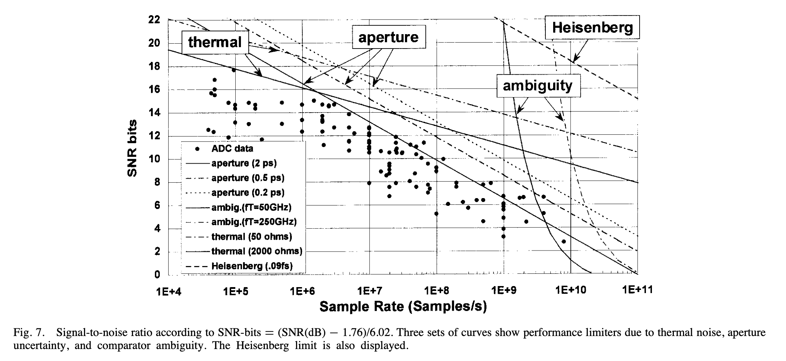

footer: Carsten Wulff 2023
slidenumbers:true
autoscale:true
theme: Plain Jane, 1
text:  Helvetica
header:  Helvetica

<!--pan_skip: -->

## TFE4188 - Introduction to Lecture 6
# Oversampling and Sigma-Delta ADCs

<!--pan_title: Lecture 6 - Oversampling and Sigma-Delta ADCs-->

---

# Goal for today

Understand **why** there are different ADCs

Introduction to **oversampling** and  **delta-sigma** modulators

---

[1999, R. Walden: Analog-to-digital converter survey and analysis](https://ieeexplore.ieee.org/stamp/stamp.jsp?tp=&arnumber=761034)



---

[B. Murmann, ADC Performance Survey 1997-2021 (ISSCC & VLSI Symposium)](https://web.stanford.edu/~murmann/adcsurvey.html)


 


$$ FOM_W = \frac{P}{2^B f_s}$$ 

Below $$ 10 fJ/conv.step$$ is good

Below $$ 1 fJ/conv.step$$ is extreme

---

People from NTNU have made some of the worlds best ADCs

[A Compiled 9-bit 20-MS/s 3.5-fJ/conv.step SAR ADC in 28-nm FDSOI for Bluetooth Low Energy Receivers](https://ieeexplore.ieee.org/document/7906479)

[A 68 dB SNDR Compiled Noise-Shaping SAR ADC With On-Chip CDAC
Calibration](https://ieeexplore.ieee.org/document/9056925)


 

---

[B. Murmann, ADC Performance Survey 1997-2021 (ISSCC & VLSI Symposium)](https://web.stanford.edu/~murmann/adcsurvey.html)


$$FOM_S = SNDR + 10\log\left(\frac{f_s/2}{P}\right)$$ 

Above $$ 180 dB$$ is extreme

---

#[fit] Quantization

---


---


---


---

[.column]

$$e_n(t) = \sum_{p=1}^\infty{A_p\sin{p\omega t}}$$

where p is the harmonic index, and

 $$
A_p = 
\begin{cases}
\delta_{p1}A  + \sum_{m =
  1}^\infty{\frac{2}{m\pi}J_p(2m\pi A)} &, p = \text{ odd} \\
 0 &, p = \text{ even}
\end{cases}
$$

 $$
\delta_{p1}
\begin{cases}
1 &, p=1 \\
0 &, p \neq 1
\end{cases}
$$

and $$J_p(x)$$ is a Bessel function of the first kind, $$A$$ is the amplitude of the input signal.

[.column]

If we approximate the amplitude of the input signal as 

$$A = \frac{2^n - 1}{2} \approx 2^{n-1}$$

where n is the number of bits, we can rewrite as .... 


<sub> See [The intermodulation and distortion due to quantization of sinusoids](https://ieeexplore.ieee.org/document/1164729) </sub>


---

$$e_n(t) = \sum_{p=1}^\infty{A_p\sin{p\omega t}}$$

$$ A_p = \delta_{p1}2^{n-1} + \sum_{m=1}^\infty{\frac{2}{m\pi}J_p(2m\pi
  2^{n-1})},  p=odd$$

---

$$ SQNR = 10 \log\left(\frac{A^2/2}{\Delta^2/12}\right) = 10 \log\left(\frac{6 A^2}{\Delta^2}\right) $$

$$ \Delta = \frac{2A}{2^B}$$

$$ SQNR = 10 \log\left(\frac{6 A^2}{4 A^2/2^B}\right) = 20 B \log 2 + 10 \log 6/4$$

$$ SQNR  \approx 6.02 B + 1.76$$

---


---


---

#[fit] Oversampling

---

In-band quantization noise at an oversampling ratio (OSR)

$$ \frac{\Delta^2}{12 OSR}$$

$$ SQNR = 10 \log\left(\frac{6 A^2}{\Delta^2/OSR}\right) = 10 \log\left(\frac{6 A^2}{\Delta^2}\right) + 10 \log(OSR)$$

$$ SQNR \approx 6.02B + 1.76 + 10 \log(OSR)$$ 


$$ 10 \log(2) \approx 3 dB$$
$$ 10 \log(4) \approx 6 dB$$


**0.5-bit per doubling of OSR**

---

```python
def oversample(x,OSR):
    N = len(x)
    y = np.zeros(N)

    for n in range(0,N):
        for k in range(0,OSR):
            m = n+k
            if (m < N):
                y[n] += x[m]
    return y
```

---


---


---


#[fit] Noise Shaping

---


---


---


--

--


 $$ y[n] = e[n] + h*(u[n] - y[n])$$

 $$ Y(z) = E(z) + H(z)\left[U(z) - Y(z)\right]$$

 Assume U and E are uncorrelated
 
---


--

--

 $$ Y(z) = E(z) + H(z)\left[U(z) - Y(z)\right]$$

 Assume $$E = 0$$

 $$Y = HU - HY $$ 

 $$ STF = \frac{Y}{U} = \frac{H}{1 + H} = \frac{1}{1 + \frac{1}{H}}$$


---


--

--

 $$ Y(z) = E(z) + H(z)\left[U(z) - Y(z)\right]$$

 Assume $$U  = 0 $$
 
 $$ U = 0 \Rightarrow Y = E + HY \rightarrow NTF = \frac{1}{1 + H}$$

---


$$Y(Z) = STF(z) U(z) + NTF(z) E(z)$$

---

#[fit] First-Order Noise-Shaping

---


$$H(z) = \frac{1}{z-1}$$

$$STF = \frac{1/(z-1)}{1 + 1/(z-1)} = \frac{1}{z} = z^{-1}$$

$$NFT = \frac{1}{1 + 1/(z-1)} = \frac{z-1}{z} = 1 - z^{-1}$$

---


 $$NFT =  1 - z^{-1}$$

 $$z = e^{sT} \overset{s=j\omega}{\rightarrow}  e^{j\omega T} = e^{j2 \pi f/f_s}$$

 $$NTF(f) = 1- e^{-j2 \pi f/f_s} $$
 
 $$ = \frac{e^{j \pi f/f_s} -e^{-j \pi f/f_s}}{2j}\times 2j \times e^{-j\pi f/f_s}$$
 
 $$ = \sin{\frac{\pi f}{f_s}} \times 2j \times e^{-j \pi f/f_s}$$


 $$|NFT(f)| = \left|2 \sin\left(\frac{\pi f}{f_s}\right)\right|$$

---

$$ P_s = A^2/2$$
$$ P_n = \int_{-f_0}^{f_0} \frac{\Delta^2}{12}\frac{1}{f_s}\left[2 \sin{\pi f/f_s}\right]^2 dt$$

$$ \vdots $$

$$SQNR = 6.02 B + 1.76 - 5.17 + 30 \log(OSR)$$ 


---

Assume 1-bit quantizer, what would be the maximum ENOB?

| OSR  | Oversampling | First-Order | Second Order | 
|:----:|:------------:|:-----------:|:------------:|
| 4    | 2            | 3.1         | 3.9          |
| 64   | 4            | 9.1         | 13.9         |
| 1024 | 6            | 15.1        | 23.9         |

---

```python
# x_sn is discrete time, continuous value input
dither = 0
M = len(x_sn)
y_sd = np.zeros(M)
x = np.zeros(M)
for n in range(1,M):
    x[n] = x_sn[n-1] + (x_sn[n]-y_sd[n-1])
    y_sd[n] = np.round(x[n]*2**bits  
        + dither*np.random.randn()/4)/2**bits
```
---


---


---
#[fit] Thanks!

---
