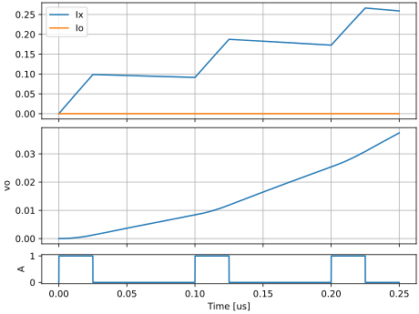
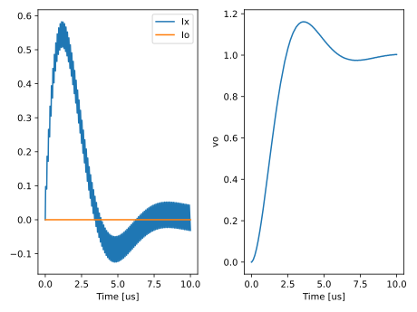
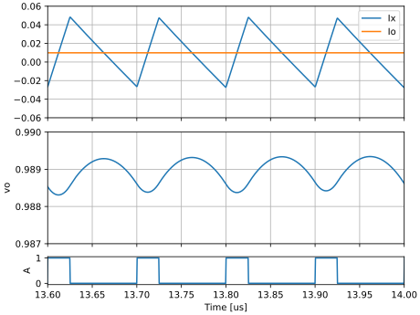
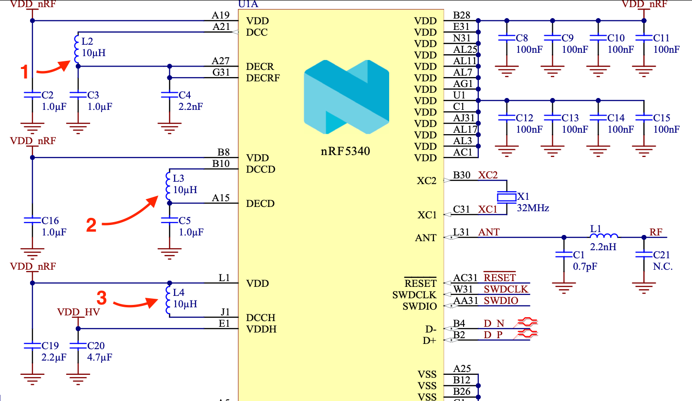
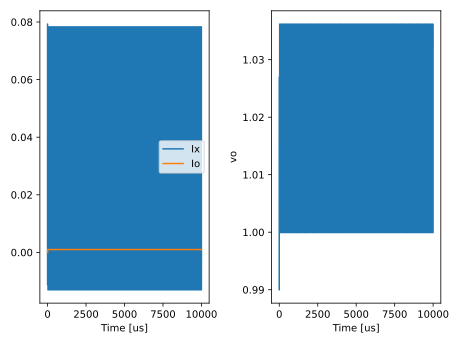

footer: Carsten Wulff 2023
slidenumbers:true
autoscale:true
theme:Plain Jane,1

<!--pan_skip: -->

## TFE4188 - Introduction to Lecture 7
# Voltage regulation

<!--pan_title: Lecture 7 - Voltage regulation -->

---

<!--pan_doc:

<iframe width="560" height="315" src="https://www.youtube.com/embed/GRzz3wxKJGQ" title="YouTube video player" frameborder="0" allow="accelerometer; autoplay; clipboard-write; encrypted-media; gyroscope; picture-in-picture; web-share" allowfullscreen></iframe>

-->

<!--pan_skip: -->

# Goal

**Why** do we need voltage regulation

Introduction to **linear regulators**

Introduction to **switched regulators**

---

<!--pan_skip: -->

#[fit] Why

---

# Voltage source

<!--pan_doc:

Most, if not all, integrated circuits need a supply and ground to work.

Assume a system is AC powered. Then there will be switched regulator to turn wall AC into DC. The DC might be 48 V, 24 V, 12 V, 5 V, 3 V
1.8 V, 1.0 V, 0.8 V, or who knows. The voltage depends on the type of IC and the application.
 
Many ICs are battery operated, whether it's your phone, watch, heart rate monitor, mouse, keyboard, game controller or car.
 
For batteries the voltage is determined by the difference in Fermi level on the two electrodes, and the Fermi level (chemical potential) 
is a function of the battery chemistry.
As a result, we need to know the battery chemistry in order to know the voltage. 

[Linden's Handbook of Batteries](https://www.amazon.com/Lindens-Handbook-Batteries-Fifth-Kirby/dp/1260115925) is a good book
if you want to dive deep into primary (non-chargeable) or secondary (chargeable) batteries and their voltage curves.

-->

<!--pan_doc:

Some common voltage sources are listed below.

-->

|  |Chemistry|  Voltage [V] |
|----|:----|----:|
| Primary Cell| LiFeS2 + Zn/Alk/MnO2 + LiMnO2  | 0.8 - 3.6 |
| Secondary Cell| Li-Ion | 2.5 - 4.3 |
| USB | - | 4.0 - 6.5 (20)|

---

<!--pan_doc:

The battery determines the voltage of the "electron source", however, can't we just run everything directly off the battery? Why do we need DC to DC converters or voltage regulators?

Turns out, transistors can die. 

-->

[.column]

## Core voltage

<!--pan_doc:

The transistors in a particular technology (from GlobalFoundries, TSMC, Samsung or others) have a maximum 
voltage that they can survive for a certain time. Exceed that time, or voltage, and the transistors die. 

### Why transistors die

A gate oxide will break due to Time Dependent Dielectric Breakdown (TDDB) if the voltage across the gate oxide is too large. Silicon oxide can break down at approximately 5 MV/cm. The breakdown forms a conductive channel from the gate to the channel and is permanent. After breakdown there will be a resistor of kOhms between gate and channel. A similar breakdown phenomena is used in [Metal-Oxide RRAM](https://ieeexplore.ieee.org/document/6193402).

The threshold voltage of a transistor can shift excessively over time caused by Hot-Carrier Injection (HCI) or Negative Bias Temperature Instability.

Hot-Carrier injection is caused by electrons, or holes, accelerated to high velocity in the channel, or drain depletion region , causing impact ionization (breaking a co-valent bond releasing an electron/hole pair). At a high drain/source field, and  
medium gate/(source or drain) field, the channel minority carriers can be accelerated to high energy and transition to traps in the oxide, shifting the 
threshold voltage. 

Negative Bias Temperature Instability is a shift in threshold voltage due to a physical change in the oxide. 
A strong electric field across the oxide for a long time can break co-valent, or ionic bonds, in the oxide. The bond break will change the forces (stress) in the amorphous silicon oxide which might not recover. As such, there might be more traps (states) than before. See [Simultaneous Extraction of Recoverable and Permanent Components Contributing to Bias-Temperature Instability](https://ieeexplore.ieee.org/document/4419069) for more details.

### What is traps?

For a long time, I had trouble with "traps in the oxide"". I had a hard time visualizing how electrons wandered down 
the channel and got caught in the oxide. I was trying to imagine the electric field, and that the electron needed to find 
a positive charge in the oxide to cancel. Diving a bit deeper into quantum mechanics, my mental image improved a bit, so I'll
try to give you a more accurate mental model for how to think about traps.

Quantum mechanics tells us that bound electrons can only occupy fixed states. The probability 
of finding an electron in a state is given by Fermi-Dirac statistics, but if there is no energy state at a point in space, there cannot be an electron there.

For example, there might be a 50 % probability of finding an electron in the oxide, but if there is no state there, then there will not be any electron
, and thus no change to the threshold voltage. 

What happens when we make "traps", through TDDB, HCI, or NBTI is that we create new states that can potentially be occupied by electorns. For example one, or more, broken silicon co-valent bonds and a dislocation of the crystal lattice.

If the Fermi-Dirac statistics tells us the probability of an electron being in those new states is 50 %, then there will likely be electrons there.

The threshold voltage is defined as the voltage at which we can invert the channel, or create the same density of electrons in the channel (for NMOS) as  density of dopant
atoms (density of holes) in the bulk. 

If the oxide has a net negative charge (because of electrons in new states), then we have to pull harder 
(higher gate voltage) to establish the channel. As a result, the threshold voltage increases with electrons stuck in the oxide. 

In quantum mechanics the time evolution, and the complex probability amplitude of an electron changing state, could, in theory, be computed with the Schrodinger equation. 
Unfortunately, for any real scenario, like the gate oxide of a transistor, using Schrodinger to compute exactly what will happen is beyond the capability of the 
largest supercomputers. 

### Breakdown voltages

The voltage where the transistor can survive is estimated by the foundry, by approximation, and testing, and may be like the table below. 

-->

| Node [nm] | Voltage [V] |
|:---------:|:-----------:|
| 180       | 1.8         |
| 130       | 1.5         |
| 55        | 1.2         |
| 22        | 0.8         |

[.column]

## IO voltage

<!--pan_doc:

Most ICs talk to other ICs, and they have a voltage for the general purpose input/output. The voltage reduction in I/O voltage does not need to scale as fast 
as the core voltage, because foundries have thicker oxide transistors that can survive the voltage. 
-->

| Voltage [V]|
| ----:|
|5.0|
|**3.0**|  
|*1.8*|
|1.2|

---

<!--pan_doc:

## Supply planning

For any IC, we must know the application. We must know where the voltage comes from, the IO voltage, the core voltage, and any other requirements (like charging batteries).

One example could be an IC that is powered from a Li-Ion battery, with a USB to provide charging capability. 

Between each voltage we need an analog block, a regulator, to reduce the voltage in an effective manner. What type of regulator depends again on the application, 
but the architecture of the analog design would be either a linear regulator, or a switched regulator. 

-->

---

<!--pan_doc:

The dynamic range of the power consumed by an IC can be large. From nA when it's not doing anything, to hundreds of mA when there is high computation load. 

As a result, it's not necessarily possible, or effective, to have one regulator from 1.8 V to 0.8 V. We may need multiple regulators. Some that can
handle low load (nA - $\mu$A) effectively, and some that can handle high loads.

For example, if you design a regulator to deliver 500 mA to the load, and the regulator uses 5 mA, that's only 1 % of the current, which may be OK. 
The same regulator might consume 5 mA even though the load is 1 uA, which would be bad. All the current flows in the regulator at low loads.

-->

| Name      | Voltage | Min [nA] | Max [mA] | PWR DR [dB] |
|:---------:|:--: |:--------:|:--------:|:-----------:|
| VDD\_VBUS |5 |10       | 500      | 77          |
| VDD\_VBAT |4 |10       | 400      | 76          |
| VDD\_IO   |1.8 |10       | 50       | 67          |
| VDD\_CORE |0.8 |10       | 350      | 75          |

---

<!--pan_doc:

Most [product specifications](https://infocenter.nordicsemi.com/topic/ps_nrf5340/chapters/pmu/doc/pmu.html?cp=4_0_0_3) will give you a view into what type of 
regulators there are on an IC. The picture below is from nRF5340

-->

---

<!--pan_skip: -->

#[fit] Linear Regulators

---

<!--pan_doc:

# Linear Regulators

-->

## PMOS pass-fet

<!--pan_doc:

One way to make a regulator is to control the current in a PMOS with a feedback loop, as shown below. The OTA continuously adjusts the gate-source voltage of
the PMOS to force the input voltages of the OTA to be equal.

For digital loads, where $I_{load}$ is a digital current, with high current every rising edge of the clock, it's an option to place a large external decoupling capacitor 
(a reservoir of charge) in parallel with the load. Accordingly, the OTA would supply the average current.

The device between supply (1.5 V) and output voltage (0.8 V) is often called a pass-fet. A PMOS pass-fet regulator is often called a LDO, or low dropout regulator, since
we only need a $V_{DSSAT}$ across the PMOS, which can be a few hundred mV. 

Key parameters of regulators are

| Parameter                    | Description                                                                                               | Unit |
|:----------------------------:|:---------------------------------------------------------------------------------------------------------:|:----:|
| Load regulation              | How much does the output voltage change with load current                                                 | V/A  |
| Line regulation              | How much does the output voltage change with input voltage                                                | V/V  |
| Power supply rejection ratio | What is the transfer function from input voltage to output voltage? The PSRR at DC is the line regulation | dB   |
| Max current                  | How much current can be delivered through the pass-fet?                                                   | A    |
| Quiescent current             | What is the current used by the regulator                                                                 | A    |
| Settling time  | How fast does the output voltage settle at a current step | s|

A disadvantage of a PMOS is the hole mobility, which is lower than for NMOS. If the maximum current of an LDO is large, then the PMOS can be big. Maybe even 
50 % of the IC area.

-->

---

## NMOS pass-fet

<!--pan_doc:

An NMOS pass-fet will be smaller than a PMOS for large loads. The disadvantage with an NMOS is the gate-source voltage needed. For some scenarios the needed gate voltage might
exceed the input voltage (1.5 V). A gate voltage above input voltage is possible, but increases complexity, as a charge pump (switched capacitor regulator) is needed to make 
the gate voltage.

Another interesting phenomena with NMOS pass-fet is that the PSRR is usually better, but we do have a common gate amplifier, as such, high frequency voltage ripple on output voltage
will be amplified to the input voltage, and may cause issues for others using the input voltage.

-->

---

<!--pan_skip: -->

#[fit]LDO's in JSSC

---

<!--pan_skip: -->

[A Scalable High-Current High-Accuracy Dual-Loop Four-Phase Switching LDO for Microprocessors](https://ieeexplore.ieee.org/document/9639005)

---

<!--pan_skip: -->

---

<!--pan_skip: -->

---

<!--pan_skip:-->

#[fit] Switched Regulators

---

<!--pan_doc:

# Switched Regulators

Linear regulator have poor power efficiency. Linear regulators have the same current in the load, as from the input. 

For some applications a poor efficiency might be OK, but for most battery operated systems we're interested in using the electrons from the battery in the most effective manner. 

Another challenge is temperature. A linear regulator with a 5 V input voltage, and 1 V output voltage will have a maximum power efficiency of 20 % (1/5). 80 % of the power is wasted in the pass-fet as heat. 

Imagine a LDO driving an 80 W CPU at 1 V from a 5 V power supply. The power drawn from the 5 V supply is 400 W, as such, 320 W would be wasted in the LDO. A quad flat no-leads (QFN) package usually have a thermal resistance of 20 $^{\circ}$C/W, so if it would be possible, the temperature of the LDO would be 6400 $^{\circ}$C. Obviously, that cannot work. 

For increased power efficiency, we must use switched regulators.

Imagine a switch regulator with 93 % power efficiency. 
The power from the 5 V supply would be $80\text{ W}/ 0.93 = 86\text{ W}$, as such, 
only 6 W is wasted as heat. A temperature increase of $6\text{ W} \times 20\text{ } ^{\circ}\text{C/W}  = 120 ^{\circ}$C is still high, but not impossible with a small heat-sink.

All switched regulators are based on devices that store electric field (capacitors), or magnetic field (inductors). 

## Types of switched-regulators

Mouser has a nice overview of different type of switched regulators. I would encourage you to download the PDF from Mouser. 

A capacitor can be charged to a voltage. Once charged, one can reconfigure a capacitor circuit, for example changing the capacitor circuit from series to parallel (convert down in voltage), or parallel to series (convert up in voltage). See "Charge pumps" in figure below.

An inductor, once charged with a current, will continue to push the current even if we change the voltage across the inductor terminals. As such, we can redirect current, either to charge a capacitor to a higher voltage ( "Step-up", or "Boost" in figure below), or a lower voltage ("Step-down" or "Buck" in figure below), than the input voltage.

-->

[Reference Guide to Switched DC/DC Conversion](https://emea.info.mouser.com/dc-dc-converter-guide?cid=homepage&pid=mouser)

---

## Inductive DC/DC converters

---

<!--pan_doc:

I've found that people struggle with inductive DC/DCs. They see a circuit inductors, capacitors, and transistors and think filters, Laplace and steady state. The path of Laplace and steady state will lead you astray and you won't understand how it works.

Hopefully I can put you on the right path to understanding. 

In the figure below we can see a typical inductive switch mode DC/DC converter. The input voltage is $V_{DDH}$, and the output is $V_O$.

Most DC/DCs are feedback systems, so the control will be adjusted to force the output to be what is wanted, however, let's ignore closed loop for now. 

-->

<!--pan_doc:

To see what happens I find the best path to understanding is to look at the integral equations. 

The current in the inductor is given by
-->

$$I_x(t) = \frac{1}{L} \int{V_x(t) dt}$$

<!--pan_doc:

and the voltage on the capacitor is given by

-->

$$V_o(t) = \frac{1}{C} \int{(I_x(t) - I_o(t))}dt$$

<!--pan_doc:

Before you dive into Matlab, Mathcad, Maple, SymPy or another of your favorite math software, it helps to think a bit.

My mathematics is not great, but I don't think there is any closed form solution to the output voltage of the DC/DC, especially since the state of the NMOS and PMOS is time-dependent.

The output voltage also affect the voltage across the inductor, which affects the current, which affects the output voltage, etc, etc. 

The equations can be solved numerically, but a numerical solution to the above integrals needs initial conditions.

There are many versions of the control block, let's look at two.

-->

---

## Pulse width modulation (PWM)

<!--pan_doc:

Assume $I_x=0$ and $I_{o} = 0$ at $t=0$. Assume the output voltage is $V_O=0$. Imagine we set $A=1$ for a fixed time duration.  The voltage at $V_1=V_{DDH}$, and $V_x = V_{VDDH}-V_O$. As $V_x$ is positive, and roughly constant, the current $I_x$ would increase linearly, as given by the equation of the current above. 

Since the $I_x$ is linear, then the increase in $V_o$ would be a second order, as given by the equation of the output voltage above. 

Let's set $A=0$ and $B=1$ for  fixed time duration (it does not need to be the same as duration as we set $A=1$). The voltage across the inductor would be $V_x = 0 - V_o$. The output voltage would not have increased much, so the absolute value of $V_x$ during $A=1$ would be higher than the absolute value of $V_x$ during the first $B=1$. 

The $V_x$ is now negative, so the current will decrease, however, since $V_x$ is small, it does not decrease much. 
 
I've made a
-->

[Jupyter PWM BUCK model](https://github.com/wulffern/aic2023/blob/main/jupyter/buck.ipynb)

<!--pan_doc:

that numerically solves the equations. 

In the figure below we can see how the current during A increases fast, while during B it decreases little. The output voltage increases similarly to a second order function.

If we run the simulation longer, see plot below, the DC/DC will start to settle into a steady state condition.

On the left we can see the current $I_x$ and $I_o$, on the right you can see the output voltage.  Turns out that the output voltage will be 

$$ V_o = V_{in} \times \text{ Duty-Cycle}$$

, where the duty-cycle is the ratio between the duration of $A=1$ and $B=1$.

-->

<!--pan_doc:

Once the system has fully settled, see figure below, we can see the reason for why DC/DC converters are useful.

During $A=1$ the current $I_x$ increases fast, and it's only during $A=1$ we pull current from $V_{DDH}$. At the start of $A=0$ the current is still positive, which means we pull current from ground. The average current in the inductor is the same as the average current in the load, however, the current from $V_{DDH}$ is lower than the average inductor current, since some of the current comes from ground. 

If the DC/DC was 100% efficient, then the current from the 4 V input supply would be 1/4'th of the 1 V output supply. 100% efficient DC/DC converters violate the laws of nature, as such, we can expect to get up to 9X% under optimal conditions. 

## Real world use

DC/DC converters are used when power efficiency is important. Below is a screenshot of the hardware description in the [nRF5340 Product Specification](https://infocenter.nordicsemi.com/pdf/nRF5340_PS_v1.3.pdf).

We can see 3 inductor/capacitor pairs. One for the "VDDH", and two for "DECRF" and "DECD", as such, we can make a good guess there are three DC/DC converters inside the nRF5340. 

-->

---

---

## Pulsed Frequency Mode (PFM)

<!--pan_doc: 

Power efficiency is key in DC/DC converters. For high loads, PWM, as explained above, is usually the most efficient and practical. 

For lighter loads, other configurations can be more efficient. 

In PWM we continuously switch the NMOS and PMOS, as such, the parasitic capacitance on the $V_1$ node is charged and discharged, consuming power. If the load is close to 0 A, then the parasitic load's can be significant. 

In pulsed-frequency mode we switch the NMOS and PMOS when it's needed. If there is no load, there is no switching, and $V_1$ or $DCC$ in figure below is high impedant. 

-->

---

<!--pan_doc:

Imagine $V_o$ is at 1 V, and we apply a constant output load. According to the integral equations the $V_o$ would decrease linearly. 

In the figure above we observe $V_o$ with a comparator that sets $V_{OL}$ high if the $V_o < V_{REF}$. The output from the comparator could be the inputs to a finite state machine (FSM). 

Consider the FSM below. On $vol=1$ we transition to "UP" state where turn on the PMOS for a fixed number of clock cycles. The inductor current would increase linearly. From the "UP" state we go to the "DOWN" state, where we turn on the NMOS. The inductor current would decrease roughly linearly. 

The "zero-cross" comparator observes the voltage across the NMOS drain/source. As soon as we turn the NMOS on the current direction in the inductor is still from $DCC$ to $V_o$. Since the current is pulled from ground, the $DCC$ must be below ground. As the current in the inductor decreases, the voltage across the NMOS will at some point be equal to zero, at which point the inductor current is zero. 

When $vz=1$ happens in the state diagram, or the zero cross comparator triggers, we transition from the "DWN" state back to "IDLE". Now the FSM wait for the next time $V_o < V_{REF}$. 

-->

---

<!--pan_doc:

I think the name "pulsed-frequency mode" refers to the fact that the frequency changes according to load current, however, I'm not sure of the origin of the name. The name is not important. What's important is that you understand that mode 1 (PWM) and mode 2 (PFM) are two different "operation modes" of a DC/DC converter. 

I made a jupyter model for the PFM mode. I would encourage you to play with them. 

Below you can see a period of the PFM buck. The state can be seen in the bottom plot, the voltage in the middle and the current in the inductor and load in the top plot. 

-->

[Jupyter PFM BUCK model](https://github.com/wulffern/aic2023/blob/main/jupyter/buck_pfm.ipynb)

---

<!--pan_doc:

# Want to learn more?

**Search terms:** regulator, buck converter, dc/dc converter, boost converter

## Linear regulators

[A Scalable High-Current High-Accuracy Dual-Loop Four-Phase Switching LDO for Microprocessors](https://ieeexplore.ieee.org/document/9639005) Overview of fancy LDO schemes, digital as well as analog

[Development of Single-Transistor-Control LDO Based on Flipped Voltage Follower for SoC](https://ieeexplore.ieee.org/document/4436075) In capacitor less LDOs a flipped voltage follower is a common circuit, worth a read. 

[A 200-mA Digital Low Drop-Out Regulator With Coarse-Fine Dual Loop in Mobile Application Processor](https://ieeexplore.ieee.org/document/7740906) Some insights into large power systems. 

## DC-DC converters

[Design Techniques for Fully Integrated Switched-Capacitor DC-DC Converters](https://ieeexplore.ieee.org/document/5948387)
Goes through design of SC DC-DC converters. Good place to start to learn the trade-offs, and the circuits.

[High Frequency Buck Converter Design Using Time-Based Control Techniques](https://ieeexplore.ieee.org/document/6998097)
I love papers that challenge "this is the way". Why should we design analog feedback loops for our bucks, why not design digital feedback loops?

[Single-Inductor Multi-Output (SIMO) DC-DC Converters With High Light-Load Efficiency and Minimized Cross-Regulation for Portable Devices](https://ieeexplore.ieee.org/document/4804971)
Maybe you have many supplies you want to drive, but you don't want to have many inductors. SIMO is then an option

[A 10-MHz 2–800-mA 0.5–1.5-V 90% Peak Efficiency Time-Based Buck Converter With Seamless Transition Between PWM/PFM Modes](https://ieeexplore.ieee.org/document/8187654)
Has some lovely illustrations of PFM and PWM and the trade-offs between those two modes.

[A monolithic current-mode CMOS DC-DC converter with on-chip current-sensing technique](https://ieeexplore.ieee.org/document/1261283)
In bucks converters there are two "religious" camps. One hail to "voltage mode" control loop, another hail to "current mode" control loops. It's good to read about both and make up your own mind. 

-->

<!--pan_skip: -->

#[fit] BUCKs in JSSC

---

<!--pan_skip: -->

[A 10-MHz 2–800-mA 0.5–1.5-V 90% Peak Efficiency Time-Based Buck Converter With Seamless Transition Between PWM/PFM Modes](https://ieeexplore.ieee.org/document/8187654)

<!--pan_skip: -->

---

<!--pan_skip: -->

---

<!--pan_skip: -->

---
<!--pan_skip: -->

## Boost

---

#[fit] Thanks!
