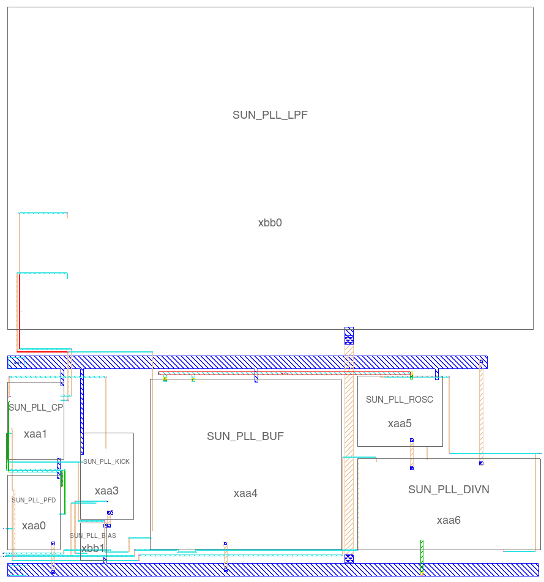
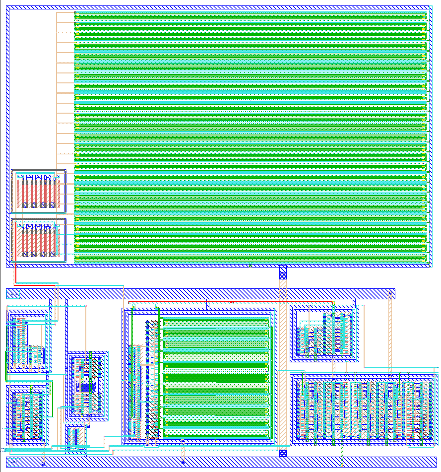

footer: Carsten Wulff 2023
slidenumbers:true
autoscale:true
theme:Plain Jane,1

<!--pan_skip: -->

## TFE4188 - Introduction to Lecture 8
# Clocks and PLLs

<!--pan_title: Lecture 8 - Clocks and PLLs -->


---

<!--pan_doc:

<iframe width="560" height="315" src="https://www.youtube.com/embed/Vahp2tsGWIQ" title="YouTube video player" frameborder="0" allow="accelerometer; autoplay; clipboard-write; encrypted-media; gyroscope; picture-in-picture; web-share" allowfullscreen></iframe>

-->

<!--pan_skip: -->

# Goal

**Why** do we need to generate clocks 

Introduction to **PLLs**

---

<!--pan_skip: -->

#[fit] Why

---

<!--pan_doc: 


# Why clocks?

Virtually all integrated circuits have some form of clock system.

For digital we need clocks to tell us when the data is correct. For Radio's we need clocks to generate the carrier wave. For analog we need 
clocks for switched regulators, ADCs, accurate delay's or indeed, long delays. 

The principle of a clock is simple. Make a 1-bit digital signal that toggles with a period $T$ and a frequency $f = 1/T$.

The implementation is not necessarily simple. 

The key parameters of a clock are the frequency of the fundamental, noise of the frequency spectrum, and stability over 
process and enviromental conditions.


When I start a design process, I want to know why, how, what (and sometimes who). If I understand the problem from first principles
it's more likely that the design will be suitable. 

But proving that something is suitable, or indeed optimal, is not easy in the world of analog design. Analog design is similar
to physics. An hypothesis is almost impossible to prove "correct", but easier to prove wrong. 

## A customer story

Take an example.

### Imagine a world 

> "I have a customer that needs an accurate clock to count seconds". -- Some manager that talked to a customer, but don't understand details.

As a designer, I might latch on to the word "accurate clock", and translate into "most accurate clock in the world", then I'd google atomic clocks, like 
[Rubidium standard](https://en.wikipedia.org/wiki/Rubidium_standard) that I know is based on the hyperfine transition of electrons between two energy levels in rubidium-87. 

I know from quantum mechanics that the hyperfine transition between two energy levels will produce an precise frequency, as the frequency of the 
photons transmitted is defined by $E = \hbar \omega = h f$. 

I also know that quantum electro dynamics is the most precise theory in 
physics, so we know what's going on. 

I know that as long as the Rubidium crystal is clean (few energy states in the vicinity of the hyperfine transition), the distance between atoms stay constant, the temperature 
does not drift too much, then the frequency will be precise. So I buy a [rubidium oscillator](https://www2.mouser.com/ProductDetail/IQD/LFRBXO059244Bulk?qs=iw0hurA%2FaD0K8weKx%2Fu2ow%3D%3D) at 
a cost of \$ 3k.

I design a an ASIC to count the clock ticks, package it plastic, make a box, and give my manager.

Who will most likely say something like 

> "Are you insane? The customer want's to put the clock on a wristband, and make millions. We can't have a cost of \$ 3k per device. You must
make it smaller an it must cost 10 cents to make"

Where I would respond.

> "What you're asking is physically impossible. We can't make the device that cheap, or that small. Nobody can do that."

And both my manager and I would be correct.

### Imagine a better world

Most people in this world have no idea how things work. Very few people are able to understand the full stack. Everyone of us must
simplify what we know to some extent. As such, as a designer, it's your responsibility to fully understand what is asked of you. 

When someone says 

> " I have a customer that needs an accurate clock to count seconds"

Your response should be "Why does the customer need an accurate clock? How accurate? What is the customer going to use the clock for?". Unless you understand the details of the problem, 
then your design will be sub-optimal. It might be a great clock source, but it will be useless for 
solving the problem.

## Frequency

The frequency of the clock is the frequency of the fundamental. If it's a digital clock (1-bit) with 50 % duty-cycle, then we know that a digital 
pulse train is an infinite sum of odd-harmnoics, where the fundamental is given by the period of the train. 


## Noise 

Clock noise have many names. Cycle-to-cycle jitter is how the period changes with time. Jitter may also mean how the period right now
will change in the future, so a time-domain change in the amount of cycle-to-cycle jitter. Phase noise is how the period changes as a 
function of time scales. For example, a clock might have fast period changes over short time spans, but if we average over a year, the period is stable.

What type of noise you care about depends on the problem. Digital will care about the cycle-to-cycle jitter affects on setup and hold times. 
Radio's will care about the frequency content of the noise with an offset to the carrier wave. 

## Stability

The variation over all corners and enviromental conditions is usually given in a percentage, parts per million, or parts per billion. 

For a digital clock to run a Micro-Controller, maybe it's sufficient with 10% accuracy of the clock frequency. For a Bluetooth radio we must
have +-50 ppm, set by the standard. For GPS we might need parts-per-billion. 


## Conclusion

Each "clock problem" will have different frequency, noise and stability requirements. You must know the order of magnitude of those before you can design a clock source. There is no "one-solution fits all" clock generation IP.


# A typical System-On-Chip clock system

On the [nRF52832 development kit](https://www.nordicsemi.com/Products/Development-hardware/nrf52-dk) you can see some components that indicate what type of clock system must be inside the IC. 

In the figure below you can see the following items.
-->

1. 32 MHz crystal
2. 32 KiHz crystal
3. In PCB antenna
4. DC/DC inductor 


<!--pan_doc:

## 32 MHz crystal 

Any Bluetooth radio will need a frequency reference. We need to generate an accurate 2.402 MHz - 2.480 MHz carrier frequency for the 
gaussian frequency shift keying (GFSK) modulation. The Bluetooth Standard requires a +- 50 ppm accurate timing refrence, and carrier frequency offset accuracy.

I'm not sure it's possible yet to make an IC that does not have some form of frequency reference, like a crystal. The ICs I've seen 
so far that have "crystal less radio" usually have a resonator (crystal or bulk-accustic-wave or MEMS resonator) on die. 

The power consumption of a high frequency crystal will be proportional to frequency. Assuming we have a digital output, then the power of that
digital output will be $P = C V^2 f$, for example 
$P = 100\text{ fF} \times 1\text{ V}^2 \times 32\text{ MHz} = 3.2\text{ } \mu\text{W}$
is probably close to a minimum power consumption of a 32 MHz clock.

## 32 KiHz crystal 

Reducing the frequency, we can get down to minimum power consumption of $P = 100\text{ fF} \times 1\text{ V}^2 \times 32\text{ KiHz} = 3.2 \text{ nW}$ for a clock. 

For a system that sleeps most of the time, and only wakes up at regular ticks to do something, then a low-frequency crystal might be worth the effort. 

## PCB antenna

Since we can see the PCB antenna, we know that the IC includes a radio. From that fact we can deduce what must be inside the SoC. If we read 
the [Product Specification](https://infocenter.nordicsemi.com/index.jsp?topic=%2Fstruct_nrf52%2Fstruct%2Fnrf52832_ps.html) we can understand more.

## DC/DC inductor

Since we can see a large inductor, we can also make the assumption that the IC contains a switched regulator. That switched regulator, especially if it has a pulse-width-modulated control loop, will need a clock. 

-->

---

<!--pan_doc: 

From our assumptions we could make a guess what must be inside the IC, something like the picture below.

There will be a crystal oscillator connected to the crystal. We'll learn about those later.

These crystal oscillators generate a fixed frequency, 32 MHz, or 32 KiHz, but there might be other clocks needed inside the IC.

To generate those clocks, there will be phase-locked loops (PLL), frequency locked loops (FLL), or delay-locked loops (DLL). 

PLLs take a reference input, and can generate a higher frequency, (or indeed lower frequency) output. A PLL is a magical block. It's one of the few analog IPs where we can actually design for infinite gain in our feedback loop.

-->


---

<!--pan_doc:

Most of the digital blocks on an IC will be synchronous logic, see figure below. A fundamental principle of sychnronous logic is that the data at the flip-flops (DFF, rectangles with triangle clock input, D, Q and $\overline{\text{Q}}$) only need to be correct at certain times. 

The sequence of transitions in the combinatorial logic is of no consequence, as long as the B 
inputs are correct when the clock goes high next time.

The registers, or flip-flops, are your SystemVerilog "always_ff" code. While the blue cloud is your "always_comb" code. 

In a SoC we have to check, for all paths between a Y[N] and B[M] that the path is fast enough for all transients to settle until the clock
strikes next time. How early the B data must arrive in relation to the clock edge is the setup time of the DFFs.

We also must check for all paths that the B[M] are held for long enough after the clock strikes such that our flip-flop does not change 
state. The hold time is the distance from the clock edge to where the data is allowed to change. Negative hold times are common in DFFs, so the data can start to change before the clock edge.

In an IC with millions of flip-flops there can be billions of paths. The setup and hold time for every single one must be checked. One could imagine a simulation 
of all the paths on a netlist with parasitics (capacitors and resistors from layout) to check the delays, but there are so many combinations
that the simulation time becomes unpractical. 

Static Timing Analysis (STA) is a light-weight way to check all the paths. For the STA we make a model of the delay in each cell (captured in a liberty file), the setup/hold times of all flip-flops, wire propagation delays, clock frequency (or period), and the variation in the clock frequency. The process, voltage, temperature variation must also be checked for all components, so the number of liberty files can quickly grow large. 

For an analog designer the constraints from digital will tell us what's the maximum frequency we can have at any point in time, and what is the maximum cycle-to-cycle variation in the period.

-->


---

#[fit] PLL

<!--pan_doc:

PLL, or it's cousins FLL and DLL are really cool. A PLL is based on the familiar concept of feedback, shown in the figure below. As long
as we make $H(s)$ infinite we can force the output to be an exact copy of the input. 

-->

---


---

<!--pan_doc:

For a frequency loop the figure looks a bit different. If we want a higher output frequency we can divide the frequency by a number (N) 
and compare with our reference (for example the 32 MHz reference from the crystal oscillator). 

We then take the error, apply a transfer function $H(s)$ with high gain, and control our oscillator frequency. 

If the down-divided output frequency is too high, we force the oscillator to a lower frequency. If the down-divided output frequency
is too low we force the oscillator to a higher frequency. 

If we design the $H(s)$ correctly, then we have $f_o = N \times f_{in}$

Sometimes you want a finer freuqnecy resolution, in that case you'd add a divider on the reference and get $f_o = N \times \frac{f_{in}}{M}$.. 

-->


---

<!--pan_doc:

I've made an example [PLL](https://github.com/wulffern/sun_pll_sky130nm) that you can download and play with. I make no claims that 
it's a good PLL. Actually, I know it's a bad PLL. The ring-oscillator frequency varies to fast with the voltage control.  But it does give you a starting point.

A PLL can consist of a oscillator (SUN\_PLL\_ROSC) that generates our output frequency. A divider (SUN\_PLL\_DIVN) that generates a feedback frequency that we can compare to the reference. A Phase and Frequency Detector (SUN\_PLL\_PFD) and a charge-pump (SUN\_PLL\_CP) that model the $+$, or the comparison function in our previous picture. And a loop filter (SUN\_PLL\_LPF and SUN\_PLL\_BUF) that is our $H(s)$.

-->


---

#[fit]PLLs need calculation!

 \#noCowboyDesign

<!--pan_doc:

Read any book on PLLs, talk to any PLL designer and they will all tell you the same thing. **PLLs require calculation**. You must 
setup a linear model of the feedback loop, and calculate the loop transfer function to check the stability, and the loop gain. 
**This is the way!** (to quote Mandalorian).

But how can we make a linear model of a non-linear system? The voltages inside a PLL must be non-linear, they are clocks. A PLL is not linear 
in time-domain!

I have no idea who first thought of the idea, but it turns out, that one can model a PLL as a linear system if one consider the phase of the voltages inside the PLL. Where the phase is defined as

-->


---

$$ \phi(t) = 2 \pi \int_0^t f(t) dt$$

---

<!--pan_doc:

As long as the bandwidth of the $H(s)$ is about $\frac{1}{10}$ of the reference frequency, then the linear model below holds (at least is good enough).

The phase of our input is $\phi_{in}(s)$, the phase of the output is $\phi(s)$, the divided phase is $\phi_{div}(s)$ and the phase error is $\phi_d(s)$. 

The $K_{pd}$ is the gain of our phase-frequency detector and charge-pump. The $K_{lp}H_{lp}(s)$ is our loop filter $H(s)$. 
The $K_{osc}/s$ is our oscillator transfer function. And the $1/N$ is our feedback divider. 


-->


## Loop gain

<!--pan_doc:

The loop transfer function can then be analyzed and we get.

-->


$$ \frac{\phi_d}{\phi_{in}} = \frac{1}{1 + L(s)}$$ 


$$ L(s) = \frac{ K_{osc} K_{pd} K_{lp} H_{lp}(s) }{N s} $$


<!--pan_doc:

Here is the magic of PLLs. Notice what happens when $s = j\omega = j 0$, or at zero frequency. If we assume that $H_{lp}(s)$ is a low pass filter, then $H_{lp}(0) = \text{constant}$. The loop gain, however, will have a $L(0) \propto \frac{1}{0}$ which approaces infinity at 0. 

That means, we have an infinite DC gain in the loop transfer function. It is the only case I know of in an analog design where we can actually have infinite gain. Infinite gain translate can translate to infinite precision.

If the reference was a Rubidium oscillator we could generate any frequency with the same precision as the frequency of the Rubidium oscillator. Magic. 

For the linear model, we need to figure out the factors, like $K_{vco}$, which must be determined by simulation.

-->


---

## Controlled oscillator

<!--pan_doc:

The gain of the oscillator is the change in output frequency as a function of the change of the control node. For a voltage-controlled oscillator (VCO) we could sweep the control voltage, and check the frequency. The derivative of the f(V) would be proportional to the  $K_{vco}$.

The control node does not need to be a voltage. Anything that changes the frequency of the oscillator can be used as a control node. There 
exist PLLs with voltage control, current control, capacitance control, and digital control. 

For the SUN\_PLL\_ROSC it is the VDD of the ring-oscillator (VDD\_ROSC) that is our control node.

-->

$$K_{osc} = 2 \pi\frac{ df}{dV_{cntl}}$$


---


### [SUN\_PLL\_SKY130NM/sim/ROSC/](https://github.com/wulffern/sun_pll_sky130nm/tree/main/sim/ROSC)

<!--pan_doc:

I simulate the ring oscillator in ngspice with a transient simulation and get the oscilator frequency as a function of voltage. 

**tran.spi**
```spice
let start_v = 1.1
let stop_v = 1.7
let delta_v = 0.1
let v_act = start_v
* loop
while v_act le stop_v
alter VROSC v_act
tran 1p 40n
meas tran vrosc avg v(VDD_ROSC)
meas tran tpd trig v(CK) val='0.8' rise=10 targ v(CK) val='0.8' rise=11
let v_act = v_act + delta_v
end
```

I use `tran.py` to extract the time-domain signal from ngspice into a CSV file.

Then I use a python script to extract the $K_{osc}$

**kvco.py**
```python
    df = pd.read_csv(f)
    freq = 1/df["tpd"]
    kvco = np.mean(freq.diff()/df["vrosc"].diff())
```

Below I've made a plot of the oscillation frequency over corners.

-->


---

## Phase detector and charge pump

<!--pan_doc:

The gain of the phase-detector and charge pump is the current we feed into the loop filter over a period. I don't remember why, check in the book for a detailed description.

The two blocks compare our reference clock to our feedback clock, and produce an error signal.

-->


$$ K_{pd} = \frac{I_{cp}}{2 \pi} $$


---

## Loop filter

<!--pan_doc:

In the book you'll find a first order loop filter, and a second order loop filter. Engineers are creative, so you'll likely find other loop filters in the literature.

I would start with the "known to work" loop filters 
before you explore on your own. 

If you're really interested in PLLs, you should buy [Design of CMOS Phase-Locked Loops](https://www.amazon.com/Design-CMOS-Phase-Locked-Loops-Architecture/dp/1108494544) by Behzad Razavi. 

The loop filter has a unity gain buffer. My oscillator draws current, while the VPLF node is high impedant, so I can't draw current from the loop filter without changing the filter transfer function. 

-->

 
$$ K_{lp}H_{lp}(s)= K_{lp}\left(\frac{1}{s} + \frac{1}{\omega_z}\right) $$

$$ K_{lp}H_{lp}(s) = \frac{1}{s(C_1 + C_2)}\frac{1 + s R C_1}{1 +
sR\frac{C_1C_2}{C_1 + C_2}}$$


---

## Divider 

<!--pan_doc:


The divider is modelled as 

-->

$$ K_{div} = \frac{1}{N}$$


---
[.column]


## Loop transfer function

<!--pan_doc:

With the loop transfer function we can start to model what happens in the linear loop. What is the phase response, and what is the gain response. 

-->

$$ L(s) = \frac{ K_{osc} K_{pd} K_{lp} H_{lp}(s) }{N s} $$

[.column]


### Python model

<!--pan_doc:

I've made a python model of the loop, you can find it at
-->
[sun\_pll\_sky130nm/py/pll.py](https://github.com/wulffern/sun_pll_sky130nm/blob/main/py/pll.py)


---

<!--pan_doc:

Below is a plot  of the loop gain, and the transfer function from input phase to divider phase. 

We can see that the loop gain at low frequency is large, and proportional to $1/s$. As such, the phase of the divided down feedback clock is the same as our reference. 

The closed loop transfer function $\phi_{div}/\phi_{in}$ shows us that the divided phase at low frequency is the same as the input phase. Since the phase is the same, and the frequency must be the same, then we know that the output clock will be N times reference frequency.

-->


---

<!--pan_doc:

The top testbench for the PLL is [tran.spi](https://github.com/wulffern/sun_pll_sky130nm/blob/main/sim/SUN_PLL/tran.spi).

I power up the PLL and wait for the output clock to settle. I use [freq.py](https://github.com/wulffern/sun_pll_sky130nm/blob/main/sim/SUN_PLL/freq.py) to plot the frequency as a function of time. The orange curve is the average frequency. We can see that the output frequency settles to 512 MHz.


-->


<!--pan_doc:

You can find the schematics, layout, testbenches, python script etc at [SUN\_PLL\_SKY130NM](https://github.com/wulffern/sun_pll_sky130nm)

Below are a couple layout images of the finished PLL

-->

---


---





<!--pan_doc:

## Want to learn more?

Back in 2020 there was a Master student at NTNU on PLL. I would recommend looking at that 
thesis to learn more, and to get inspired [Ultra Low Power Frequency Synthesizer](https://ntnuopen.ntnu.no/ntnu-xmlui/handle/11250/2778127).


[A Low Noise Sub-Sampling PLL in Which Divider Noise is Eliminated and PD/CP Noise is Not Multiplied by N2](https://ieeexplore.ieee.org/document/5342373)


[All-digital PLL and transmitter for mobile phones](https://ieeexplore.ieee.org/document/1546223)


[A 2.9–4.0-GHz Fractional-N Digital PLL With Bang-Bang Phase Detector and 560-fsrms Integrated Jitter at 4.5-mW Power](https://ieeexplore.ieee.org/document/6006551)

-->


---

<!--pan_skip: -->

## [SUN\_PLL\_SKY130NM](https://github.com/wulffern/sun_pll_sky130nm)

---
<!--pan_skip: -->

#[fit] JSSC PLLs

---
<!--pan_skip: -->


---
<!--pan_skip: -->


---
<!--pan_skip: -->


---
<!--pan_skip: -->


---
<!--pan_skip: -->


---
<!--pan_skip: -->


---


#[fit] Thanks!


