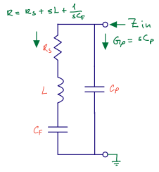
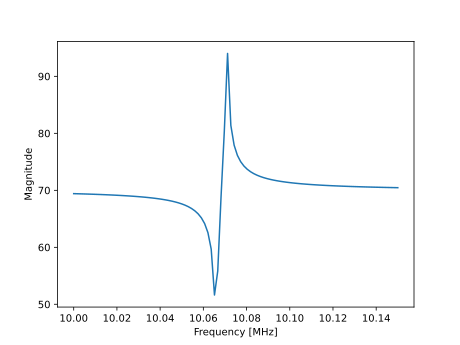
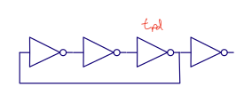
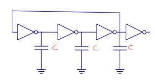
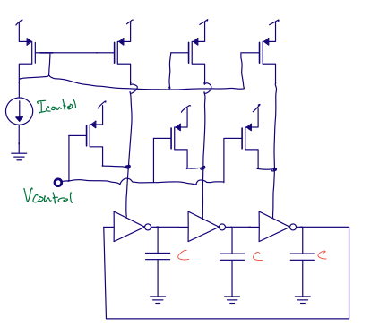
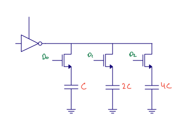
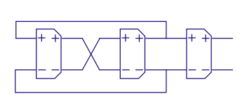
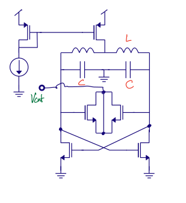
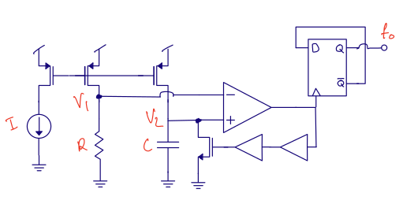

footer: Carsten Wulff 2023
slidenumbers:true
autoscale:true
theme:Plain Jane,1

<!--pan_skip: -->

## TFE4188 - Introduction to Lecture 9
# Oscillators

<!--pan_title: Lecture 9 - Oscillators -->

---

# Goal

<!--pan_skip: -->

Introduction to **Crystal Oscillators**

Introduction to **VCOs**

Introduction to **Relaxation-oscillators**

---

<!--pan_doc: 

<iframe width="560" height="315" src="https://www.youtube.com/embed/V8VYUI_scNM" title="YouTube video player" frameborder="0" allow="accelerometer; autoplay; clipboard-write; encrypted-media; gyroscope; picture-in-picture; web-share" allowfullscreen></iframe>

-->

# Crystal oscillators

---

<!--pan_doc:

The world depends on accurate clocks. From the timepiece on your wrist, to the
phone in your pocket, they all have a need for an accurate
way of counting the passing of time. 

Without accurate clocks an accurate GPS location would not be possible. In GPS
we even correct for [Special and General
Relativity](https://en.wikipedia.org/wiki/Error_analysis_for_the_Global_Positioning_System)
to the tune of about $+38.6 \mu\text{s/day }$.

The most accurate clocks, like [Rubidium standard](https://en.wikipedia.org/wiki/Rubidium_standard), use the hyper-fine splitting of energy levels in atoms,
however, most clocks don't need to be accurate to parts per billion. 

For accuracy's of parts per million, which is sufficient for your wrist watch, or
most communication, it's possible to use crystals.

A quartz crystal can resonate at specific frequencies. If we apply a electric
field across a crystal, we will induce a vibration in the crystal, which can
again affect the electric field. For some history, see [Crystal
Oscillators](https://en.wikipedia.org/wiki/Crystal_oscillator)

-->

---

<!--pan_doc:

The vibrations in the crystal lattice can have many modes, as illustrated by figure below. 

All we need to do with a crystal is to inject sufficient energy to sustain the
oscillation,
and the resonance of the crystal will ensure we have
a correct enough frequency. 

-->

---

<!--pan_doc:

## Impedance

The impedance of a crystal is usually modeled as below. A RLC circuit with a parallel capacitor. 

Our job is to make a circuit that we can connect to the two pins and provide the energy we will loose due to $R_s$. 

-->

Assuming zero series resistance

$$ Z_{in} = \frac{s^2 C_F L + 1}{s^3 C_P L C_F + s C_P + s C_F}$$

<!--pan_doc:

Notice that at $s=0$ the impedance goes to infinity, so a crystal is high impedant at DC. 

-->

Since the 1/(sCp) does not change much at resonance, then 

$$ Z_{in} \approx \frac{L C_F s^2 + 1}{L C_F C_p s^2 + C_F + C_P}$$

See [Crystal oscillator impedance](https://github.com/wulffern/aic2023/blob/main/jupyter/xosc.ipynb) for a detailed explanation.

---

<!--pan_doc:

In the impedance plot below we can clearly see that there are two "resonance" points. Usually noted by series and parallel resonance. 

I would encourage you to read [The Crystal Oscillator](https://ieeexplore.ieee.org/document/7954123) for more details.

-->

---

<!--pan_doc: 

## Circuit

Below is a common oscillator circuit, a Pierce Oscillator. The crystal is the below the dotted line, and the two capacitance's are the on-PCB capacitance's.

Above the dotted line is what we have inside the IC. Call the left side of the inverter XC1 and right side XC2. 
The inverter is biased by a resistor, $R_1$, to keep the XC1 at a reasonable voltage.
The XC1 and XC2 will oscillate in opposite directions. As XC1 increases, XC2 will decrease. The $R_2$ is to model the internal resistance (on-chip wires, bond-wire).

-->

<!--pan_doc: 

-->
**Negative transconductance compensate crystal series resistance**
<!--pan_doc:

The transconductance of the inverter must compensate for the energy loss caused by $R_s$ in the crystal model. 
The transconductor also need to be large enough for the oscillation to start, and build up. 

I've found that sometimes people get confused by the negative transconductance. There is nothing magical about that. 
Imagine the PMOS and the NMOS in the inverter, and that the input voltage is exactly the voltage we need for the current in the
PMOS and NMOS to be the same. If the current in the PMOS and NMOS is the same, then there can be no current flowing in the output.

Imagine we increase the voltage. The PMOS current would decrease, and the NMOS current would increase. We would pull current from the output. 

Imagine we now decrease the voltage instead. The PMOS current would increase, and the NMOS current would decrease.
The current in the output would increase. 

As such, a negative transconductance is just that as we increase the input voltage, the current into the output decreases, and visa versa. 

-->

**Long startup time caused by high Q**

<!--pan_doc:

The [Q factor](https://en.wikipedia.org/wiki/Q_factor) has a few definitions, so it's easy to get confused. Think of Q like this, if 
a resonator has high Q, then the oscillations die out slowly. 

Imagine a perfect world without resistance, and an inductor and capacitor in parallel. Imagine we initially store some voltage across the capacitor, and 
we let the circuit go. The inductor shorts the plates of the capacitor, and the current in the inductor will build up until the voltage across
the capacitor is zero. The inductor still has stored current, and that current does not stop, so the voltage across the capacitor will
become negative, and continue decreasing until the inductor current is zero. At that point the negative voltage will flip the current in the inductor, 
and we go back again. 

The LC circuit will resonate back and forth. If there was no resistance in the circuit, then the oscillation would never die out.
The system would be infinite Q. 

The Q of the crystal oscillator can be described as $Q = 1/(\omega R_s C_f)$, assuming some common values 
of $R_s = 50$, $C_f = 5e^{-15}$ and $\omega = 2 \pi \times 32$ MHz then $Q \approx 20$ k. 

That number may not tell you much, but think of it like this, it will take 20 000 clock cycles before the amplitude falls by 1/e. For example, if the amplitude
of oscillation was 1 V, and you stop introducing energy into the system, then 20 000 clock cycles later, or 0.6 ms, the amplitude would be 0.37 V.

The same is roughly true for startup of the oscillator. If the crystal had almost no amplitude, then an increase $e$ would take 20 k cycles. 
Increasing the amplitude of the crystal to 1 V could take milliseconds. 

Most circuits on-chip have startup times on the order of microseconds, while crystal oscillators have startup time on the order of milliseconds. As such, for low power
IoT, the startup time of crystal oscillators, or indeed keeping the oscillator running at a really low current, are key research topics. 

-->

**Can fine tune frequency with parasitic capacitance**

<!--pan_doc:
The resonance frequency of the crystal oscillator can be modified by the parasitic capacitance from XC1 and XC2 to ground. The tunability of crystals is usually in ppm/pF.
Sometimes micro-controller vendors will include internal [load capacitance's](https://infocenter.nordicsemi.com/topic/ps_nrf5340/chapters/oscillators/doc/oscillators.html?cp=4_0_0_3_11_0_0#concept_internal_caps)
to support multiple crystal vendors without changing the PCB. 

## Temperature behavior

One of the key reasons for using crystals is their stability over temperature. Below is a plot of a typical temperature behavior. The cutting angle of the crystal affect the 
temperature behavior, as such, the closer crystals are to "no change in frequency over temperature", the more expensive they become. 

In communication standards, like Bluetooth Low Energy, it's common to specify timing accuracy's of +- 50 ppm. Have a look in the [Bluetooth Core Specification 5.4](https://www.bluetooth.org/DocMan/handlers/DownloadDoc.ashx?doc_id=556599)
Volume 6, Part A, Chapter 3.1 (page 2653) for details.

-->

---

---

# Controlled Oscillators

<!--pan_doc:

On an integrated circuit way may need multiple clocks, and we can't have crystal oscillators for all of them. We can use frequency locked loops, phase locked loops and delay locked loops
to make multiples of the crystal reference frequency. 

All phase locked loops contain an oscillator where we control the frequency of oscillation.

--> 

---

## Ring oscillator

<!--pan_doc:
The simplest oscillator is a series of inverters biting their own tail, a ring oscillator. 

The delay of each stage can be thought of as a RC time constant, where the R is the transconductance of the inverter, and the C is the gate capacitance
of the next inverter. 
-->

$$ t_{pd} \approx R C $$

$$ R \approx \frac{1}{gm} \approx \frac{1}{\mu_n C_{ox} \frac{W}{L} (VDD - V_{th})}$$

$$ C \approx \frac{2}{3} C_{ox} W L$$

---

<!--pan_doc:

One way to change the oscillation frequency is to change the VDD of the ring oscillator. 
Based on the delay of a single inverter we can make an estimate of the oscillator gain. How large change in frequency do we get for a change in VDD. 

-->

$$ t_{pd} \approx \frac{2/3 C_{ox} W L}{\frac{W}{L} \mu_n C_{ox}(VDD - V_{th})}$$

$$ f = \frac{1}{2 N t_{pd}} = \frac{\mu_n (VDD-V_{th})}{\frac{4}{3} N L^2}$$ 

$$ K_{vco} = 2 \pi \frac{\partial f}{\partial VDD} = \frac{2 \pi \mu_n}{\frac{4}{3} N L^2}$$

<!--pan_doc:

The $K_{vco}$ is proportional to mobility, and inversely proportional to the number of stages and the length of the transistor squared. 
In most PLLs we don't want the $K_{vco}$ to be too large. Ideally we want the ring oscillator to oscillate close to the frequency we want, i.e 512 MHz, and a small
$K_{vco}$ to account for variation over temperature (mobility of transistors decreases with increased temperature, the threshold voltage of transistors decrease with
temperature), and changes in VDD. 

To reduce the $K_{vco}$ of the standard ring oscillator we can increase the gate length, and increase the number of stages. 

I think it's a good idea to always have a prime number of stages in the ring oscillator. I have seen some ring oscillators with 21 stages oscillate at 3 times the frequency 
in measurement. Since $21 = 7 \times 3$ it's possible to have three "waves" of traveling through the ring oscillator at all times, forever. If you use a prime number of stages,
then sustained oscillation at other frequencies cannot happen. 

As such, then number of inverter stages should be $\in [3, 5, 7, 11, 13, 17, 19, 23, 29, 31]$

--->

---
## Capacitive load 

<!--pan_doc:

The oscillation frequency of the ring oscillator can also be changed by adding capacitance. 

-->

$$ f = \frac{\mu_n C_{ox} \frac{W}{L} (VDD - V_{th})}{2N\left(\frac{2}{3}C_{ox}WL + C\right)}$$

$$ K_{vco} = \frac{2 \pi \mu_n C_{ox} \frac{W}{L}}{2N\left(\frac{2}{3}C_{ox}WL + C\right)}$$

<!--pan_doc:

Assume that the extra capacitance is much larger than the gate capacitance, then 

$$ f = \frac{\mu_n C_{ox} \frac{W}{L} (VDD - V_{th})}{2N C }$$

$$ K_{vco} = \frac{2 \pi \mu_n C_{ox} \frac{W}{L}}{2N C }$$

And maybe we could make the $K_{vco}$ relatively small. 

The power consumption of an oscillator, however, will be similar to a digital circuit of $P = C \times f \times VDD^2$, so increasing capacitance will also increase
the power consumption. 

-->

---
## Realistic 

<!--pan_doc:

Assume you wanted to design a phase-locked loop, what type of oscillator should you try first? If the noise of the clock is not too important, so you don't need an 
LC-oscillator, then I'd try the oscillator below, although I'd expand the number of stages to fit the frequency.

The circuit has a capacitance loaded ring oscillator fed by a current. The $I_{control}$ will give a coarse control of the frequency, while the $V_{control}$ can give a
more precise control of the frequency.

Since the $V_{control}$ can only increase the frequency it's important that the $I_{control}$ is set such that the frequency is below the target. 

Most PLLs will include some form of self calibration at startup. At startup the PLL will do a coarse calibration to find a sweet-spot for $I_{control}$, and then use $V_{control}$
to do fine tuning. 

Since PLLs always have a reference frequency, and a phase and frequency detector, it's possible to sweep the calibration word for $I_{control}$ and then check whether the output
frequency is above or below the target based on the phase and frequency detector output. Although we don't know exactly what the oscillator frequency is, we can know the frequency close enough.

It's also possible to run a counter on the output frequency of the VCO, and count the edges between two reference clocks. That way we can get a precise 
estimate of the oscillation frequency. 

Another advantage with the  architecture below is that we have some immunity towards supply noise. If we decouple both the current mirror, and the $V_{control}$ towards VDD, 
then any change to VDD will not affect the current into the ring oscillator. 

Maybe a small side track, but inject a signal into an oscillator from an amplifier, the oscillator will have a tendency to lock to the injected signal, we call 
this "injection locking", and it's common to do in ultra high frequency oscillators (60 - 160 GHz). Assume we allow the PLL to find the right $V_{control}$ that corresponds
to the injected frequency. Assume that the injected frequency changes, for example frequency shift keying (two frequencies that mean 1 or 0), as in Bluetooth Low Energy.
The PLL will vary the $V_{control}$ of the PLL to match the frequency change of the injected signal, as such, the $V_{control}$ is now the demodulated frequency change. 

Still today, there are radio recievers that use a PLLs to directly demodulate the incoming frequency shift keyed modulated carrier. 

-->

<!--pan_doc:

We can calculate the $K_{vco}$ of the oscillator as shown below. The inverters mostly act as switches, and when the PMOS is on, then the rise time is controlled 
by the PMOS current mirror, the additional $V_{control}$ and the capacitor. For the calculation below we assume that the pull-down of the capacitor by the NMOS 
does not affect the frequency much.

The advantage with the above ring-oscillator is that we can control the frequency of oscillation with $I_{control}$
and have a independent $K_{vco}$ based on the sizing of the $V_{control}$ transistors. 

-->

$$ I = C \frac{dV}{dt}$$

$$ f \approx \frac{ I_{control}  + \frac{1}{2}\mu_p C_{ox} \frac{W}{L} (VDD - V_{control} -
V_{th})^2}{C \frac{VDD}{2} N}$$

$$ K_{vco} = 2 \pi \frac{\partial f}{\partial V_{control}}$$

$$ K_{vco} = 2 \pi  \frac{\mu_p C_{ox} W/L }{C\frac{VDD}{2}N}$$

---

## Digitally controlled oscillator 

<!--pan_doc:

We can digitally control the oscillator frequency as shown below by adding capacitors. 

Today there are all digital loops where the oscillator is not really a "voltage controlled oscillator", but rather a "digital control oscillator". DCOs are common in
all-digital PLLs.

Another reason to use digital frequency control is to compensate for process variation. We know that mobility affects the $K_{vco}$, as such, for fast transistors 
the frequency can go up. We could measure the free-running frequency in production, and compensate with a digital control word.

-->

---

## Differential

<!--pan_doc:

Differential circuits are 
-->
potentially less sensitive to supply noise
<!--pan_doc:
. 

Imagine a single ended ring oscillator. If I inject a voltage onto the input of one of the inverters that was just about to flip, I can either delay the flip, or 
speed up the flip, depending on whether the voltage pulse increases or decreases the input voltage for a while. Such voltage pulses will lead to jitter. 

Imagine the same scenario on a differential oscillator (think diff pair). As long as the voltage pulse is the same for both inputs, then no change will incur. I may change
the current slightly, but that depends on the tail current source. 

Another cool thing about differential circuits is that it's easy to multiply by -1, just flip the wires, as a result, I can use a 2 stage ring differential ring oscillator.
-->

---

## LC oscillator

<!--pan_doc:

Most radio's are based on modulating information on-to a carrier frequency, for example 2.402 GHz for a Bluetooth Low Energy Advertiser. One of the key properties
of the carrier waves is that it must be "clean". We're adding a modulated signal on top of the carrier, so if there is noise inherent on the carrier, then 
we add noise to our modulation signal, which is bad.

Most ring oscillators are too high noise for radio's, we must use a inductor and capacitor to create the resonator. 

Inductors are huge components on a IC. Take a look at the nRF51822 below, the two round inductors are easily identifiable. Actually, based on the die image we can
guess that there are two oscillators in the nRF51822. Maybe it's a [multiple conversion superheterodyne reciever](https://en.wikipedia.org/wiki/Superheterodyne_receiver#Multiple_conversion)

 

Below is a typical LC oscillator. The main resonance is set by the L and C, while the tunability is provided by a varactor, a voltage variable capacitor. Or with
less fancy words, the gate capacitance of a transistor, since the gate capacitance of a transistor depends on the effective voltage, and is thus a "varactor"

The NMOS at the bottom provide the "negative transconductance" to compensate for the loss in the LC tank. 

-->

$$ f \propto \frac{1}{\sqrt{LC}}$$

---

# Relaxation oscillators

<!--pan_doc:

A last common oscillator is the relaxation oscillator, or "RC" oscillator. By know you should be proficient enough in circuits to figure out how the below circuit works.

If you can't figure it out, then ask me.

-->

---

<!--pan_skip: -->

##[fit]Q: Show that Fo is 1/(2RC)

---

# Additional material

## Crystal oscillators

[The Crystal Oscillator - A Circuit for All Seasons](https://ieeexplore.ieee.org/document/7954123)   

[High-performance crystal oscillator circuits: theory and application](https://ieeexplore.ieee.org/document/318)

[Ultra-low Power 32kHz Crystal Oscillators: Fundamentals and Design Techniques](https://ieeexplore.ieee.org/stamp/stamp.jsp?tp=&arnumber=9542926)

[A Sub-nW Single-Supply 32-kHz Sub-Harmonic Pulse Injection Crystal Oscillator](https://ieeexplore.ieee.org/stamp/stamp.jsp?tp=&arnumber=9173539)

## CMOS oscillators

[The Ring Oscillator - A Circuit for All Seasons
](https://ieeexplore.ieee.org/document/8901474)       

[A Study of Phase Noise in CMOS Oscillators](https://ieeexplore.ieee.org/stamp/stamp.jsp?tp=&arnumber=494195)

[An Ultra-Low-Noise Swing-Boosted Differential Relaxation Oscillator in 0.18-um CMOS](https://ieeexplore.ieee.org/stamp/stamp.jsp?tp=&arnumber=9081906)

---

#[fit] Thanks!
