footer: Carsten Wulff 2023
slidenumbers:true
autoscale:true
theme:Plain Jane,1

[.background-color: #00A9CE]

<!--pan_skip: -->

## TFE4188 - Lecture 10
# Low Power Radio

<!--pan_title: Lecture 10 - Low Power Radio -->

---

<!--pan_skip: -->

# Goal

Let's make a radio (or at least, let's **pretend**)

---

[.background-color: #00A9CE]

<!--pan_skip: -->

## Problem statement:

#[fit] Make the best radio ICs for gaming mice

---

<!--pan_skip: -->

## What do we need to know?
- Data Rate
- Carrier Frequency & Range
- Power supply

---

<!--pan_doc:

Radio's are all around us. In our phone, on our wrist, in our house, there is Bluetooth, WiFi, Zigbee, LTE, GPS and many more. 

A radio is a device that receives and transmits light encoded with information. The frequency of the light depends on the standard. How the information is encoded onto 
the light depends on the standard.

Assume that we did not know any standards, what would we do if we wanted to make the best radio IC for gaming mice?

There are a few key concepts we would have to know before we decide on a radio type: Data Rate, Carrier Frequency and range, and the power supply.

-->

#[fit] Data Rate

---

[.column]

## Data 

<!--pan_doc:

A mouse reports on the relative displacement of the mouse as a function of time, some X and Y displacement. A mouse has buttons. There can be many mice in a room, so 
PCs would like to tell them apart, they must have an address. 

A mouse must be low-power. As such, the radio cannot be on all the time. The radio must start up and be ready to receive quickly. We don't know how far 
away from the PC the mice might be, as such, we don't know the dB loss in the communication channel. As a result, the radio needs to have a high dynamic range, from weak signals
to strong signals. In order for the radio to adjust the gain of the reciever we should include a pre-amble, a known sequence, for example 01010101, such that the radio can 
adjust the gain, and also, recover the symbol timing. 

All in all, the packets we send from the mouse may need to have the following bits.

-->

| What | Bits | Why |
| ----  | ---- | ---- |
| X displacement | 8 | |
| Y displacement | 8 | |
| CRC | 4 | Bit errors|
| Buttons| 16 | On-hot coding. Most mice have buttons|
| Preamble| 8 | Synchronization|
| Address | 32 | Unique identifier |
| Total | 76 | |

[.column]

## Rate

<!--pan_doc:

Gamers are crazy for speed, they care about milliseconds. So our mice needs to be able to send and receive data quite often. 
-->

Assume 1 ms update rate

---
## Data Rate

<!--pan_doc:

To compute the data rate, let's do a back of the envelope estimate of the data, and the rate. 

-->

Application Data Rate > 76 bits/ms = 76 kbps

Assume 30 % packet loss

Raw Data Rate > 228 kbps

Multiply by $$\pi$$ > 716 kbps

Round to nearest nice number = 1Mbps

<!--pan_doc:

The above statements are a exact copy of what happens in industry when we start design of something. We make an educated guess. More optimistic people would multiply with $e$. 

-->

---

# [fit] Carrier Frequency & Range

---
## ISM (industrial, scientific and medical) bands

<!--pan_doc:

There are rules and regulations that prevent us from transmitting and receiving at any frequency we want. We need to pick one of the ISM bands, or 
we need to get a license from governments around the world.

But how should we pick? There are at least two criteria that should be investigated. Antenna and Range. 

-->

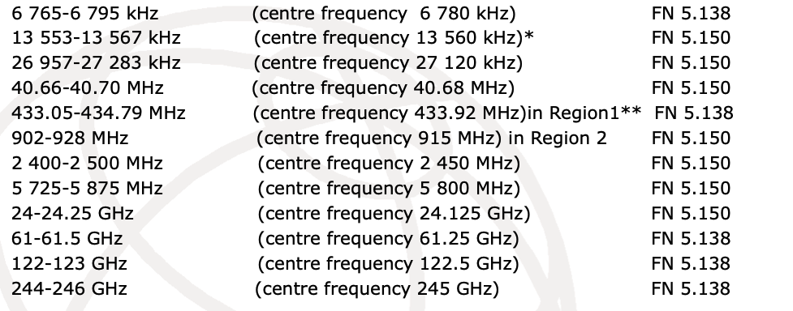

---

## Antenna

<!--pan_doc:

For a mouse we want to hold in our hand, there is a size limit to the antenna. There are many types of antenna, but a
-->
[.column]
assume $$\lambda/4$$ is an OK antenna size ($$\lambda = c/f$$)

<!--pan_doc:

The below table shows the ISM band and the size of a quarter wavelength antenna. Any frequency above 2.4 GHz may be OK from a size perspective. 

-->

[.column]
| ISM band |$$\lambda/4$$ | Unit|OK/NOK|
|---|---:|---:|---:|
| 40.68 MHz | 1.8  | m |:x:|
| 433.92 MHz | 17 | cm|:x:|
| 915 MHz | 8.2 | cm||
| 2450 MHz | 3.06 | cm|:white_check_mark:|
| 5800 MHz | 1.29 | cm|:white_check_mark:|
| 24.125 GHz | 3.1 | mm|:white_check_mark:|
| 61.25 GHz | 1.2 | mm|:white_check_mark:|

---

## Range (Friis)

<!--pan_doc:

One of the worst questions a radio designer can get is "What is the range of your radio?", especially if the people asking are those that don't understand
physics, or the real world. The answer to the question is incredibly complicated, as it depends on exactly what is between two devices talking. 

If we assume, however, that there is only free space, and no real reflections from anywhere, then we can make an estimate of the range. 

-->

[.column]

Assume no antenna gain, power density p at distance D is

$$ p = \frac{P_{TX}}{4 \pi D^2}$$

Assume reciever antenna has no gain, then the effective aperture is

$$ A_e = \frac{\lambda^2}{4 \pi}$$

[.column]

Power received is then

$$P_{RX} = \frac{P_{TX}}{D^2} \left[\frac{\lambda}{4 \pi}\right]^2$$

Or in terms of distance

$$ D = 10^\frac{P_{TX} - P_{RX} + 20 log_{10}\left(\frac{c}{4 \pi f}\right)}{20} $$

---

## Range (Free space)

<!--pan_doc:

If we take the ideal equation above, and use some realistic numbers for TX and RX power, we can estimate a range. 
-->

Assume TX = 0 dBm, assume RX sensitivity is -80 dBm

| Freq | **$$20 log_{10}\left(c/4 \pi f\right)$$** [dB]| D [m]| OK/NOK|
| ----|:----:| ---: | ---:|
| 915 MHz | -31.7 | 260.9 | :white_check_mark:|
| **2.45 GHz** | **-40.2** | **97.4** |:white_check_mark:|
| 5.80 GHz | -47.7 | 41.2 |:white_check_mark:|
| 24.12 GHz | -60.1 | 9.9 | :x:|
| 61.25 GHz | -68.2 | 3.9 | :x:|
| 160 GHz | -76.52| 1.5 | :x:|

---

## Range (Real world)

<!--pan_doc:

In the real world, however, the 
-->

path loss factor, $$ n \in [1.6,6]$$, $$ D = 10^\frac{P_{TX} - P_{RX} + 20 log_{10}\left(\frac{c}{4 \pi f}\right)}{n
\times 10} $$

<!--pan_doc:

So the real world range of a radio can vary more than an order of magnitude. Still, 2.4 GHz seems like a good choice for a mouse. 
-->

| Freq | **$$20 log_{10}\left(c/4 \pi f\right)$$** [dB]| D@n=2 [m]|D@n=6 [m] | OK/NOK|
| ----|:----:| ---: | ---:| ---:|
| **2.45 GHz** | **-40.2** | **97.4** | **4.6** |:white_check_mark:|
| 5.80 GHz | -47.7 | 41.2 | 3.45 |:white_check_mark:|
| 24.12 GHz | -60.1 | 9.9 | 2.1 | :x:|

---

# [fit] Power supply

<!--pan_doc:

We could have a wired mouse for power, but that's boring. Why would we want a wired mouse to have wireless communication? It must be powered by a battery, but 
what type of battery?

There exists a bible of batteries, see picture below. It's worth a read if you want to dive deeper into chemistry and properties of primary (non-chargeable) and secondary (chargeable) cells.

-->

---

## Battery

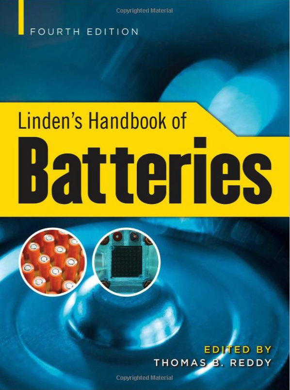

Mouse is maybe AA,  3000 mAh

|Cell |Chemistry|  Voltage (V) | Capacity (Ah) |
|----|:----|----:| ---:|
| AA |LiFeS2  | 1.0 - 1.8 | 3 |
 | 2xAA |LiFeS2  | 2.0 - 3.6 | 3 |
| AA |Zn/Alk/MnO2 | 0.8 - 1.6 | 3 |
| 2xAA |Zn/Alk/MnO2 | 1.6 - 3.2 | 3 |

---
[.background-color: #00A9CE]

# Decisions we must make

<!--pan_doc:

Now we know that we need a 1 Mbps radio at 2.4 GHz that runs of a 1.0 V - 1.8 V or 2.0 V - 3.6 V supply. 

Next we need to decide what modulation scheme we want for our light. How should we encode the bits onto the 2.4 GHz carrier wave?

-->

---

## Modulation scheme

<!--pan_doc:

People have been creative over the last 50 years in terms of encoding bits onto carriers. Below is a small excerpt of some common schemes. 

-->

| Scheme | Acronym|Pro | Con |
| ----| ----|----| ----|
| Binary phase shift keying | BPSK | Simple | Not constant envelope|
| Quadrature phase-shift keying | QPSK |2bits/symbol| Not constant envelope|
| Offset QPSK |OQPSK| 2bits/symbol | Constant envelope with half-sine pulse shaping|
| Gaussian Frequency Shift Keying | GFSK | 1 bit/symbol| Constant envelope|
| Quadrature amplitude modulation| QAM | > 1024 bits/symbol| Really non-constant envelope|

---

<!--pan_doc:

## BPSK

In binary phase shift keying the 1 and 0 is encoded in the phase change. Change the phase 180 degrees and we've transitioned from a 0 to a 1. Do another 180 degrees and
we're back to where we were. 

It's common to show modulation schemes in a constellation diagram with the real axis and the complex axis. 
For the real light we send the phase and amplitude is usually real. 

I say usually, because in quantum mechanics, and the time evolution of a particle, the amplitude of the wave function is actually a complex variable. As such, nature 
is actually complex at the most fundamental level. 

But for now, let's keep it real in the real world.

Still, the maths is much more elegant in the complex plane. 

The equation for the unit circle is $y = e^{i( \omega t + \phi)}$ where $\phi$ is the phase, and $\omega$ is the angular frequency. 

Imagine we spin a bike wheel around at a constant frequency (constant $\omega$), on the bike wheel there is a red dot. If you keep your eyes open all 
the time, then the red dot would go round and round. But imagine that you only opened your eyes every second for a brief moment to see where the dot was. 
Sometimes it could be on the right side, sometimes on the left side. If our "eye opening rate", or your sample rate, matched how fast the "wheel rotator" changed 
the location of the dot, then you could receive information. 

Now imagine you have a strobe light matched to the "normal" carrier frequency. If one rotation of the wheel matched the frequency of the strobe light, then the red dot would
stay in exactly the same place. If the wheel rotation was slightly faster, then the red dot would move one way around the circle at every strobe. If the wheel rotation was
slightly slower, the red dot would move the other way around the circle. 

That's exactly how we can change the position in the constellation. We increase the carrier frequency for a bit to rotate 180 degrees, and we can decrease the frequency to 
go back 180 degrees. In this example the dot would move around the unit circle, and the amplitude of the carrier can stay constant. 

-->

<!--pan_doc:

There is another way to change phase 180 degrees, and that's simply to swap the phase in the transmitter circuit. Imagine as below we have a local oscillator driving 
pseudo differential common source stages with switches on top. If we flip the switches we can change the phase 180 degrees pretty fast. 

A challenge is, however, that the amplitude will change. In general, constant envelope (don't change amplitude) modulation is less bandwidth efficient (slower) than schemes
that change both phase and amplitude. 

-->

---

<!--pan_doc:

Standards like Zigbee used offset quadrature phase shift keying, with a constellation as shown below. With 4 points we can send 2 bits per symbol. 

-->

<!--pan_doc:

In ZigBee, or 802.15.4 as the standard is called, the phase changes
is actually done with a constant envelope. 

The nice thing about constant envelope is that the radio transmitter can be simple. We don't need to change the amplitude. 
If we have a PLL as a local oscillator, where we can change the phase (or frequency), then we only need a power amplifier before the antenna.
-->

<!--pan_doc:

For phase and amplitude modulation, or complex transmitters, we need a way to change the amplitude and phase. What a shocker. There are two ways to do that. A polar architecture 
where phase change is done in the PLL, and amplitude in the power amplifier. 

-->

<!--pan_doc:

Or a Cartesian architecture where we make the in-phase component, and quadrature-phase 
components in digital, then use two digital to analog converters, and a set of complex mixers to encode onto the carrier. The power amplifier would not need to change
the amplitude. 
-->

---

<!--pan_doc:

We can continue to add constellation points around the unit circle. Below we can see 8-PSK, where we can send 3-bits per symbol. Assuming we could shift position between the 
constellation points at a fixed rate, i.e 1 mega symbols per second. With 1-bit per symbol we'd get 1 Mbps. With 3-bits per symbol we'd get 3 Mbps. 

We could add 16 points, 32 points and so on to the unit circle, however, there is always noise in the transmitter, which will create a cloud around each constellation point,
and it's harder and harder to distinguish the points from each other. 

--->

<!--pan_doc:

Bluetooth Classic uses $\pi/4$-DQPSK and 8DPSK. 

DPSK means differential phase shift keying. Think about DPSK like this. In the QPSK diagram above the symbols (00,01,10,11) are determined by the constellation point $1 + j$, $1-j$ 
and so on. What would happen if the constellation rotated slowly? Would $1+j$ turn into $1-j$ at some point? That might screw up our decoding if the received constellation
point was at $1 + 0j$, we would not know what it was. 

If we encoded the symbols as a change in phase instead (differential), then it would not matter if the 
constellation rotated slowly. A change from $1+j$ to $1-j$ would still be 90 degrees. 

Why would the constellation rotate you ask? Imagine the transmitter transmits at 2 400 000 000 Hz. How does our reciever generate the same frequency? We need a reference
and a PLL. The crystal-oscillator reference has a variation of +-50 ppm, so $2.4e9 \times 50/1e6 = 120$ kHz.

Assume our receiver local oscillator was at 2 400 120 000 Hz. The transmitter sends 2 400 000 000 Hz + modulation. At the reciever we multiply with our local oscillator, 
and if you remember your math, multiplication of two sine creates a sum and a difference between the two frequencies. As such, the low frequency part 
(the difference between the frequencies) would be 120 kHz + modulation. As a result, our constellation would rotate 120 000 times per second. Assuming a symbol rate 
of 1MS/s our constellation would rotate roughly 1/10 of the way each symbol. 

In DPSK the rotation is not that important. In PSK we have to measure the carrier offset, and continuously de-rotate the constellation. 

Most radios will de-rotate somewhat based on the preamble, for example in Bluetooth Low Energy there is an initial 10101010 sequence that we can use to estimate 
the offset between TX and RX carriers, or the frequency offset. 

The $\pi/4$ part of $\pi/4-DQPSK$ just means we actively rotate the constellation 45 degrees every symbol, as a consequence, the amplitude never goes through the 
origin. In the transmitter circuit, it's difficult to turn the carrier off, so we try to avoid the zero point in the constellation. 

-->

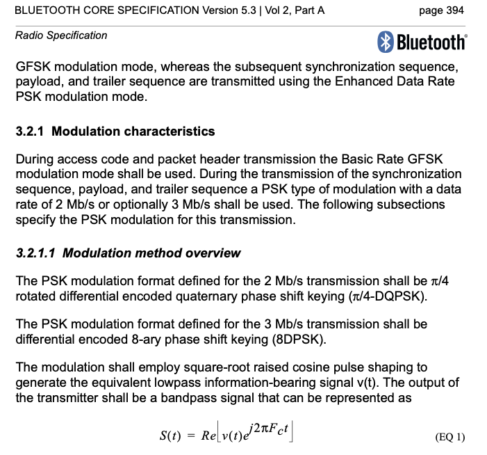

---

<!--pan_doc:

I don't think 16PSK is that common, at 4-bits per symbol it's common to switch to Quadrature Amplitude Modulation (QAM), as shown below. The goal of QAM is to maximize
the distance between each symbol. The challenge with QAM is the amplitude modulation. The modulation scheme is sensitive to variations in the transmitter amplitude. As such,
more complex circuits than 8PSK could be necessary. 

If you wanted to research "new fancy modulation schemes" I'd think about [Sphere packing](https://en.wikipedia.org/wiki/Sphere_packing).

-->

<!--pan_doc:

## Single carrier, or multi carrier?

Assume we wanted to send 1024 Mbps over the air. We could choose a bandwidth of a about 1 GHz with 1-bit per symbol, or  have a bandwidth of 1 MHz if
we sent 1024 QAM at 1MS/s. 

In both cases we get problems with the physical communication channel, the change in phase and amplitude affect what is received. 
For a 1 GHz bandwidth at 2.4 GHz carrier we'd have problems with the phase. At 1024 QAM we'd have problems with the amplitude. 

Back in 1966 [Orthogonal frequency division multiplexing](https://en.wikipedia.org/wiki/Orthogonal_frequency-division_multiplexing#:~:text=OFDM%20is%20a%20frequency%2Ddivision,is%20divided%20into%20multiple%20streams.)
was introduced to deal with the communication channel. 

In OFDM we modulate a number of sub-carriers in the frequency space with our wanted modulation scheme (BPSK, PSK, QAM), then do an inverse fourier transform to 
get the time domain signal, mix on to the carrier, and transmit. At the reciever we take an FFT and do demodulation in the frequency space. 

There are more details in OFDM than the simple statement above, but the details are just to fix challenges, such as "How do I recover the symbol timing? 
How do I correct for frequency offset? How do I ensure that my time domain signal terminates correctly for every FFT chunk"

The genius with OFDM is that we can pick a few of the sub-carriers to be pilot tones that carry no new information. If we knew exactly what was sent in phase and amplitude, 
then we could measure the phase and amplitude change due to the physical communication channel, and we could correct the frequency space before we tried to de-modulate.

It's possible to do the same with single carrier modulation also. Imagine we made a 128-QAM modulation on a single carrier. As long as we constructed the time domain signal
correctly (cyclic prefix to make the FFT work nicely, some preamble to measure the communication channel, then we could take an FFT at the reciever, correct 
the phase and amplitude, do an IFFT and demodulate the time-domain signal as normal. 

In radio design there are so many choices it's easy to get lost. 

-->

---

<!--pan_skip: -->

## Single carrier, or multi carrier?

Bluetooth, 802.15.4, ANT all use one carrier
- Simple TX, constant envelope

WiFi, LTE ++ all use Orthogonal frequency division multiplexing (OFDM)
- Complex TX, non-constant envelope

---

<!--pan_skip: -->

#[fit] Let's make the best, highest data rate radio!

#[fit]\#racetoidle

---

## Use a Software Defined Radio 

<!--pan_doc:

For our mouse, what radio scheme should we choose? One common instances of "how to make a choice" in industry is "Delay the choice as long as possible so
your sure the choice is right". 

Maybe the best would be to integrated a software defined radio reciever? Something like the picture below, an antenna, low noise amplifier, and a 
analog-to-digital converter. That way we could support any transmitter. Fantastic idea, right?

-->

<!--pan_doc:

Well, lets check if it's a good idea. We know we'll use 2.4 GHz, so we need about 2.5 GHz bandwidth, at least. We know we want good range, so maybe 100 dB
dynamic range. 
In analog to digital 
converter design there are figure of merits, so we can actually compute a rough power consumption for such an ADC. 
-->

ADC FOM $$ = \frac{P}{2 BW 2^n}$$

State of the art FOM $$\approx 5 \text{ fJ/step}$$
 
 $$ BW = 2.5\text{ GHz}$$
 
 $$ DR = 100\text{ dB} = (96-1.76)/6.02 \approx 16\text{ bit} $$ 
 
 $$ P = 5\text{ fF} \times 5 \text{ GHz} \times 2^{16} = 1.6\text{ W}$$

<!--pan_doc:

At 1.6 W our mouse would only last for 2 hours. That's too short. Maybe we could use a WiFi 6 radio, those are good! [#racetoidle](https://en.wikipedia.org/wiki/Dynamic_frequency_scaling) 

-->

---

## WiFi 6 

<!--pan_doc:

It's fun sometimes to read really high end radio papers. The complexity of the radios are so high it's hard to understand how it could be made. 

One example is the one below

-->

[An 802.11ax 4 × 4 High-Efficiency WLAN AP Transceiver SoC Supporting 1024-QAM With Frequency-Dependent IQ Calibration and Integrated Interference Analyzer](https://ieeexplore.ieee.org/document/8528383)

---

<!--pan_doc:

There are multiple PLLs, multiple recievers, multiple ADCs and dacs, with a bunch of calibration and compensation loops. 

-->

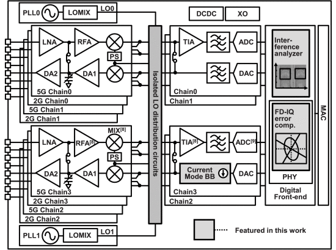

---

<!--pan_doc:

And an insane 1024 QAM constellation. Notice how small space there is between the points. 

-->

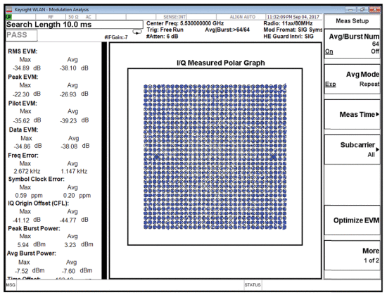

---

<!--pan_doc:

Again, though, the current consumption is a bit too high. Almost 1 Watt. Maybe something simpler is needed for our wireless mouse?

-->

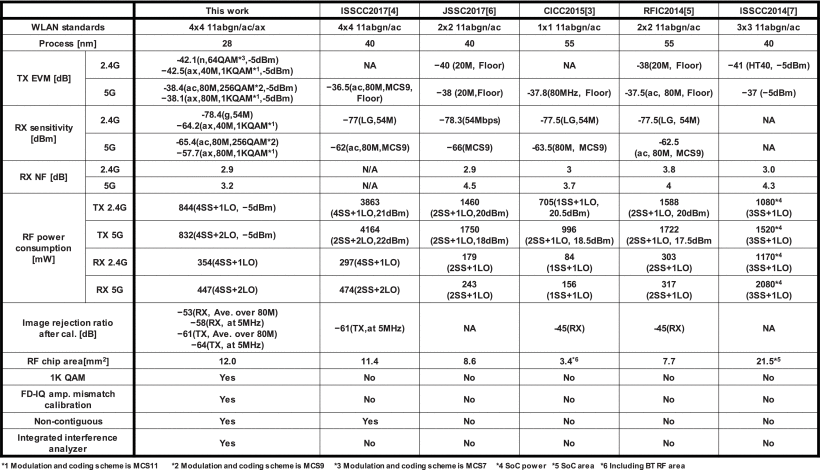

---

<!--pan_skip: -->

## [fit] Crap, complex!
## [fit] Crap, too high power!

---
[.background-color: #00A9CE]

<!--pan_skip: -->

---

<!--pan_skip: -->

#  [Bluetooth](https://www.bluetooth.com/specifications/specs/core-specification-5-4/)

- Compromise between speed, power and cost 
- "Simple" to use
- "Simple" to implement

---

<!--pan_doc: 

# Bluetooth

[Bluetooth](https://www.bluetooth.com/specifications/specs/core-specification-5-4/) was made to be a "simple" standard and was introduced in 1998. 
The standard has continued to develop, with Low Energy introduced in 2010. The latest planned changes can be seen at [Specifications in Development](https://www.bluetooth.com/specifications/specifications-in-development/).

-->

## Bluetooth Basic Rate/Extended Data rate 

- 2.400 GHz to 2.4835 GHz
- 1 MHz channel spacing
- 78 Channels
- Up to 20 dBm
- Minimum -70 dBm sensitivity (1 Mbps)
- 1 MHz GFSK (1 Mbps), pi/4-DQPSK (2 Mbps), 8DPSK (3 Mbps)

<!--pan_doc:

You'll find BR/EDR in most audio equipment, cars and legacy devices. For new devices (also audio), there is now a transition to Bluetooth Low Energy.

-->

---

## Bluetooth Low Energy

- 2.400 GHz to 2.480 GHz
- 2 MHz channel spacing
- 40 Channels (3 primary advertising channels)
- Up to 20 dBm 
- Minimum -70 dBm sensitivity (1 Mbps)
- 1 MHz GFSK (1 Mbps, 500 kbps, 125 kbps), 2 MHz GFSK (2 Mbps)

---

<!--pan_doc:

Below are the Bluetooth LE channels. The green are the advertiser channels, the blue are the data channels, and the yellow is the WiFi channels.

The advertiser channels have been intentionally placed where there is space between the WiFi channels to decrease the probability of collisions. 

-->

---

<!--pan_doc:

Any Bluetooth LE peripheral will advertise it's presence, it will wake up once in a while (every few hundred milliseconds, to seconds) and transmit a short "I'm here" packet. 
After transmitting it will wait a bit in receive to see if anyone responds. 

A Bluetooth LE central will camp in receive on a advertiser channel and look for these short messages from peripherals. If one is observed, the Central may choose to respond.

Take any spectrum analyzer anywhere, and you'll see traffic on 2402, 2426, and 2480 MHz. 

-->

---

<!--pan_doc:

In a connection a central and peripheral (the master/slave names below have been removed from the spec, that was a fun update to a 3500 page document) will have 
agreed on an interval to talk. Every "connection interval" they will transmit and receive data. The connection interval is tunable from 7.5 ms to seconds.

Bluetooth LE is the perfect standard for wireless mice. 

-->

---

For further information [Building a Bluetooth application on nRF Connect SDK](https://devzone.nordicsemi.com/guides/nrf-connect-sdk-guides/b/software/posts/building-a-ble-application-on-ncs-comparing-and-contrasting-to-softdevice-based-ble-applications)

<!--pan_skip: -->

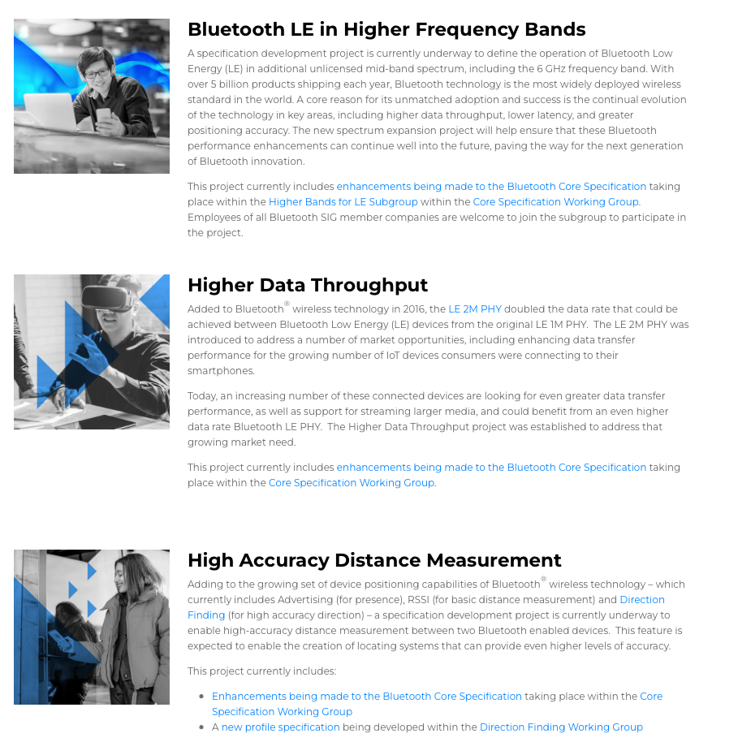

---
[.background-color: #00A9CE]

<!--pan_skip: -->

#[fit] Low Power Recievers

---

# Algorithm to design state-of-the-art LE radio
- Find most recent digest from International Solid State Circuit Conference (ISSCC)
- Find Bluetooth low energy papers 
- Pick the best blocks from each paper

---

<!--pan_doc: 

A typical Bluetooth radio may look something like the picture below. 

-->

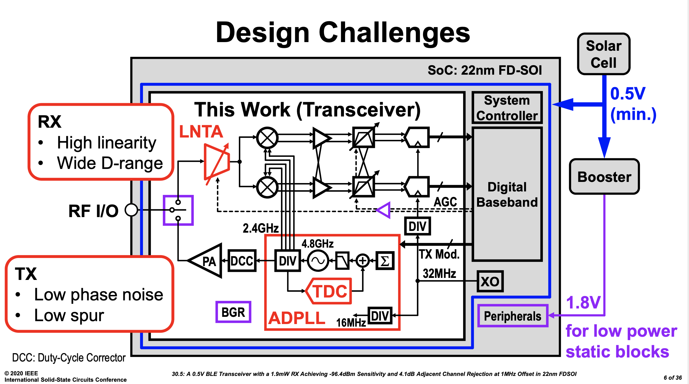

---

<!--pan_doc:

In the typical radio we'll need the blocks below. I've added a column for how many people I would want if I was to lead development of a new radio.

-->

| Blocks            | Key parameter                         | Architecture  | Complexity (nr people) |
|-------------------|---------------------------------------|---------------|------------------------|
| Antenna           | Gain, impedance                       | ??            | <1                     |
| RF match          | loss, input impedance                 | PI-match?     | <1                     |
| Low noise amp     | NF, current, linearity                | LNTA          | 1                      |
| Mixer             | NF, current, linearity                | Passive       | 1                      |
| Anti-alias filter | NF, linearity                         | TIA + AFIR    | 1                      |
| ADC               | Sample rate, dynamic range, linearity | NS-SAR        | 1 - 2                  |
| PLL               | Freq accuracy, phase noise, current   | AD-PLL        | 2-3                    |
| Baseband          | Eb/N0, gate count, current.           | SystemVerilog | > 10                   |

---

## [fit] LNTA

---

<!--pan_doc:

The first thing that must happen in the radio is to amplify the noise as early as possible. Any circuit has inherent noise, be it thermal-, flicker-, burst-, or shot-noise. 
The earlier we can amplify the input noise, the less contribution there will be from the radio circuits.

The challenges in the low noise amplifier is to provide the right gain. If there is a strong input signal, then reduce the gain. If there is a low input signal, then 
increase the gain. 

One way to implement variable gain is to reconfigure the LNA. 

The example below combines a NMOS common gate, common source and a PMOS common source. Depending on the required gain there is also attenuation introduced. 

One second challenge in the LNA is that the gain must be tuned without change to the input impedance. At RF it matters that the impedances are matched, otherwise 
power would be lost to reflections. 

-->

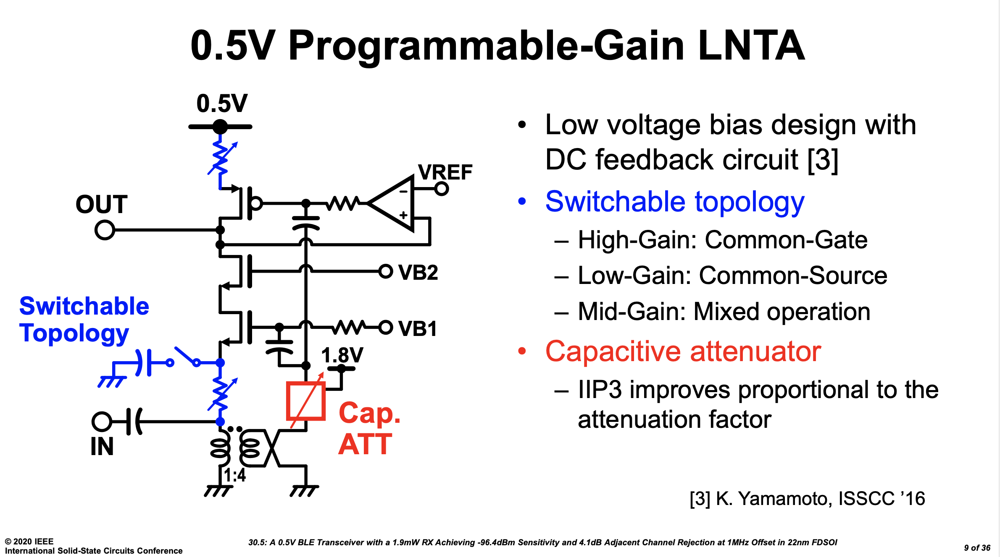

---

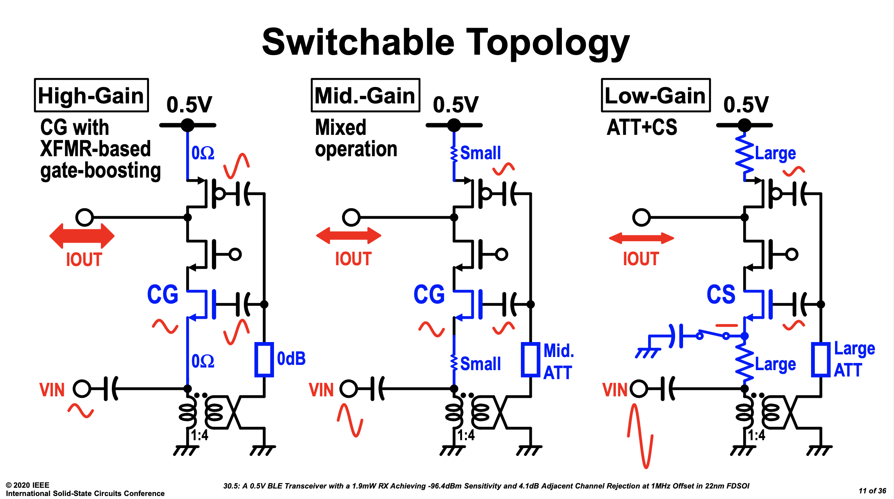

---

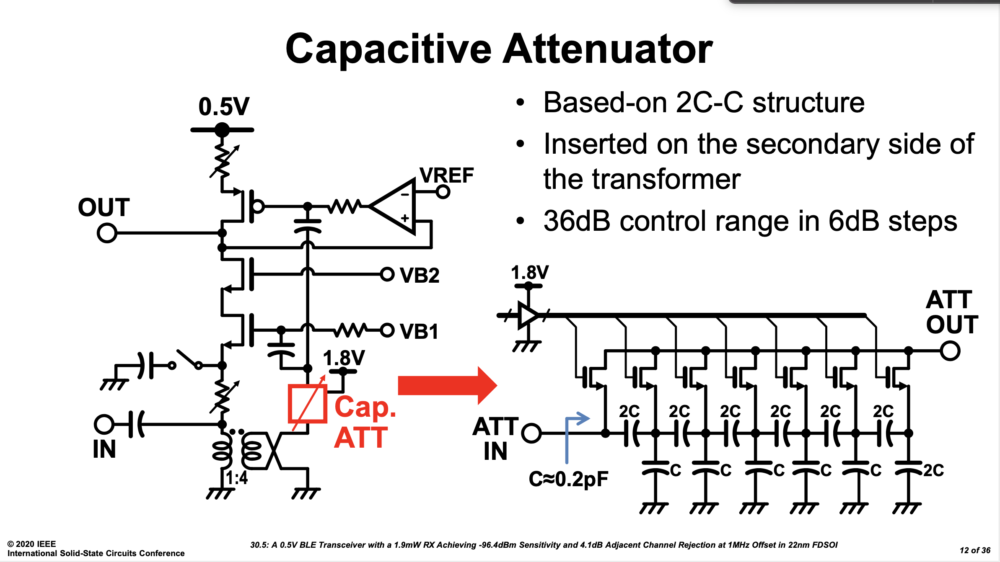

---

## [fit] MIXER

<!--pan_doc:

In the mixer we multiply the input signal with our local oscillator. Most often a complex mixer is used. There is nothing complex about complex signal processing, 
just read [Complex signal processing is not complex](https://ieeexplore.ieee.org/document/1333231).

In order to reduce power, it's most common with a passive mixer as shown below. A passive mixer is just MOS that we turn on and off with 25% duty-cycle.

-->

---

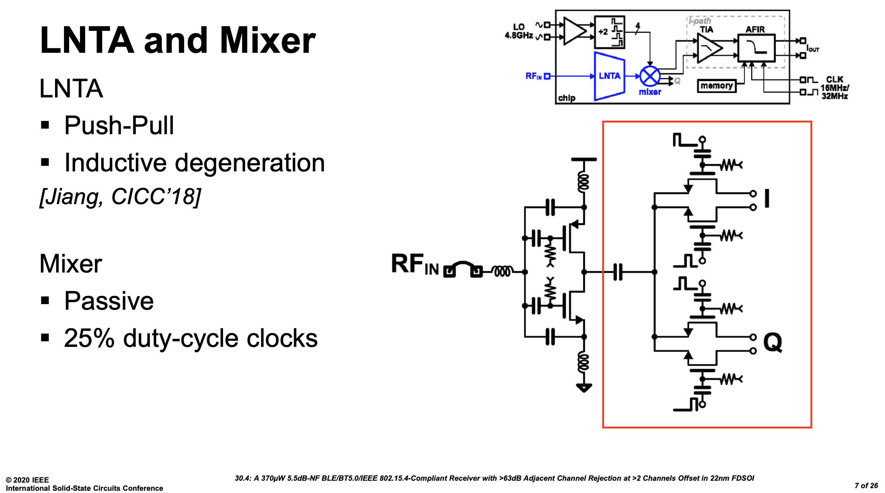

---

<!--pan_doc:

To generate the quadrature and in-phase clock signals, which must be 90 degrees phase offset, it's common to generate twice the frequency in the 
local oscillator (4.8 GHz), and then divide down to 4 2.4 GHz clock signals. 

I liked the "Windmill" divider in the picture below (I have not tried it though, but it looked cool).

If the LO is the same as the carrier, then the modulation signal 
will be at DC, often called direct conversion. 

The challenge at DC is that there is flicker noise, offset, and burst noise. The modulation type, however, can impact whether low frequency noise is an issue. In OFDM we
can choose to skip the sub-carriers around 0 Hz, and direct conversion works well. An advantage with direct conversion is that there is no "image frequency" and 
we can use the full complex bandwidth. 

For FSK and direct conversion the low frequency noise can cause issues, as such, it's common to offset the LO from the transmitted signal, for example 4 MHz offset. 
The low frequency noise problem disappears, however, we now have a challenge with the image frequency (-4 MHz) that must be rejected, and we need an increased bandwidth.

There is no "one correct choice", there are trade-offs that both ways. KISS (Keep It Simple Stupid) is one of my guiding principles when working on radio architecture. 

These days most de-modulation happens in digital, and we need to convert the analog signal to digital, but first AAF.

-->

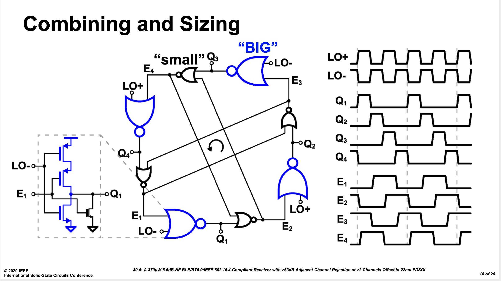

---

## [fit] AAF

<!--pan_doc:

The anti alias filter rejects frequencies that can fold into the band of interest due to sampling. Below is a fancy anti-alias filter, but quite often, simple active-RC 
filters are perfect. 

We often need gain in the AAF, as the LNA does not have sufficient gain for the weakest signals. -100 dBm in 50 ohm is 6.2 nV RMS, while input 
range of an ADC may be 1 V. Assume we place the lowest input signal at 0.1 V, so we need a voltage gain of $20\log(0.1/6.2e-9) = 76$dB in the reciever.

-->

---

---

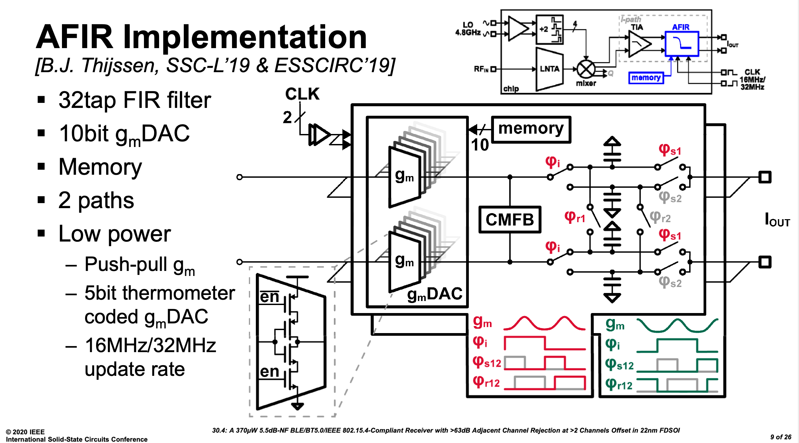

---

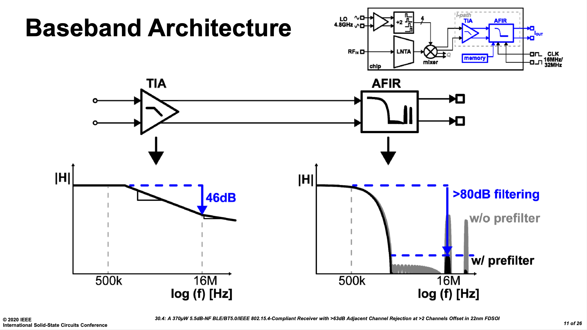

---

## [fit] ADC

<!--pan_doc:

Aaah, ADCs, an IP close to my heart. I did my Ph.d and Post-Doc on ADCs, and the Ph.D students I've co-supervised have worked on ADCs. 

At NTNU there have been multiple students through the years that have made world-class ADCs, and there's still students at NTNU working on state-of-the-art ADCs. 

These days, a good option is a SAR, or a Noise-Shaped SAR. 

If I were to pick, I'd make something like [A 68 dB SNDR Compiled Noise-Shaping SAR ADC With On-Chip CDAC Calibration](https://ieeexplore.ieee.org/document/9056925).

-->

---

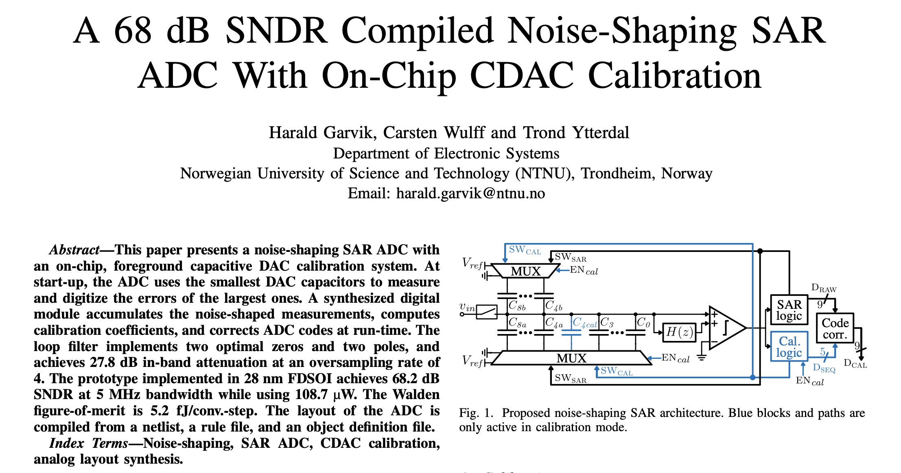

---

<!--pan_doc:

Or if I did not need high resolution, I'd choose my trusty [A Compiled 9-bit 20-MS/s 3.5-fJ/conv.step SAR ADC in 28-nm FDSOI for Bluetooth Low Energy Receivers](https://ieeexplore.ieee.org/document/7906479).
That particular ADC have been ported to multiple technologies (22 nm FDSOI, 22 nm, 28 nm, 55 nm, 65 nm and 130nm),
and can be found at [sun_sar9b_sky130nm](https://github.com/wulffern/sun_sar9b_sky130nm/tree/main).

-->

---

<!--pan_doc:

The main selling point of the ADC was that it's compiled from a [JSON](https://github.com/wulffern/sun_sar9b_sky130nm/blob/main/cic/ip.json) file, a [SPICE](https://github.com/wulffern/sun_sar9b_sky130nm/blob/main/cic/ip.spi) file 
and a [technology](https://github.com/wulffern/sun_sar9b_sky130nm/blob/main/cic/sky130.tech) file into a DRC/LVS clean layout.

I also included a few circuit improvements. The bottom plate of the SAR capacitor is in the clock loop for the comparator (DN0, DP1 below), as such, the 
delay of the comparator automatically adjusts with capacitance corner, so it's more robust over corners

-->

---

<!--pan_doc:

The compiled nature also made it possible to quickly change the transistor technology. Below is a picture with 180 nm FDSOI transistors on the left, and 28 nm FDSOI transistors on the right.

I detest doing anything twice, so I love the fact that I never have to re-draw that ADC again. I just fix the technology file (and maybe some tweaks to the other files), and 
I have a completed ADC.
-->

---

## [fit] AD-PLL

<!--pan_doc:

The phase locked loop is the heart of the radio, and it's probably the most difficult part to make. Depends a bit on technology, but these days, All Digital PLLs are cool.

You can spend your life on PLLs. 

-->

---
#Phase Locked loops

[.column]

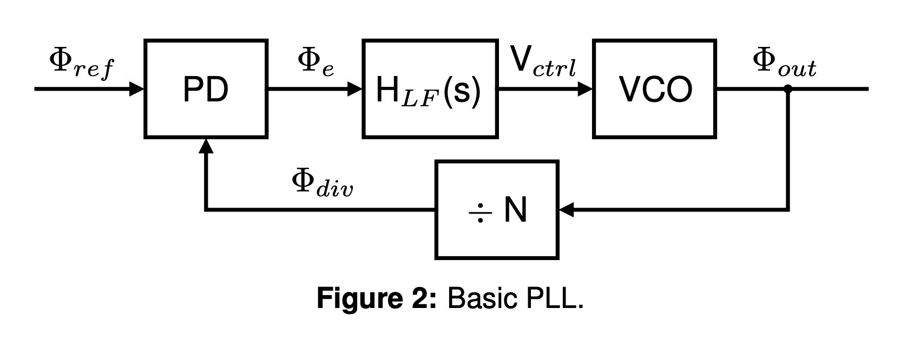

[.column]
- Read Razavi's PLL book 

---
AD-PLL with Bang-Bang phase detector for steady-state 

---

##[fit] Baseband

<!--pan_doc:

Once the signal has been converted to digital, then the de-modulation, and signal fixing start. That's for another course, but there are interesting challenges. 

-->

---

|Baseband block | Why |
|---|---|
| Mixer? | If we're using low intermediate frequency to avoid DC offset problems and flicker noise|
| Channel filters?| If the AAF is insufficient for adjacent channel|
| Power detection | To be able to control the gain of the radio|
| Phase extraction| Assuming we're using FSK|
| Timing recovery | Figure out when to slice the symbol|
| Bit detection | single slice, multi-bit slice, correlators etc|
| Address detection | Is the packet for us?|
| Header detection | What does the packet contain|
| CRC  | Does the packet have bit errors|
| Payload de-crypt| Most links are encrypted by AES|
| Memory access| Payload need to be stored until CPU can do something|

---

# What do we really want, in the end?

<!--pan_doc:

The reciever part can be summed up in one equation for the sensitivity. The noise in a certain bandwidth. The Noise Figure of the analog reciever. The Energy per bit over Noise
of the de-modulator. 

-->

$$P_{RX_{sens}} = -174 dBm + 10 \times log10(DR)  + NF + Eb/N0$$

for example, for nRF5340 

$$ P_{RX_{sens}} + 174 - 60 =  NF + Eb/N0 = 17 dB$$

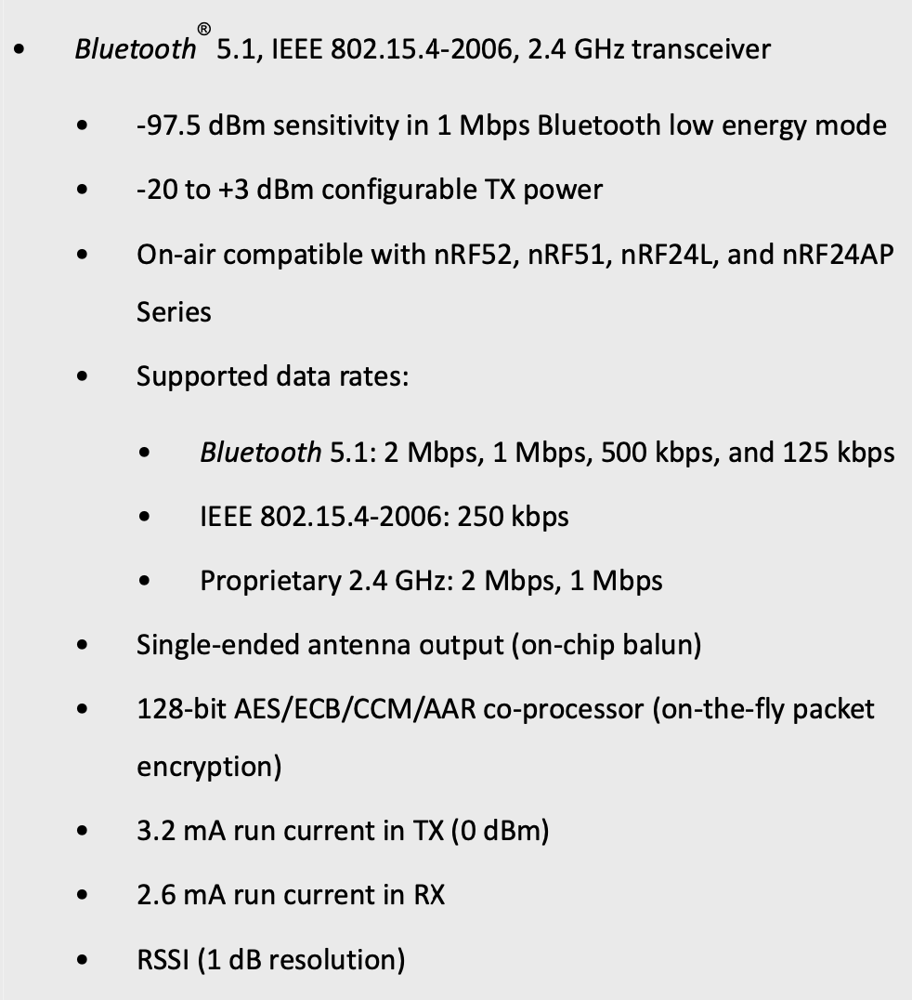

---

<!--pan_doc:

In the block diagram of the device the radio might be a small box, and the person using the radio might not realize how complex the radio actually is.

I hope you understand now that it's actually complicated.

-->

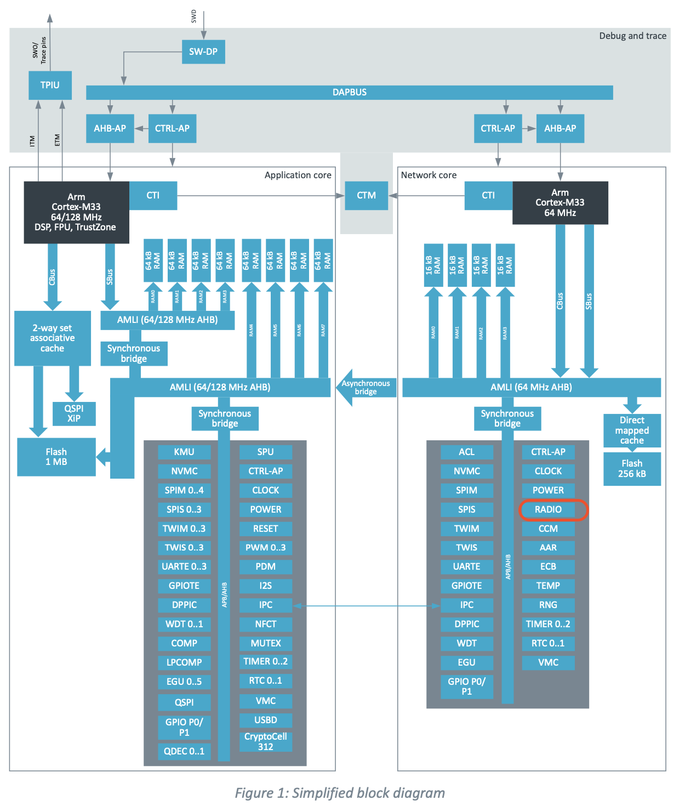

---

<!--pan_skip: -->

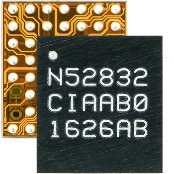

---

#[fit] Thanks!

---

# References

"A 0.5V BLE Transceiver with a 1.9mW RX Achieving -96.4dBm Sensitivity and 4.1dB Adjacent Channel Rejection at 1MHz Offset in 22nm FDSOI", M. Tamura, Sony Semiconductor Solutions, Atsugi, Japan, 30.5, ISSCC 2020

"A 370uW 5.5dB-NF BLE/BT5.0/IEEE 802.15.4-Compliant Receiver with >63dB Adjacent Channel Rejection at >2 Channels Offset in 22nm FDSOI", B. J. Thijssen, University of Twente, Enschede, The Netherlands

"A 68 dB SNDR Compiled Noise-Shaping SAR ADC With On-Chip CDAC Calibration", H. Garvik, C. Wulff, T. Ytterdal

"A Compiled 9-bit 20-MS/s 3.5-fJ/conv.step SAR ADC in 28-nm FDSOI for Bluetooth Low Energy Recievers", C. Wulff, T. Ytterdal

Cole Nielsen, <https://github.com/nielscol/thesis_presentations>

"Python Framework for Design and Simulation of Integer-N ADPLLs", Cole Nielsen, <https://github.com/nielscol/tfe4580-report/blob/master/report.pdf>

Design of CMOS Phase-Locked Loops, Behzad Razavi, University of California, Los Angeles

