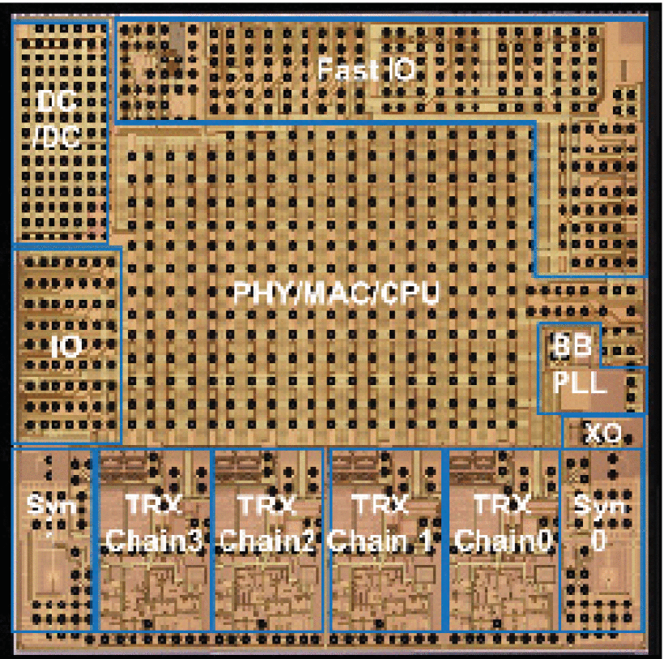

footer: Carsten Wulff 2023
slidenumbers:true
autoscale:true
theme:Plain Jane,1

[.background-color: #00A9CE]

<!--pan_skip: -->

## TFE4188 - Lecture 10
# Low Power Radio

<!--pan_title: Lecture 10 - Low Power Radio -->

---

<!--pan_skip: -->

# Goal

Let's make a radio (or at least, let's **pretend**)

---
[.background-color: #00A9CE]

<!--pan_skip: -->

## Problem statement:

#[fit] Make the best radio ICs for gaming mice

---

<!--pan_doc:

# Make the best radio IC for gaming mice

-->

## What do we need to know?
- Data Rate
- Carrier Frequency & Range
- Power supply

---

#[fit] Data Rate
<!--pan_skip: -->
---

[.column]

## Data 

| What | Bits | Why |
| ----  | ---- | ---- |
| X displacement | 8 | |
| Y displacement | 8 | |
| CRC | 4 | Bit errors|
| Buttons| 16 | On-hot coding. Most mice have buttons|
| Preamble| 8 | Syncronization|
| Address | 32 | Unique identifier |
| Total | 76 | |

[.column]

## Rate
Assume 1 ms update rate

---
## Data Rate

Application Data Rate > 76 bits/ms = 76 kbps

Assume 30 % packet loss

Raw Data Rate > 228 kbps

Multiply by $$\pi$$ > 716 kbps

Round to nearest nice number = 1Mbps

---

# [fit] Carrier Frequency & Range
<!--pan_skip: -->

---
## ISM (industrial, scientific and medical) bands

---

## Antenna

[.column]
Assume $$\lambda/4$$ is an OK antenna size ($$\lambda = c/f$$)

[.column]
| ISM band |$$\lambda/4$$ | Unit|OK/NOK|
|---|---:|---:|---:|
| 40.68 MHz | 1.8  | m |:x:|
| 433.92 MHz | 17 | cm|:x:|
| 915 MHz | 8.2 | cm||
| 2450 MHz | 3.06 | cm|:white_check_mark:|
| 5800 MHz | 1.29 | cm|:white_check_mark:|
| 24.125 GHz | 3.1 | mm|:white_check_mark:|
| 61.25 GHz | 1.2 | mm|:white_check_mark:|

---

## Range (Friis)

[.column]

Assume no antenna gain, power density p at distance D is

$$ p = \frac{P_{TX}}{4 \pi D^2}$$

Assume reciever antenna has no gain, then the effective apature is

$$ A_e = \frac{\lambda^2}{4 \pi}$$

[.column]

Power recieved is then

$$P_{RX} = \frac{P_{TX}}{D^2} \left[\frac{\lambda}{4 \pi}\right]^2$$

Or in terms of distance

$$ D = 10^\frac{P_{TX} - P_{RX} + 20 log_{10}\left(\frac{c}{4 \pi f}\right)}{20} $$

---

## Range (Free space)

Assume TX = 0 dBm, assume RX sensitivity is -80 dBm

| Freq | **$$20 log_{10}\left(c/4 \pi f\right)$$** [dB]| D [m]| OK/NOK|
| ----|:----:| ---: | ---:|
| 915 MHz | -31.7 | 260.9 | :white_check_mark:|
| **2.45 GHz** | **-40.2** | **97.4** |:white_check_mark:|
| 5.80 GHz | -47.7 | 41.2 |:white_check_mark:|
| 24.12 GHz | -60.1 | 9.9 | :x:|
| 61.25 GHz | -68.2 | 3.9 | :x:|
| 160 GHz | -76.52| 1.5 | :x:|

---

Path loss factor, $$ n \in [1.6,6]$$, $$ D = 10^\frac{P_{TX} - P_{RX} + 20 log_{10}\left(\frac{c}{4 \pi f}\right)}{n
\times 10} $$

| Freq | **$$20 log_{10}\left(c/4 \pi f\right)$$** [dB]| D@n=2 [m]|D@n=6 [m] | OK/NOK|
| ----|:----:| ---: | ---:| ---:|
| **2.45 GHz** | **-40.2** | **97.4** | **4.6** |:white_check_mark:|
| 5.80 GHz | -47.7 | 41.2 | 3.45 |:white_check_mark:|
| 24.12 GHz | -60.1 | 9.9 | 2.1 | :x:|

---

# [fit] Power supply

---

## Battery

Mouse is maybe AA,  3000 mAh

|Cell |Chemistry|  Voltage (V) | Capacity (Ah) |
|----|:----|----:| ---:|
| AA |LiFeS2  | 1.0 - 1.8 | 3 |
| 2xAA |LiFeS2  | 2.0 - 3.6 | 3 |
| AA |Zn/Alk/MnO2 | 0.8 - 1.6 | 3 |
| 2xAA |Zn/Alk/MnO2 | 1.6 - 3.2 | 3 |

---
[.background-color: #00A9CE]

# Decisions we must make

---

## Modulation scheme

| Scheme | Acronym|Pro | Con |
| ----| ----|----| ----|
| Binary phase shift keying | BPSK | Simple | Not constant envelope|
| Quadrature phase-shift keying | QPSK |2bits/symbol| Not constant envelope|
| Offset QPSK |OQPSK| 2bits/symbol | Constant envelope with half-sine pulse shaping|
| Gaussian Frequency Shift Keying | GFSK | 1 bit/symbol| Constant envelope|
| Quadrature amplitude modulation| QAM | > 1024 bits/symbol| Really non-constant envelope|

---

---

---

---

---

## Single carrier, or multi carrier?

Bluetooth, 802.15.4, ANT all use one carrier
- Simple TX, constant envelope

WiFi, LTE ++ all use Ortogonal frequency division multiplexing (OFDM)
- Complex TX, non-constant envelope

---

#[fit] Let's make the best, highest data rate radio!

#[fit]\#racetoidle

---

## Use a Software Defined Radio 

 ADC FOM $$ = \frac{P}{2 BW 2^n}$$

 State of the art FOM $$\approx 5 \text{ fJ/step}$$
 
 $$ BW = 2.5\text{ GHz}$$
 $$ DR = 100\text{ dB} = (96-1.76)/6.02 \approx 16\text{ bit} $$ 

 $$ P = 5\text{ fF} \times 5 \text{ GHz} \times 2^{16} = 1.6\text{ W}$$

---

## WiFi 6 
[An 802.11ax 4 × 4 High-Efficiency WLAN AP Transceiver SoC Supporting 1024-QAM With Frequency-Dependent IQ Calibration and Integrated Interference Analyzer](https://ieeexplore.ieee.org/document/8528383)

---
 

---

---

---

<!--pan_skip: -->

## [fit] Crap, complex!
## [fit] Crap, too high power!

---
[.background-color: #00A9CE]

---

#  [Bluetooth](https://www.bluetooth.com/specifications/specs/core-specification-5-4/)

- Compromise between speed, power and cost 
- "Simple" to use
- "Simple" to implement

---

## Bluetooth Basic Rate/Extended Data rate 

- 2.400 GHz to 2.4835 GHz
- 1 MHz channel spacing
- 78 Channels
- Up to 20 dBm
- Minimum -70 dBm sensitivity (1 Mbps)
- 1 MHz GFSK (1 Mbps), pi/4-DQPSK (2 Mbps), 8DPSK (3 Mbps)

---

## Bluetooth Low Energy

- 2.400 GHz to 2.480 GHz
- 2 MHz channel spacing
- 40 Channels (3 primary advertizing channels)
- Up to 20 dBm 
- Minimum -70 dBm sensitivity (1 Mbps)
- 1 MHz GFSK (1 Mbps, 500 kbps, 125 kbps), 2 MHz GFSK (2 Mbps)

---

---

---

---

For further information [Building a Bluetooth application on nRF Connect SDK](https://devzone.nordicsemi.com/guides/nrf-connect-sdk-guides/b/software/posts/building-a-ble-application-on-ncs-comparing-and-contrasting-to-softdevice-based-ble-applications)

---
[.background-color: #00A9CE]

<!--pan_skip: -->

#[fit] Low Power Recievers

---

# Algorithm to design state-of-the-art BLE radio
- Find most recent digest from International Solid State Circuit Conference (ISSCC)
- Find Bluetooth low energy papers 
- Pick the best blocks from each paper

---

---

|Blocks| Key parameter | Architecture| Complexity (nr people)|
|---|---|---| ---|
| Antenna | Gain, impedance| ?? | <1 |
| RF match| loss, input impedance| PI-match? | <1 |
| Low noise amp | NF, current, linearity| LNTA| 1 |
| Mixer | NF, current, linearity| Passive | 1	|
| Anti-alias filter| NF, linearity| TIA + AFIR| 1|
| ADC | Sample rate, dynamic range, linearity| NS-SAR| 1 - 2| 
| PLL | Freq accuracy, phase noise, current| AD-PLL | 2-3 |
| Baseband | Eb/N0, gate count, current. | SystemVerilog | > 10|

---

# [fit] LNTA

---

---

---

---

# [fit] MIXER

---

---

---

# [fit] AAF

---

---

---

---

# [fit] ADC

---

---

---

---

---

# [fit] AD-PLL

---
#Phase Locked loops

[.column]

[.column]
- Read Razavi's PLL book [^7]

---
AD-PLL with Bang-Bang phase detector for steady-state [^5]

---

#[fit] Baseband

---

|Baseband block | Why |
|---|---|
| Mixer? | If we're using low intermediate frequency to avoid DC offset problems and flicker noise|
| Channel filters?| If the AAF is insufficient for adjaecent channel|
| Power detection | To be able to control the gain of the radio|
| Phase extraction| Assuming we're using FSK|
| Timing recovery | Figure out when to slice the symbol|
| Bit detection | single slice, multi-bit slice, correlators etc, see|
| Address detection | Is the packet for us?|
| Header detection | What does the packet contain|
| CRC  | Does the packet have bit errors|
| Payload decrypt| Most links are encrypted by AES|
| Memory access| Payload need to be stored until CPU can do something|

---

# What do we really want, in the end?

$$P_{RX_{sens}} = -174 dBm + 10 \times log10(DR)  + NF + Eb/N0$$

for example, for nRF5340 

$$ P_{RX_{sens}} + 174 - 60 =  NF + Eb/N0 = 17 dB$$

---

---

---

#[fit] Thanks!

[^1]: "A 0.5V BLE Transceiver with a 1.9mW RX Achieving -96.4dBm Sensitivity and 4.1dB Adjacent Channel Rejection at 1MHz Offset in 22nm FDSOI", M. Tamura, Sony Semiconductor Solutions, Atsugi, Japan, 30.5, ISSCC 2020

[^2]: "A 370μW 5.5dB-NF BLE/BT5.0/IEEE 802.15.4-Compliant Receiver with >63dB Adjacent Channel Rejection at >2 Channels Offset in 22nm FDSOI", B. J. Thijssen, University of Twente, Enschede, The Netherlands

[^3]: "A 68 dB SNDR Compiled Noise-Shaping SAR ADC With On-Chip CDAC Calibration", H. Garvik, C. Wulff, T. Ytterdal

[^4]: "A Compiled 9-bit 20-MS/s 3.5-fJ/conv.step SAR ADC in 28-nm FDSOI for Bluetooth Low Energy Recievers", C. Wulff, T. Ytterdal

[^5]: Cole Nielsen, https://github.com/nielscol/thesis_presentations

[^6]: "Python Framework for Design and Simulation of Integer-N ADPLLs", Cole Nielsen, https://github.com/nielscol/tfe4580-report/blob/master/report.pdf

[^7]: Design of CMOS Phase-Locked Loops, Behzad Razavi, University of California, Los Angeles

